# 焰哨 FlameSentry · 智慧火险预警与多智能体协作平台 —— 整体实现文档

> **系统全称**：焰哨 FlameSentry · 智慧火险预警与多智能体协作平台（Smart Forest-Fire Early-Warning & Multi-Agent Collaboration Platform）
> **系统定位**：面向云南省森林火险治理场景，将传统 GIS 可视化大屏升级为「自然语言驱动 + 多 Agent 协作 + 知识库增强」的智能决策平台
> **开发者**：wjl（19136220923@163.com）
> **源码地址**：
> - 后端：https://gitee.com/wjl2004/fire_agent_back
> - 前端：https://gitee.com/wjl2004/fire_agent_front

---

## 目录

1. [项目概述](#1-项目概述)
2. [可行性分析](#2-可行性分析)
3. [需求分析](#3-需求分析)
4. [总体架构设计](#4-总体架构设计)
5. [数据库设计](#5-数据库设计)
6. [后端详细设计与实现](#6-后端详细设计与实现)
7. [前端详细设计与实现](#7-前端详细设计与实现)
8. [核心技术专题](#8-核心技术专题)
9. [系统部署与运行](#9-系统部署与运行)
10. [系统特色与创新点](#10-系统特色与创新点)
11. [总结与展望](#11-总结与展望)

---

## 1. 项目概述

### 1.1 项目背景

森林火灾是破坏性极强的自然灾害，云南省地处干热河谷与横断山脉交错地带，冬春季节（尤其 2—5 月）干旱少雨、风干物燥，是我国森林火险最高发的省份之一。传统的森林火险信息化系统多以「被动展示」为主——火点数据以静态表格或大屏点位形式呈现，存在以下痛点：

| 痛点 | 具体表现 |
|---|---|
| 查询门槛高 | 业务人员需懂 SQL / GIS 软件才能从数据库中获取"某州市某月份火险排名"等结论 |
| 缺乏知识沉淀 | 防火条例、处置规范等文档散落在本地，遇到火情难以快速检索权威依据 |
| 分析靠人工 | 从"查数据 → 做空间分析 → 写处置报告"全链路依赖人工，耗时长、标准不一 |
| 系统割裂 | 可视化大屏、数据查询、报告撰写分属不同工具，无法形成决策闭环 |

随着大语言模型（LLM）、检索增强生成（RAG）与多智能体（Multi-Agent）编排技术的成熟，构建一个「用自然语言驱动、由多个 Agent 分工协作完成 数据查询 → GIS 空间分析 → 知识检索 → 报告生成 全流程」的智能决策平台成为可能。

### 1.2 项目目标

本系统在原有「云南省火险预警 GIS 可视化大屏（纯前端）」基础上演进为**前后端分离 + 多 Agent 协作**的智能决策平台，实现以下目标：

1. **GIS 作战大屏**：历史火点（5411 条 NASA FIRMS MODIS 实测数据）、预测火险（GTWR 模型 2025—2026 逐日/逐月）、16 州市行政边界一屏总览，支持聚合、热力图、量测、导出；
2. **自然语言智能查询**：用户输入"2025 年春季哪些州市风险最高"，LLM 解析意图 → 结构化查询 → 摘要/表格/图表/地图四维联动展示；
3. **知识库 RAG 问答**：上传 PDF/TXT/MD 防火文档 → 切分 → 向量化 → 混合检索 → LLM 引用来源回答；
4. **多 Agent 协作分析**：LangGraph 状态机编排 5 个 Agent，自动生成含真实数据的 Markdown 分析报告；
5. **报告中心**：报告统一检索、导出 Markdown/HTML、打印存 PDF；
6. **AI 火情识别（视觉）**：上传火场照片/卫星截图，视觉大模型（qwen-vl 系列）输出火情判定/场景描述/严重程度/处置建议，识别历史落库可回看；
7. **全链路语音交互**：智能查询/知识库/Agent 中心支持语音输入（ASR 自动执行），查询摘要/RAG 回答/Agent 报告/分析报告/识别结果均支持语音播报（TTS）；
8. **认证与权限**：JWT 双角色（admin/user）+ 用户数据隔离；
9. **系统管理**：模型/数据源/Agent 参数在线配置，写入 `.env` 热生效、敏感信息脱敏、百炼免费额度模型目录（5 大类一键切换）、系统日志、用户管理。

### 1.3 系统功能总览

| 功能模块 | 核心能力 |
|---|---|
| 登录/注册 | JWT 认证，admin/user 双角色，注册即登录 |
| 作战大屏 | 历史火点/预测火险/行政边界/热力图/聚合点位/量测标绘/地图导出，后端 API + 本地 JSON 降级兜底；**左侧 AI 火情识别侧栏（视觉模型 + 历史回看 + MD 渲染 + 语音播报）** |
| 智能查询 | 自然语言 → LLM 意图识别 → SQL 查询 → 摘要/表格/图表/地图四维展示，查询历史落库；**语音输入自动查询 + 摘要语音播报** |
| 知识库 RAG | 文档上传/切分/向量化/混合检索/引用来源回答，OCR 兜底解析扫描版 PDF；**语音提问 + 回答语音播报** |
| Agent 协作中心 | 5 Agent 流水线可视化执行，任务与步骤落库（支持历史回放执行过程），报告自动生成；**语音输入任务 + 报告语音播报** |
| 报告中心 | 列表/详情/删除/筛选/分页/导出 Markdown/HTML/打印 PDF；**报告语音播报** |
| 系统管理 | 系统总览/数据源/模型接入（含百炼免费额度模型目录 5 大类一键切换）/Agent 参数/系统日志/用户管理 六大 Tab |

---

## 2. 可行性分析

### 2.1 技术可行性

| 层面 | 分析 | 结论 |
|---|---|---|
| **前端技术** | Vue 3 Composition API 已成为主流范式，OpenLayers 10 对 GeoJSON/聚合/热力图支持成熟，ECharts 5 覆盖全部图表需求，Element Plus 提供完整后台组件库 | ✅ 可行 |
| **后端技术** | FastAPI 原生异步、自动生成 Swagger 文档，SQLAlchemy 2.0 + GeoAlchemy2 完整支持 PostGIS 空间字段；三者均为生产级成熟框架 | ✅ 可行 |
| **空间数据库** | PostgreSQL + PostGIS 提供 POINT/MULTIPOLYGON 空间类型与 GiST 索引，满足火点存储与空间分析需求 | ✅ 可行 |
| **大模型能力** | 阿里百炼（DashScope）提供 OpenAI 兼容接口（qwen-plus 对话 + text-embedding-v3 向量化），AMD GPU Cloud 提供备选推理服务，LangChain 0.3 / LangGraph 0.2 提供 Agent 编排标准范式 | ✅ 可行 |
| **RAG 链路** | RecursiveCharacterTextSplitter 中文感知切分 + pdfplumber/pypdf/PyMuPDF/RapidOCR 四层 PDF 文本提取兜底，技术链路完整 | ✅ 可行 |
| **降级容错** | 所有 LLM 依赖点均设计"无 Key 降级"（关键词解析/模板报告），保证系统在任何环境下可演示可用 | ✅ 可行 |

### 2.2 经济可行性

- **开发成本**：全部采用开源技术栈（Vue/FastAPI/PostgreSQL/LangChain），零授权费用；
- **模型成本**：qwen-plus / DeepSeek-V4-Flash 按 token 计费，且系统支持切换本地 Ollama 完全免费运行；
- **硬件成本**：单机（8GB 内存）即可同时运行前后端与数据库，满足毕业设计与中小规模演示；
- **数据成本**：NASA FIRMS 火点数据公开下载，行政边界 GeoJSON 来自开放地理数据。

### 2.3 操作可行性

- 前端全部交互基于 Element Plus 组件与自然语言输入，业务人员零学习成本；
- 系统管理页提供在线配置 + 连接测试 + 脱敏回显，运维无需登录服务器改配置；
- 智能查询、Agent 任务均提供示例语句，一键点击即查。

### 2.4 法律与数据合规可行性

- 火点数据来自 NASA FIRMS 公开数据集，无版权风险；
- 用户密码采用 bcrypt 哈希存储，JWT 密钥置于 `.env`，不落源码；
- 知识库文档由用户自行上传，系统不做数据转售。

---

## 3. 需求分析

### 3.1 功能需求（用例视角）

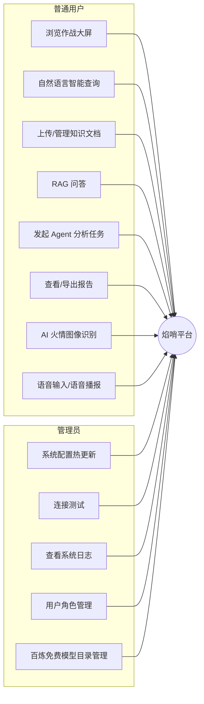

**核心用例说明**：

| 编号 | 用例 | 参与者 | 主要流程 |
|---|---|---|---|
| UC-01 | 智能查询 | 用户 | 输入自然语言 → QueryAgent 解析意图与参数 → 执行 SQL → 四维展示 → 历史落库 |
| UC-02 | 知识问答 | 用户 | 输入问题 → 混合检索（向量+关键词）→ LLM 基于检索内容回答 → 展示引用来源 |
| UC-03 | Agent 分析 | 用户 | 输入分析任务 → 5 Agent 流水线执行 → 报告自动落库 → 查看报告 |
| UC-04 | 报告导出 | 用户 | 选择报告 → 导出 Markdown / HTML / 打印 PDF / 语音播报 |
| UC-05 | 系统配置 | 管理员 | 修改模型 Key/参数 → 写入 .env → 热生效 → 脱敏回显 |
| UC-06 | 火情图像识别 | 用户 | 上传火场照片 → 视觉模型分析（火情判定/严重程度/处置建议）→ 识别历史落库回看 |
| UC-07 | 语音交互 | 用户 | 点击麦克风说话 → ASR 识别 → 自动执行查询/提问/任务；点击播报 → TTS 朗读结果 |

### 3.2 非功能需求

| 类别 | 指标要求 |
|---|---|
| 性能 | 大屏并发拉取 5000 条火点响应 < 3s；智能查询全链路 < 8s（含 LLM） |
| 可用性 | 任一 LLM 接口不可用时自动降级，核心页面永不白屏（本地 JSON/模板兜底） |
| 安全性 | bcrypt 密码哈希、JWT(HS256) 鉴权、敏感配置脱敏、用户数据隔离（普通用户互不可见历史） |
| 可维护性 | 配置集中于 .env + 系统管理页热更新；系统日志环形缓冲 200 条全程留痕 |
| 兼容性 | Chrome/Edge 现代浏览器；地图 WGS84 (EPSG:4326) 标准坐标 |

---

## 4. 总体架构设计

### 4.1 系统分层架构图

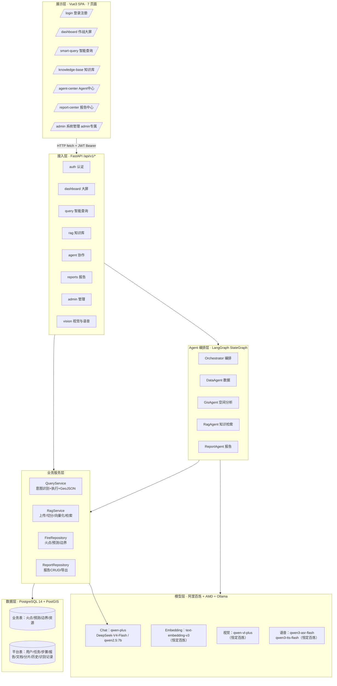

**架构说明**：

- **展示层与接入层彻底分离**：前端通过 Vite 代理 `/api → http://localhost:8000` 访问后端，天然规避跨域；
- **Agent 编排层独立于 CRUD 服务层**：Agent 不直接写 SQL，而是复用 Repository/Service，符合"编排与执行分离"原则；
- **模型层三提供商可切换**：阿里百炼（主力）/ AMD GPU Cloud（备选）/ 本地 Ollama（离线），由 `.env` 中 `ACTIVE_LLM_PROVIDER` 控制，Embedding 恒定使用阿里百炼 `text-embedding-v3`。

### 4.2 技术选型总表

#### 后端技术栈

| 类别 | 技术 | 版本 | 用途 |
|---|---|---|---|
| Web 框架 | FastAPI | 0.115.0 | REST API + Swagger 文档（/docs） |
| ASGI 服务器 | Uvicorn | 0.30.0 | 高性能异步服务 |
| ORM | SQLAlchemy | 2.0.35 | 13 张表数据模型 |
| 空间 ORM | GeoAlchemy2 | 0.15.1 | POINT / MULTIPOLYGON 几何字段 |
| 数据库 | PostgreSQL + PostGIS | 14 / 3.5 | 空间数据存储与索引 |
| 数据校验 | Pydantic + pydantic-settings | 2.9.0 | 请求/响应模型 + .env 配置类 |
| Agent 编排 | **LangGraph（StateGraph）** | 0.2.64 | 5 节点有向状态图 + 条件边 |
| LLM 框架 | **LangChain + langchain-openai** | 0.3.17 | ChatOpenAI / OpenAIEmbeddings |
| 文本切分 | langchain-text-splitters | 0.3.5 | RecursiveCharacterTextSplitter |
| PDF 解析 | pdfplumber / pypdf / PyMuPDF / RapidOCR | — | 四层兜底文本提取 |
| 向量库 | pgvector | 0.3.6 | 预留向量列升级 |
| 认证 | bcrypt + python-jose | 4.2.1 / 3.3.0 | 密码哈希 + JWT HS256 |
| 空间计算 | geopandas / shapely | 1.0.1 / 2.0.5 | 网格聚类、缓冲区分析 |
| 数据处理 | pandas / numpy | 2.2.2 / 1.26.4 | 数据导入与聚合 |
| **多模态视觉** | **qwen-vl-plus（百炼）** | — | 火情图像识别（base64 多模态消息） |
| **语音识别 ASR** | **qwen3-asr-flash（百炼）** | — | input_audio data URI 格式，录音转文本 |
| **语音合成 TTS** | **qwen3-tts-flash（百炼）** | — | 原生 multimodal 端点，文本转 wav |

#### 前端技术栈

| 类别 | 技术 | 版本 | 用途 |
|---|---|---|---|
| 框架 | Vue 3（Composition API） | ^3.5.13 | 全部页面 `<script setup>` |
| 路由 | Vue Router | ^4.5.0 | 7 条路由 + 登录/管理员守卫 |
| 状态管理 | Pinia | ^3.0.1 | auth store（token/user 持久化） |
| UI 组件库 | Element Plus | ^2.9.6 | 表格/分页/上传/消息/确认框 |
| 地图引擎 | OpenLayers | ^10.4.0 | 底图、聚合、热力图、边界、绘制 |
| 空间计算 | Turf.js | ^7.2.0 | 面积/距离量测 |
| 图表 | ECharts | ^5.6.0 | 大屏 4 图表 + 查询结果图表 |
| 构建工具 | Vite + Sass | ^6.1.0 | dev server + /api 代理 |
| 辅助库 | file-saver / moment / webgl-heatmap | — | 导出、时间、热力渲染 |
| **语音工具** | **Web Audio API + speech.js** | 原生 | 录音 PCM→WAV 纯前端编码、TTS 播报统一封装 |
| **Markdown 渲染** | **utils/markdown.js** | — | Agent 报告/报告中心/识别结果 MD 渲染 |
| 代码质量 | ESLint 9 + oxlint | dev | 双 lint 保障 |

### 4.3 前后端目录结构

**后端（6 层架构）**：

```
fire_agent_back/
├── app/
│   ├── main.py                  ← 入口：lifespan 建表 + 补列 + 种子管理员 + CORS + 路由注册
│   ├── core/                    ← config(.env 配置) / database / security(JWT) / llm(多提供商模型客户端
│   │                               + 视觉/ASR/TTS 客户端 + list_provider_models)
│   ├── models/                  ← 13 张 ORM 表模型（含 vision.py 视觉识别历史）
│   ├── schemas/                 ← Pydantic 请求/响应模型
│   ├── repositories/            ← fire_repository / report_repository
│   ├── services/                ← query_service / rag_service / data_service
│   ├── agents/                  ← 5 个 Agent（orchestrator/data/gis/rag/report）
│   ├── workflows/               ← agent_workflow（LangGraph 封装）
│   ├── utils/                   ← risk_level / geojson
│   └── api/v1/routes/           ← auth / dashboard / query / rag / agent / report / admin / media(视觉语音)
├── scripts/                     ← init_db / import_fire_points / import_predict_risks /
│                                   import_region_boundaries / run_all_imports
├── sql/public.sql               ← 数据库全量导出（建表 + 数据）
├── data/knowledge_base/         ← 知识库上传文档落盘目录
├── data/vision_uploads/         ← 火情识别图片落盘目录
├── .env                         ← 运行时配置（数据库/JWT/LLM 三提供商/视觉语音模型/RAG 参数）
└── requirements.txt
```

**前端**：

```
fire_agent_front/src/
├── main.js / App.vue            ← 入口 + 路由容器
├── router/index.js              ← 7 条路由 + 守卫
├── stores/auth.js               ← Pinia 认证状态
├── layout/MainLayout.vue        ← 48px 窄侧边栏（iconfont + 权限菜单过滤）
├── api/dashboard.js             ← 大屏 API 封装
├── components/                  ← map.vue（OpenLayers 核心）/ clock.vue / 4 个图表组件
├── views/
│   ├── login/ dashboard/ smart-query/ knowledge-base/
│   ├── agent-center/ report-center/ admin/
├── utils/                       ← riskLevel / setPointStyle / draw / parseGeoData /
│                                   speech.js(语音工具) / markdown.js(MD渲染) / authFetch.js
├── style/                       ← gis-theme.css（暗色科技风主题）
└── assets/                      ← Yunnan_fire.json / Yunnan_border.json / 预测 JSON
```

---

## 5. 数据库设计

### 5.1 概念设计 —— E-R 图

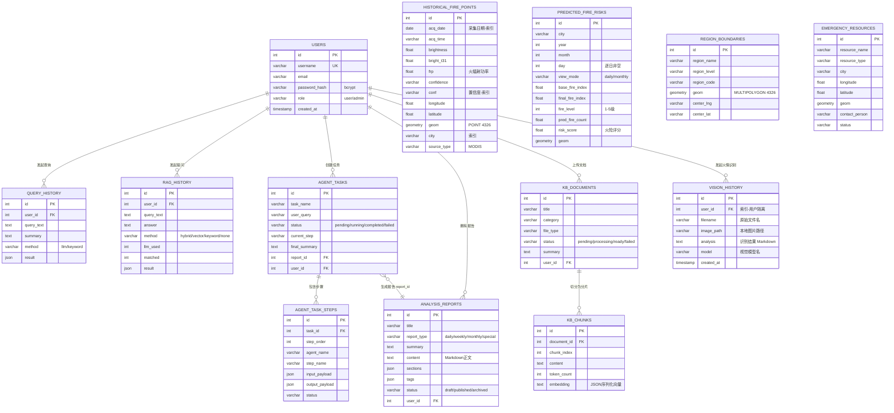

### 5.2 逻辑设计 —— 表清单

数据库共 **13 张业务表**（另含 PostGIS 系统表 `spatial_ref_sys`）：

| 分类 | 表名 | 说明 | 数据规模 |
|---|---|---|---|
| 业务数据 | `historical_fire_points` | 历史火点（NASA FIRMS MODIS 云南） | **5411 条** |
| 业务数据 | `predicted_fire_risks` | 预测火险（GTWR 模型，逐日+逐月） | 2025—2026 全量 |
| 业务数据 | `region_boundaries` | 16 州市行政边界（MULTIPOLYGON） | 16 条 |
| 业务数据 | `emergency_resources` | 应急资源（消防站/物资点，预留） | 待导入 |
| 平台数据 | `users` | 用户表 | 按注册增长 |
| 平台数据 | `query_history` | 智能查询历史（按用户+查询文本去重） | 按使用增长 |
| 平台数据 | `rag_history` | RAG 问答历史 | 按使用增长 |
| 平台数据 | `agent_tasks` | Agent 任务 | 按使用增长 |
| 平台数据 | `agent_task_steps` | Agent 任务步骤（一对多） | 按使用增长 |
| 平台数据 | `analysis_reports` | 分析报告（Markdown 正文） | 按使用增长 |
| 平台数据 | `kb_documents` | 知识库文档 | 按上传增长 |
| 平台数据 | `kb_chunks` | 知识库分片（含 embedding） | 按上传增长 |
| 平台数据 | `vision_history` | AI 火情识别历史（图片路径 + Markdown 识别结果） | 按识别增长 |

### 5.3 关键表结构说明

#### （1）historical_fire_points（历史火点表）

| 字段 | 类型 | 注释 |
|---|---|---|
| id | int4 PK | 自增主键 |
| acq_date | date NOT NULL | 采集日期（索引） |
| acq_time | varchar(8) | 采集时间 |
| daynight | varchar(4) | 昼/夜 |
| brightness | float8 | 亮度温度 K |
| bright_t31 | float8 | 31 波段亮度 |
| frp | float8 | 火辐射功率 MW |
| confidence / conf | varchar(20) | 置信度（索引列，查询过滤） |
| longitude / latitude | float8 NOT NULL | 经纬度 |
| geom | geometry(POINT, 4326) | 空间几何 |
| province / city | varchar(50) | 省市（city 建索引） |
| source_type | varchar(20) | 数据来源（MODIS） |

#### （2）predicted_fire_risks（预测火险表）

| 字段 | 类型 | 注释 |
|---|---|---|
| city | varchar(50) NOT NULL | 城市 |
| year / month / day | int4 | 年/月/日（逐月模式 day 为 NULL） |
| view_mode | varchar(10) NOT NULL | daily / monthly 双视图 |
| base_fire_index / final_fire_index | float8 | 基础/最终火险指数 |
| fire_level | int4 | 火险等级 1—5 |
| pred_fire_count / pred_fire_risk | float8 | 预测火点数 / 预测火险值 |
| risk_score | float8 | 风险评分（排序主字段） |

#### （3）agent_tasks / agent_task_steps（任务与步骤）

`agent_tasks 1 — N agent_task_steps`（级联删除）；`agent_tasks N — 1 analysis_reports`（report_id 外键）。步骤表以 JSON 记录每个 Agent 的输入/输出 payload，完整支撑前端"执行过程摘要"与回放。

#### （4）kb_documents / kb_chunks（文档与分片）

`kb_documents 1 — N kb_chunks`。分片表 `embedding` 字段当前以 JSON 序列化文本存储（升级 pgvector VECTOR(1024) 预留），`chunk_index` 记录切分顺序，`token_count` 记录分片 token 数。

#### （5）vision_history（AI 火情识别历史表）

| 字段 | 类型 | 注释 |
|---|---|---|
| id | int PK | 自增主键 |
| user_id | int（索引） | 归属用户，普通用户仅可见自己的识别记录 |
| filename | varchar(255) | 上传的原始文件名 |
| image_path | varchar(512) | 本地存储文件名（`data/vision_uploads/` 下 uuid 命名） |
| analysis | text | 视觉模型识别结果（Markdown：火情判定/场景/严重程度/处置建议） |
| model | varchar(64) | 使用的视觉模型（如 qwen-vl-plus） |
| created_at | timestamp | 识别时间 |

---

## 6. 后端详细设计与实现

### 6.1 应用入口与生命周期（main.py）

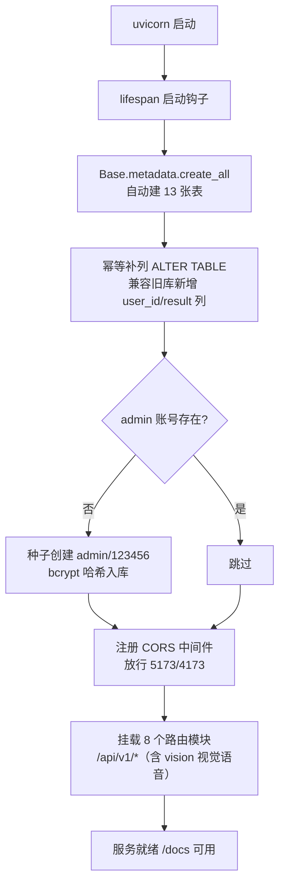

### 6.2 API 接口总表

统一响应格式：`{ code, message, data }`。

| 模块 | 方法 | 路径 | 说明 |
|---|---|---|---|
| 认证 | POST | `/api/v1/auth/register` | 注册（查重 + bcrypt + JWT，注册即登录） |
| 认证 | POST | `/api/v1/auth/login` | 登录（JWT HS256，24h 有效） |
| 认证 | GET | `/api/v1/auth/me` | 当前用户信息（Bearer） |
| 大屏 | GET | `/api/v1/dashboard/history-fires` | 历史火点（日期/城市/置信度/分页，上限 5000） |
| 大屏 | GET | `/api/v1/dashboard/predict-risks` | 预测火险（年/月/日/daily\|monthly/城市） |
| 大屏 | GET | `/api/v1/dashboard/summary` | 摘要统计（总数/高置信/平均 FRP/Top5 城市） |
| 查询 | POST | `/api/v1/query/parse` | 仅解析意图（LLM/关键词） |
| 查询 | POST | `/api/v1/query/execute` | 解析 + 执行 + 四维结果 + 历史落库 |
| 查询 | GET | `/api/v1/query/history` | 当前用户查询历史（鉴权隔离） |
| 查询 | DELETE | `/api/v1/query/history/{id}` | 删除单条历史 |
| 知识库 | POST | `/api/v1/rag/ask` | RAG 问答（回答 + 引用 + llm_used） |
| 知识库 | GET | `/api/v1/rag/history` | 问答历史 |
| 知识库 | DELETE | `/api/v1/rag/history/{id}` | 删除问答历史 |
| 知识库 | POST | `/api/v1/rag/documents` | 上传文档（multipart） |
| 知识库 | GET | `/api/v1/rag/documents` | 文档列表（用户隔离） |
| 知识库 | DELETE | `/api/v1/rag/documents/{id}` | 删除文档（文件 + 分片级联） |
| Agent | POST | `/api/v1/agent/tasks` | 创建并执行任务（LangGraph 全流程 + 报告落库） |
| Agent | GET | `/api/v1/agent/tasks` | 任务列表 |
| Agent | GET | `/api/v1/agent/tasks/{task_id}` | 任务详情（执行步骤 + 报告内容，历史回放） |
| Agent | DELETE | `/api/v1/agent/tasks/{task_id}` | 删除任务（级联步骤） |
| Agent | GET | `/api/v1/agent/status` | 5 个 Agent 运行状态 |
| 报告 | GET | `/api/v1/reports/list` | 列表（分页 + 类型筛选） |
| 报告 | GET | `/api/v1/reports/{id}` | 详情（Markdown 正文） |
| 报告 | POST | `/api/v1/reports/generate` | 生成/保存报告 |
| 报告 | DELETE | `/api/v1/reports/{id}` | 删除报告 |
| 报告 | GET | `/api/v1/reports/export/{id}?format=md\|html` | 导出（md 附件 / HTML 打印模板） |
| 管理 | GET | `/api/v1/admin/status` | 运行状态总览（登录） |
| 管理 | GET | `/api/v1/admin/config` | 当前配置（**脱敏**显示） |
| 管理 | POST | `/api/v1/admin/config` | 更新配置（**写 .env 热生效**） |
| 管理 | POST | `/api/v1/admin/test/db` | 数据库连接测试（SELECT 1） |
| 管理 | POST | `/api/v1/admin/test/llm` | LLM 连接测试（真实 invoke） |
| 管理 | GET | `/api/v1/admin/logs` | 系统日志（环形缓冲 200 条） |
| 管理 | GET | `/api/v1/admin/users` | 用户列表（**管理员**） |
| 管理 | PUT | `/api/v1/admin/users/{id}/role` | 修改角色（防自改，**管理员**） |
| 管理 | DELETE | `/api/v1/admin/users/{id}` | 删除用户（防自删，**管理员**） |
| 管理 | GET | `/api/v1/admin/llm/models?provider=` | 提供商可用模型列表 + 百炼免费额度目录（5 大类）+ 密钥概况 |
| 视觉 | POST | `/api/v1/vision/analyze` | **火情图像识别**（qwen-vl 多模态，结果落库 vision_history） |
| 视觉 | GET | `/api/v1/vision/history` | 识别历史列表（用户隔离） |
| 视觉 | GET | `/api/v1/vision/history/{id}` | 识别历史详情 |
| 视觉 | DELETE | `/api/v1/vision/history/{id}` | 删除识别记录（连同本地图片） |
| 视觉 | GET | `/api/v1/vision/image/{id}` | 识别图片鉴权流（blob 响应） |
| 语音 | POST | `/api/v1/vision/audio/transcriptions` | **语音识别 ASR**（wav → 文本，qwen3-asr-flash） |
| 语音 | POST | `/api/v1/vision/audio/speech` | **语音合成 TTS**（文本 → wav 音频流，qwen3-tts-flash） |
| 其他 | GET | `/` `/health` `/docs` | 服务信息 / 健康检查 / Swagger |

### 6.3 认证与安全设计（security.py）

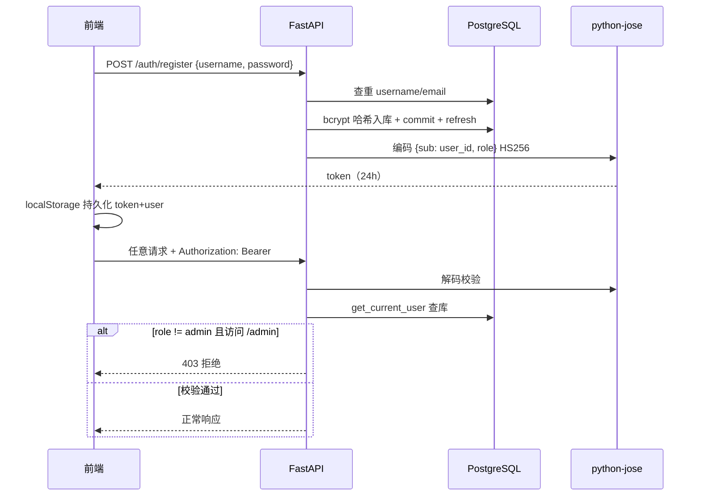

安全要点：

1. **密码安全**：bcrypt 哈希（数据库不存明文）；
2. **JWT_SECRET 环境化**：密钥置于 `.env`，不入源码仓库；
3. **双重防护**：前端路由守卫（体验）+ 后端依赖注入 `get_current_user / get_current_admin`（安全）；
4. **用户数据隔离**：查询历史 / 问答历史 / 文档 / 报告 / 任务均按 `user_id` 过滤，普通用户互不可见。

### 6.4 智能查询模块（query.py + QueryService）

**双引擎意图识别流程**：

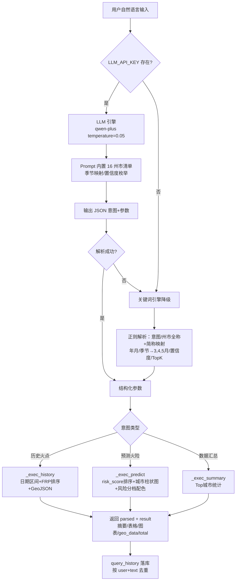

**关键实现细节**：

- **州市简称映射**："普洱"→"普洱市"、"版纳"→"西双版纳傣族自治州"；
- **GeoJSON 生成器**：通用字段推断 + 风险分档配色（≥0.8 红 / ≥0.6 橙 / ≥0.4 黄 / ≥0.2 绿 / 其余青），与前端 `riskLevel.js` 同源；
- **历史去重**：同一用户重复查询仅更新时间与摘要，不产生重复条目。

### 6.5 RAG 知识库模块（rag.py + RagService）

**文档处理流水线**：

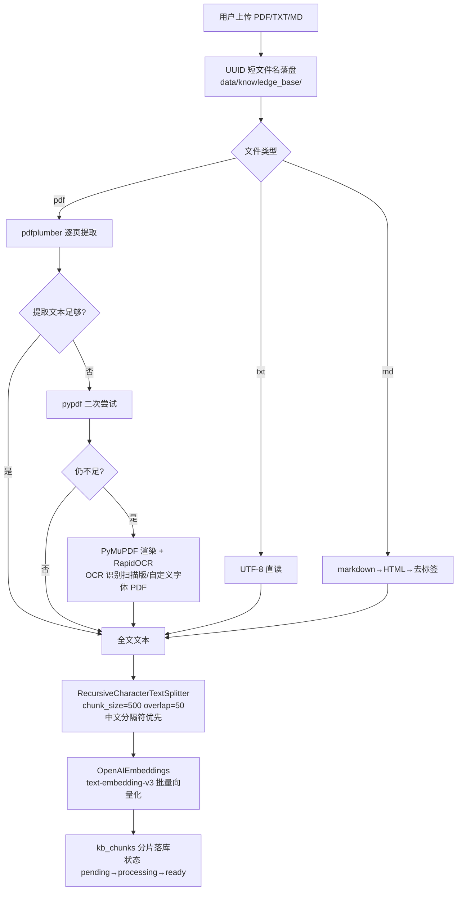

**混合检索算法（hybrid）**：

```
1. 中文分词（jieba 风格切词，停用词过滤）
2. 向量通道：问题 embedding 与分片 embedding 余弦相似度
3. 关键词通道：分片命中计数打分（2 字词优先加权）
4. 加权融合 score = α·cos_sim + β·keyword_score → 归一化
5. 取 Top-K（默认 5）分片
6. LLM 生成回答：Prompt 要求必须引用来源编号；
   未检索到匹配文档时明确声明"知识库中无相关内容"
```

### 6.6 多 Agent 协作模块（agent.py + OrchestratorAgent）

**LangGraph StateGraph 状态机**：

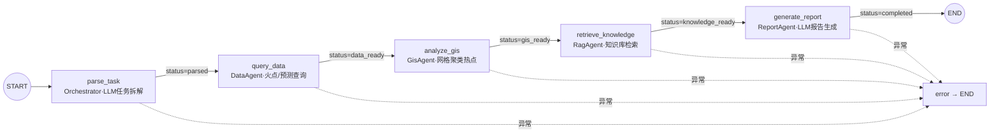

**全局状态定义（TypedDict）**：

```python
class AgentState(TypedDict):
    user_query: str          # 用户原始任务
    parsed_intent: dict      # 拆解后的子任务计划
    data_results: dict       # DataAgent 查询结果
    gis_results: dict        # GIS 热点聚类结果
    knowledge_results: list  # 知识库检索分片
    report: str              # 生成的 Markdown 报告
    status: str              # 状态机驱动流转
    steps: list[dict]        # 步骤日志（前端流水线动画数据源）
    error: str | None
```

**五个 Agent 职责分工**：

| Agent | 框架 | 职责 |
|---|---|---|
| **Orchestrator** | LangGraph | LLM 把用户需求拆解为子任务 JSON 数组；驱动整张状态图；无 LLM 时默认单步计划 |
| **DataAgent** | LangChain Tool | 封装 FireRepository：历史火点条件查询 + 聚合统计 |
| **GisAgent** | Shapely/GeoPandas | 0.1° 经纬度网格聚类：统计每格火点数与平均 FRP，≥2 火点判定热点，Top20 排序；缓冲区分析预留 |
| **RagAgent** | LangChain RAG | 委托 RagService 混合检索，返回引用来源 |
| **ReportAgent** | LangChain LLM | 将 data_results/gis_results/knowledge_results 注入 Prompt，生成五段式 Markdown 报告（概述/数据分析/风险区域识别/处置建议/参考依据），自动追加系统开发者署名；无 LLM 时模板兜底 |

**任务执行落库时序**：

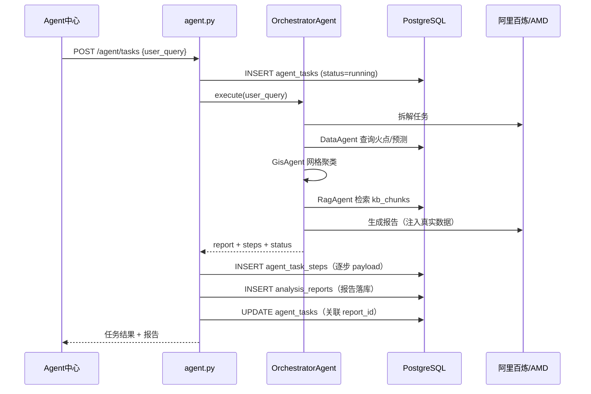

### 6.7 报告模块（report.py + ReportRepository）

- 导出 `format=md`：`text/markdown` 附件直接下载；
- 导出 `format=html`：Python `markdown` 库（extra/sane_lists/fenced_code 扩展）转 HTML → 套**内联样式打印模板**（中文字体、A4 友好、`@media print` 分页控制）→ 浏览器打印可另存 PDF；
- 普通用户仅能访问自己的报告（admin 可见全部）。

### 6.8 系统管理模块（admin.py）

**配置热生效机制**：

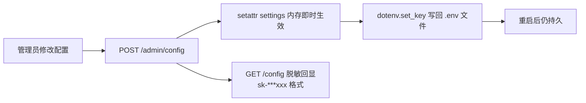

- **敏感信息脱敏**：API Key 前 3 后 3 保留，数据库 URL 只显示 `@` 之后部分；
- **系统日志**：`log_system_event()` 内存环形缓冲（插入头部，超 200 弹出尾部），Agent 任务/配置变更/角色变更/删除用户/连接测试全程留痕；
- **LLM 提供商动态切换**：`ACTIVE_LLM_PROVIDER` 支持 aliyun / amd / ollama 三提供商在线切换，无需重启；AMD 模型名与 `/models` 端点精确匹配（DeepSeek-V4-Flash / Qwen3.8-Flash-Next），Qwen3.8 使用前进行时间窗口校验（YYYY-MM-DD HH:MM:SS 格式）；**Embedding 恒定使用阿里百炼 text-embedding-v3**，不受 Chat 提供商影响。

### 6.9 LLM 多提供商路由（core/llm.py）

```
get_llm() ─── ACTIVE_LLM_PROVIDER（Chat，可在线切换）
   ├─ aliyun → ChatOpenAI(base_url=百炼兼容端点, model=qwen-plus)
   ├─ amd    → ChatOpenAI(base_url=AMD端点, model=DeepSeek-V4-Flash)
   │            └─ Qwen3.8-Flash-Next 需通过时间窗口校验
   └─ ollama → ChatOpenAI(base_url=localhost:11434/v1, model=qwen2.5:7b)

get_embedding()   ─── 恒定阿里百炼 text-embedding-v3（与 Chat 提供商解耦）
get_vision_llm()  ─── 恒定阿里百炼 VISION_MODEL（qwen-vl-plus，多模态消息）
transcribe_audio()─── 恒定阿里百炼 ASR_MODEL（chat/completions + input_audio data URI）
synthesize_speech()── 恒定阿里百炼 TTS_MODEL（原生 multimodal 端点，返回 wav）
list_provider_models() → 调用各提供商 /models 端点校验 Key 可用模型
```

### 6.10 数据导入脚本（scripts/）

| 脚本 | 功能 | 数据量 |
|---|---|---|
| `init_db.py` | 启用 PostGIS 扩展 + 建全部表 | — |
| `import_fire_points.py` | Yunnan_fire.json → historical_fire_points（含 geom 构建） | 5411 条 |
| `import_predict_risks.py` | 逐日/逐月 JSON → predicted_fire_risks | 2025—2026 全量 |
| `import_region_boundaries.py` | Yunnan_border.json → region_boundaries（SRID=4326） | 16 州市 |
| `run_all_imports.py` | 一键全量导入（建表→边界→火点→预测，支持自定义路径与耗时统计） | — |

### 6.11 视觉与语音模块（media.py · /api/v1/vision）

系统新增的多模态交互模块，**模型恒定使用阿里百炼**（VISION_MODEL / ASR_MODEL / TTS_MODEL），不受 ACTIVE_LLM_PROVIDER 切换影响。

#### （1）AI 火情图像识别

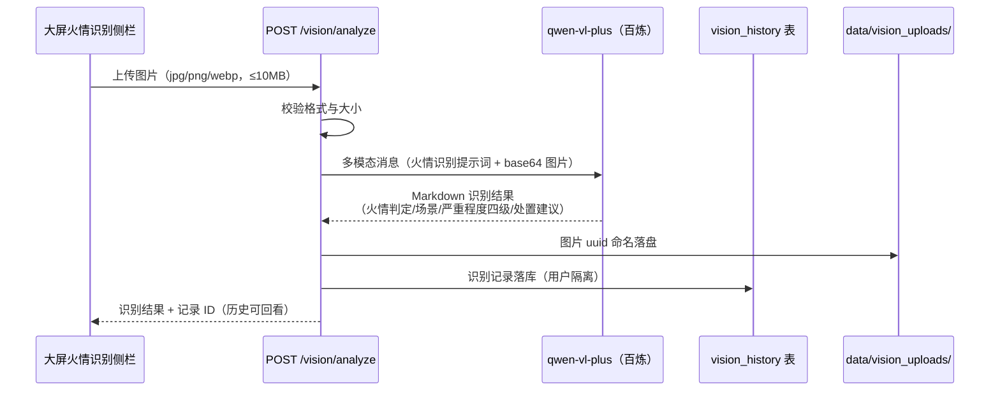

- **专业提示词**：内置森林火灾监测专家角色，输出火情判定（明火/烟雾/无异常）、场景描述、严重程度（轻微/中等/严重/危急四级）、处置建议四段结构化结论；图片与火灾无关时明确标注"非火情场景"；
- **识别历史**：列表/详情/删除接口均带用户数据隔离；图片通过 `GET /image/{id}` 鉴权流加载（前端 blob → objectURL）；
- **降级**：未配置 API Key 时返回友好提示，不抛异常。

#### （2）语音识别（ASR）与语音合成（TTS）

| 能力 | 端点 | 模型 | 关键实现细节 |
|---|---|---|---|
| 语音识别 | `POST /audio/transcriptions` | qwen3-asr-flash | 走百炼 OpenAI 兼容 `chat/completions`，音频以 **data URI** 格式嵌入 `input_audio`（裸 base64 会报"URL 无效"）；支持 wav/mp3/opus/aac/amr，≤20MB |
| 语音合成 | `POST /audio/speech` | qwen3-tts-flash | 走百炼**原生** `/api/v1/services/aigc/multimodal-generation/generation` 端点（兼容模式无 /audio/speech），必传 `voice` 参数（Cherry），响应返回音频 URL 再下载为 wav 流；文本限 500 字 |

> 前端录音为浏览器 MediaRecorder 输出的 webm 容器（ASR 不支持），故采用 Web Audio API 采集 PCM 并**纯前端编码 WAV**（详见 8.5 专题）。

---

## 7. 前端详细设计与实现

### 7.1 路由与权限设计（router/index.js）

| 路由 | 页面 | 权限 | 说明 |
|---|---|---|---|
| `/login` | 登录/注册 | 公开 | 双模式切换，登录后按 `?redirect=` 回跳 |
| `/dashboard` | 作战大屏 | 登录 | 默认首页 |
| `/smart-query` | 智能查询 | 登录 | 自然语言查询 |
| `/knowledge-base` | 知识库 | 登录 | RAG 问答 |
| `/agent-center` | Agent 协作中心 | 登录 | 多 Agent 任务 |
| `/report-center` | 报告中心 | 登录 | 报告管理 |
| `/admin` | 系统管理 | **仅 admin** | 路由守卫 + 菜单过滤双重控制 |

**守卫逻辑**：未登录访问任何受保护页面 → 重定向 `/login`（携带 redirect）；非 admin 访问 `/admin` → 警告并跳回 `/dashboard`。

### 7.2 主布局（MainLayout.vue）

- 48px 超窄侧边栏（iconfont 矢量图标 + hover 提示）；
- **权限菜单过滤**：`系统管理` 配置 `adminOnly`，仅 admin 角色渲染；
- 底部用户头像（首字母）+ 退出登录。

### 7.3 作战大屏（dashboard/index.vue，约 2167 行）

**数据流设计**：

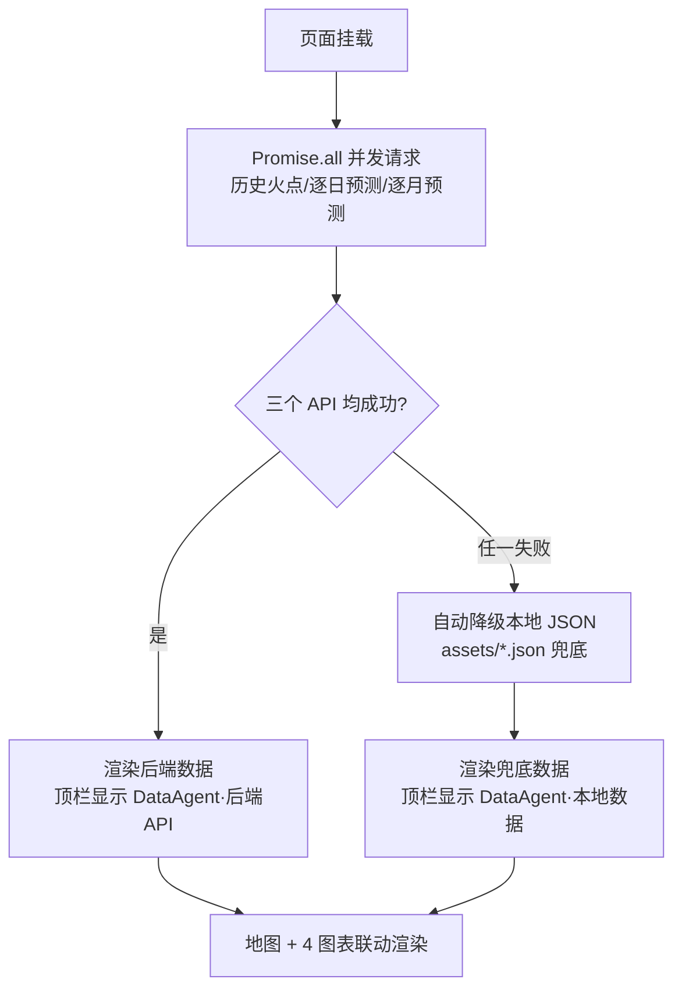

**页面功能清单**：

| 区域 | 功能 | 技术实现 |
|---|---|---|
| 中央地图 | 天地图底图、火点聚合（Cluster）、点击聚合弹出 el-drawer 详情、热力图（webgl-heatmap）、16 州市边界、多边形/线绘制量测（Turf.js 面积/距离）、地图导出 PNG | OpenLayers 10 |
| **左侧 AI 火情识别侧栏** | 可折叠（34px 竖排折叠条 ↔ 310px 展开面板）：拖拽上传火场照片 → 视觉模型识别 → 结果 **Markdown 渲染**（判定/场景/严重程度/处置建议）→ **🔊 语音播报**；识别历史列表（文件名/时间/模型）点击回看（鉴权图片流），单条删除 | VisionAgent 可视化 |
| 左上图表 | 历史火险等级分布 | ECharts（GIS 暗色主题） |
| 左下图表 | 历史火点频次 | ECharts |
| 右上图表 | 预测火险预警占比 | ECharts |
| 右下图表 | 预测火险分布 | ECharts |
| 顶栏 | 实时时钟、高德天气 API、逐日/逐月视图切换；**DataAgent 管线状态与天气垂直堆叠**（同一列两行，避免挤压左侧按钮） | clock.vue / moment |
| 数据状态 | **DataAgent 数据管线状态**（后端 API / 本地降级 / 同步中） | Agent 可视化设计 |
| 等级配色 | 5 级火险颜色/文案统一 `utils/riskLevel.js`（与后端分档一致） | 单一权威来源 |

### 7.4 智能查询页（smart-query/index.vue）

**核心交互流程**：

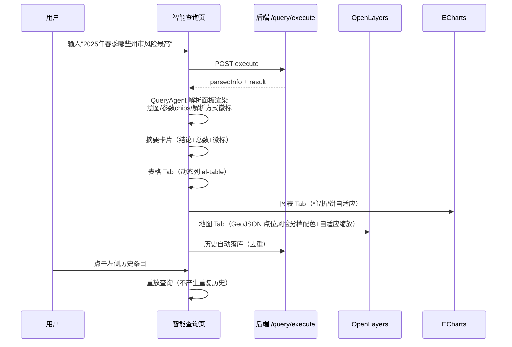

- 输入区：textarea + Ctrl+Enter 快捷执行 + 4 个示例查询标签 + **🎤 语音输入**（录音 → ASR 识别 → 自动执行查询）；
- **四维结果联动**：摘要 / 表格 / 图表 / 地图 四个 Tab；摘要卡支持 **🔊 语音播报**（摘要 + 记录数，MD 转纯文本）；
- 查询历史侧栏：点击标题栏展开/折叠（48px ↔ 220px 平滑过渡）、单条删除（`@click.stop` 防误触）、LLM/关键词解析方式标注。

### 7.5 知识库页（knowledge-base/index.vue）

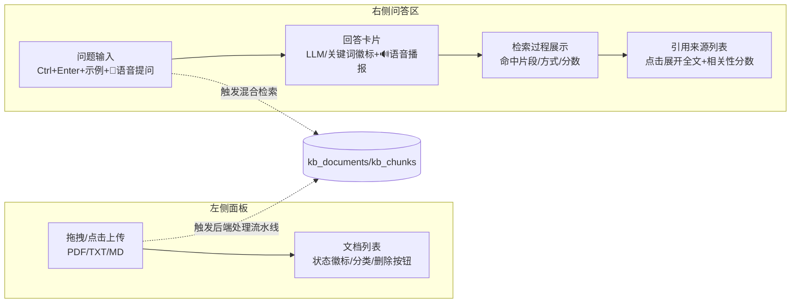

- 左侧面板展开/折叠：56px ↔ 280px；
- **语音交互**：🎤 识别完成后自动提交提问；🔊 播报 RagAgent 回答全文；
- 每条文档/历史右侧常显删除按钮（确认弹窗）。

### 7.6 Agent 协作中心（agent-center/index.vue）

**页面结构**：

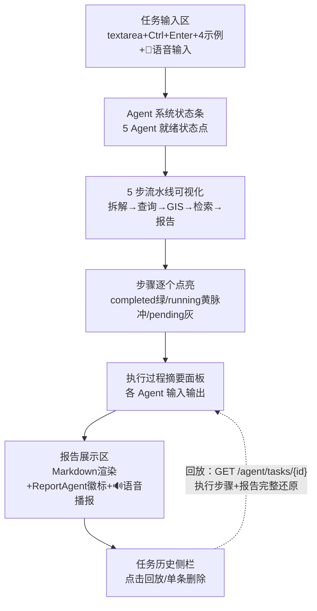

- 历史侧栏展开/折叠：56px ↔ 260px；
- **历史回放完整链路**：点击历史任务 → 本地缓存 → `GET /agent/tasks/{task_id}` 拉取持久化执行步骤（agent_task_steps 表）与关联报告 → 报告中心兜底，"Agent 执行过程"面板完整还原；
- **语音交互**：🎤 识别完成后自动执行任务；🔊 播报分析报告（MD 转纯文本）。

### 7.7 报告中心（report-center/index.vue）

- **左侧列表面板**（60px ↔ 340px 折叠）：类型筛选（全部/日报/周报/月报/专项）+ 分页 + 类型徽标/标签/摘要（2 行截断）+ 单条删除；
- **右侧详情**：头部徽标 + Markdown 正文渲染 + **五种操作**（🔊 语音播报（摘要+正文）/ Markdown blob 下载 / HTML 文件 / 打印另存 PDF / 删除）；
- **ReportAgent 徽标**：Agent 自动生成的报告在列表与详情中标识来源。

### 7.8 系统管理页（admin/index.vue，仅管理员，6 Tab）

| Tab | 功能要点 |
|---|---|
| 系统总览 | 版本、数据库状态、LLM 可用性、模型名、5 Agent 状态卡片（空值兜底防白屏） |
| 数据源 | 数据库地址（脱敏）+ 连接测试即时反馈 |
| 模型接入 | LLM 提供商切换（aliyun/amd/ollama）、API Key（脱敏 `sk-***xxx`）、Embedding 配置、RAG 分块参数；保存即写 .env 热生效 + LLM 真实 invoke 测试；**百炼免费额度模型目录**：获取 `/models` 实时校验可用性（249+），5 大类 Tab（大语言/视觉/全模态/语音/向量，35 个免费额度模型），按"免费优先→有效期长→当前使用→已验证"排序，密钥概况卡（Key 脱敏/当前模型/控制台直达/高校权益入口），全类型模型一键「使用」切换（写 .env 热生效） |
| Agent 参数 | 编排温度 / 报告温度 / 最大 Agent 数（内存态即时生效） |
| 系统日志 | 环形缓冲 200 条：Agent 任务/配置变更/用户管理/连接测试 |
| 用户管理 | 用户列表、角色修改（user↔admin，防自改）、删除用户（防自删） |

- 统一 `authFetch` 封装：自动附 Bearer，401 自动登出回登录页。

### 7.9 前端公共技术设计

| 机制 | 实现 |
|---|---|
| API 请求 | `utils/authFetch.js`：自动 JWT + 401 拦截；Vite 代理 `/api → 8000` |
| 状态管理 | Pinia auth store + localStorage 持久化 |
| UI 一致性 | 左侧面板"点击标题栏展开/折叠"交互在知识库/Agent/报告/查询四页统一；删除按钮常显 + `@click.stop` |
| 主题 | `style/gis-theme.css` 暗色科技风 + ECharts GIS 主题复用 |
| 等级同源 | `utils/riskLevel.js` 与后端 `utils/risk_level.py` 分档完全一致 |
| 地图导出 | Canvas `willReadFrequently` patch + downLoad 工具 |

---

## 8. 核心技术专题

### 8.1 LLM 全面降级策略（系统永不崩溃设计）

所有 LLM 依赖点检测 `llm_available()`（LLM_API_KEY 是否有值），无 Key 或调用异常自动降级：

| 模块 | 完整模式（有 Key） | 降级模式（无 Key/异常） |
|---|---|---|
| 智能查询 | LLM 意图识别（JSON 输出） | 关键词正则解析（意图/城市/年月/季节/TopK） |
| Agent 任务拆解 | LLM 动态生成子任务计划 | 默认单步计划 |
| 报告生成 | LLM 五段式专业报告 | 固定模板报告（含提示语） |
| RAG 问答 | LLM 引用来源回答 | 混合检索结果直接返回 |
| 火情图像识别 | 视觉模型四段结构化识别 | 返回友好提示（未配置 Key/模型），不抛异常 |
| 语音识别/合成 | ASR 转文本 / TTS 转 wav 播报 | 前端按钮隐藏或提示"未配置"，核心流程不受影响 |
| 大屏数据 | 后端 API | 前端本地 JSON 兜底 |

### 8.2 Agent 风味贯穿全系统

不只是 Agent 中心，全系统每个 AI 能力都"看得见 Agent"：

| 页面 | Agent 可视化 |
|---|---|
| 作战大屏 | **DataAgent 数据管线状态**（后端 API / 本地降级 / 同步中）；**VisionAgent 火情识别侧栏**（视觉模型识别过程与历史回看） |
| 智能查询 | **QueryAgent 解析过程**（意图 / 结构化参数 chips / 解析方式徽标） |
| 知识库 | **RagAgent 检索过程**（命中片段 / 检索方式 / 相关性分数） |
| Agent 中心 | 5 Agent 流水线 + 执行过程摘要 |
| 报告中心 | **ReportAgent 生成徽标** |

### 8.3 扫描版 PDF 的四层文本提取兜底

针对 GB/T 36743-2018 等自定义字体编码 PDF（常规提取乱码）设计降级链：

```
pdfplumber 逐页提取 → pypdf 二次尝试 → PyMuPDF 文本层 → RapidOCR 图像识别
```

PyMuPDF 高分辨率渲染每页为图像，RapidOCR（onnxruntime）离线识别中文，最终成功提取扫描版国家标准文本入库。

### 8.4 报告资产沉淀闭环

```
Agent 任务执行 → 报告自动落库 analysis_reports
→ 报告中心统一检索（类型筛选/分页）
→ 导出 Markdown / HTML（内联样式打印模板）/ 打印存 PDF
```

每份报告自动追加系统开发者署名（系统名称、开发者、邮箱、前后端源码地址）。

### 8.5 全链路语音交互（speech.js · 纯前端 WAV 编码）

**为什么需要纯前端编码 WAV**：浏览器 `MediaRecorder` 录音输出 webm/opus 容器，而百炼 ASR 仅支持 wav/mp3/opus/aac/amr 裸格式，故放弃 MediaRecorder，改用 **Web Audio API** 自行采集与编码：

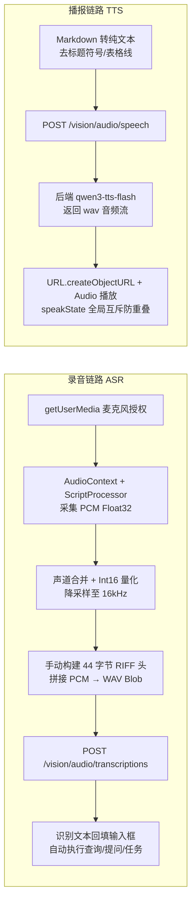

- **统一封装**：`utils/speech.js` 导出 `startRecord / recordState / speakText / speakState / cleanupSpeech`，五个页面（大屏/查询/知识库/Agent/报告）共用一套状态与 UI（🎤 录音中红点脉冲 / 🔊 播报中可再次点击停止）；
- **页面组件卸载时 `cleanupSpeech()`** 释放麦克风与音频资源，防止后台占用；
- **播报内容自适应**：查询播摘要、RAG 播回答全文、Agent/报告播 Markdown 转纯文本、火情识别播识别结论。

---

## 9. 系统部署与运行

### 9.1 运行环境

| 组件 | 要求 |
|---|---|
| 操作系统 | Windows / Linux / macOS |
| Python | 3.10+（推荐 conda 独立环境） |
| Node.js | 18+（推荐 20） |
| 数据库 | PostgreSQL 14+ 并启用 PostGIS 扩展 |
| 网络 | 需访问阿里百炼 / AMD 端点（离线可切 Ollama） |

### 9.2 后端启动步骤

```bash
# 1. 创建并激活环境
conda create -n fire_agent_back python=3.10
conda activate fire_agent_back

# 2. 安装依赖
cd fire_agent_back
pip install -r requirements.txt

# 3. 配置 .env（见 9.4）

# 4. 准备数据库（需已启用 PostGIS 并创建 fire_agent 库）
python scripts/run_all_imports.py   # 建表 + 导入 5411 火点/16 边界/预测数据

# 5. 启动服务
uvicorn app.main:app --reload --port 8000
```

- Swagger 文档：`http://localhost:8000/docs`
- 首次启动自动建表 + 创建默认管理员 `admin / 123456`

### 9.3 前端启动步骤

```bash
cd fire_agent_front
npm install
npm run dev          # http://localhost:5173
```

### 9.4 .env 配置说明（后端根目录）

```env
# 数据库（需已启用 PostGIS）
DATABASE_URL=postgresql://postgres:密码@localhost:5432/fire_agent

# JWT 密钥（生产环境务必修改）
JWT_SECRET=自定义强密钥

# 高德地图（天气 API）
AMAP_KEY=你的key

# 活跃 LLM 提供商 aliyun | amd | ollama
ACTIVE_LLM_PROVIDER=aliyun

# 阿里百炼（Chat + Embedding）
LLM_API_KEY=sk-xxxxxxxx
LLM_API_BASE=https://dashscope.aliyuncs.com/compatible-mode/v1
LLM_MODEL=qwen-plus
EMBEDDING_MODEL=text-embedding-v3

# 视觉 / 语音模型（恒定百炼，不受 ACTIVE_LLM_PROVIDER 影响）
VISION_MODEL=qwen-vl-plus
ASR_MODEL=qwen3-asr-flash
TTS_MODEL=qwen3-tts-flash

# AMD GPU Cloud（备选 Chat 提供商）
AMD_API_KEY=你的key
AMD_API_BASE=https://developer.amd.com.cn/radeon/v1
AMD_MODEL=DeepSeek-V4-Flash

# Qwen3.8-Flash-Next 可用时间窗口（YYYY-MM-DD HH:MM:SS，空 = 不限）
QWEN3_8_FLASH_START=
QWEN3_8_FLASH_END=

# 本地 Ollama（离线备选）
OLLAMA_API_BASE=http://localhost:11434/v1
OLLAMA_MODEL=qwen2.5:7b

# RAG 知识库
KB_UPLOAD_DIR=data/knowledge_base
KB_CHUNK_SIZE=500
KB_CHUNK_OVERLAP=50
KB_TOP_K=5
```

> 模型配置也可不写 .env，直接在「系统管理 → 模型接入」页在线填写，保存即写入 .env 并热生效（脱敏回显）。

---

## 10. 系统特色与创新点

1. **从纯前端大屏到前后端分离多 Agent 平台的完整演进**：前端 GIS 资产（1631 行大屏 + OpenLayers + 4 图表）全部继承复用，后端全新构建 6 层架构，完整呈现"数据可视化系统 → 智能决策平台"升级路径。
2. **LangGraph StateGraph 状态机驱动的多 Agent 编排**：TypedDict 全局状态 + 5 节点 + 条件边（should_continue）控制流转，`steps` 日志直接驱动前端流水线动画，工程闭环完整。
3. **LLM + 关键词双引擎 + 全面降级策略**：拔掉 API Key 系统依然完整可演示，答辩/生产双场景零风险。
4. **自然语言 → 数据库 → 地图全链路联动**："2025 年春季哪些州市风险最高"一句话 → LLM 解析 → SQL 查询 → 摘要/表格/ECharts/OpenLayers 地图（风险分档配色与前端同源）四维联动。
5. **RAG 知识库全流程**：四层 PDF 文本提取兜底（含 OCR 扫描版）→ 中文感知切分 → embedding 向量化 → 混合检索（分词 + 向量余弦 + 关键词加权）→ 引用来源回答。
6. **配置热生效工程化**：写 .env + setattr 内存双写，切换 LLM 提供商/改 Key 无需重启；敏感信息全程脱敏。
7. **用户数据隔离与安全细节**：JWT 双重防护、bcrypt、防自改/自删、查询历史按 user+text 去重、普通用户历史/报告/文档完全隔离。
8. **报告资产沉淀闭环**：Agent 分析 → 自动落库 → 统一检索 → 多格式导出，每份报告含开发者署名与数据来源声明。
9. **多模态视觉 + 全链路语音交互**：qwen-vl 火情图像识别（四段结构化结论 + 历史回看）与 ASR/TTS 全页面覆盖（语音输入自动执行、结果一键播报），前端纯 Web Audio API 编码 WAV 解决浏览器录音格式兼容难题；视觉/语音模型恒定百炼，与 Chat 提供商解耦。
10. **百炼免费额度模型目录**：内置 35 个免费额度模型（5 大类）与 `/models` 实时校验交叉比对，按"免费优先→有效期长→当前使用→已验证"排序，全类型模型一键切换写 .env 热生效。

---

## 11. 总结与展望

### 11.1 工作总结

本系统完成了从「云南省火险预警 GIS 可视化大屏」到「多智能体智能决策平台」的完整演进：

- **后端**：FastAPI 6 层架构、13 张数据表（含 PostGIS 空间字段与 vision_history 识别历史）、8 大路由模块、5 Agent LangGraph 编排、RAG 混合检索、三 LLM 提供商动态路由、视觉/语音多模态模块、JWT 认证与用户隔离、配置热更新；
- **前端**：Vue3 7 页面平台、OpenLayers 地图全功能、ECharts 图表体系、四页统一折叠交互、Agent 过程可视化、Markdown 报告渲染与多格式导出、AI 火情识别侧栏、全链路语音输入与播报；
- **数据**：5411 条 NASA FIRMS 实测火点、GTWR 模型 2025—2026 逐日/逐月预测、16 州市边界全量入库，一键导入脚本。

### 11.2 待优化事项（诚实清单）

| # | 问题 | 优化方向 |
|---|---|---|
| 1 | RAG 向量以 JSON 存 Text 列 | pgvector VECTOR(1024) 列 + 余弦近邻检索（依赖已装） |
| 2 | emergency_resources 表空置 | 导入消防站/物资点数据 + 大屏资源图层 |
| 3 | 部分业务接口未强制鉴权（演示期公开） | 全局 get_current_user 依赖 |
| 4 | 无自动化测试 | pytest + httpx 核心接口回归 |
| 5 | 日志仅内存态 | logging 文件轮转 / 结构化日志 |
| 6 | Alembic 未实际使用 | 生成首个 migration 基线 |

### 11.3 后续展望

- **pgvector 语义检索**：知识库升级真·向量近邻，混合 BM25 + 向量召回；
- **GIS 热区上图联动**：GisAgent 聚类结果直接渲染大屏热点图层；
- **实时数据流**：接入 FIRMS 近实时火点 feed / 气象 API 定时任务（APScheduler）；
- **报告增强**：内嵌图表快照、Word 导出、定时自动日报；
- **细粒度权限**：页面/接口级 RBAC 与操作审计；
- **部署工程化**：Docker Compose 一键起（postgres+postgis+pgvector + backend + frontend + nginx）。

---

## 附：答辩演示建议路线

1. **登录** → admin/123456 登录，展示注册入口
2. **作战大屏** → 聚合点详情、热力图、边界、绘制量测、导出 PNG、图表联动、DataAgent 状态；**左侧 AI 火情识别侧栏** → 上传火场照片 → 视觉模型识别（火情判定/严重程度/处置建议）→ 🔊 语音播报 → 历史回看
3. **智能查询** → "2025 年春季哪些州市风险最高" → LLM 解析徽标 → 表格/图表/地图四 Tab → 展开历史；可演示 🎤 语音输入自动查询 + 🔊 摘要播报
4. **知识库** → 上传防火规范 PDF → 提问 → 引用来源与相关性分数 → 删除文档
5. **Agent 中心** → 输入分析任务 → 流水线逐节点点亮 → LLM 报告 → 历史回放
6. **报告中心** → 刚生成的报告已在列表 → 导出 HTML → 打印另存 PDF
7. **系统管理**（admin）→ 切换 LLM 提供商热生效（脱敏回显）→ 连接测试 → 系统日志 → 用户管理
8. **降级演示**（加分项）→ 清空 LLM_API_KEY → 智能查询/Agent 任务依然可用（关键词引擎 + 模板报告）

---

*本文档基于 fire_agent_back / fire_agent_front 当前代码库实际实现编写，作为毕业论文整体实现章节素材与项目交付说明。*
