# 基于多智能体协同的森林火险智能分析与预警平台设计与实现

> 论文类型：本科毕业设计（软件工程方向） · 成果系统：焰哨（FlameSentry）森林火险智能分析与预警平台
> 说明：本文以真实可运行的系统为事实依据撰写，全部插图源文件保存于 docs/puml 目录，系统界面截图保存于 docs/images 目录。

## 摘  要

森林火灾是我国破坏性最强的自然灾害之一，云南省地处干热河谷与横断山脉交错地带，冬春季节干旱少雨，长期位居全国森林火险高发区前列。传统火险信息化系统以"被动展示"为主，普遍存在查询门槛高、领域知识分散、分析依赖人工、报告标准不一等问题，难以支撑快速决策。针对上述问题，本文设计并实现了一个基于多智能体协同的森林火险智能分析与预警平台，将自然语言交互、检索增强生成与状态图驱动的多智能体编排引入森林火险治理场景。

系统采用前后端分离架构。后端以异步接口框架为骨架，以支持空间类型的数据库承载历史火点、预测火险与行政边界数据；核心编排层由八个节点构成的状态图驱动：任务拆解节点产出结构化执行计划并约束关键步骤不可裁剪，数据查询与知识检索节点并行执行、经汇聚屏障后进入空间热点分析，报告生成节点按刚性模板产出分析报告，评审节点以低温度模型评审与确定性硬护栏双重把关，最终经人工审批闸口定稿。统一模型调用层提供指数退避重试、熔断与多提供商降级能力，保证外部模型服务不可用时系统仍可完整运行。前端基于渐进式框架与开源地图引擎实现作战大屏、智能查询、知识库问答、协作中心、报告中心与系统管理六类界面，支持实时进度推送与全链路语音交互。

系统测试从功能、接口、编排回归与安全四个维度展开：功能与接口测试覆盖全部核心业务路径，编排回归评估基于金标用例集验证任务拆解、路由与报告完成度，安全测试验证令牌鉴权与用户数据隔离。结果表明，系统在真实数据环境下运行稳定，能够自动完成"数据查询—空间分析—知识检索—报告生成"的决策闭环，为森林火险治理提供了一种可落地、可演示、可维护的工程化方案。

**关键词**：多智能体协同；森林火险；检索增强生成；状态图编排；实时交互

## Abstract

Forest fire is one of the most destructive natural disasters in China. Yunnan Province, located in the interleaving zone of dry-hot valleys and the Hengduan Mountains with a dry winter–spring climate, has long been among the most fire-prone provinces. Traditional fire-risk information systems are mostly passive dashboards, suffering from high query barriers, scattered domain knowledge, labor-intensive analysis, and inconsistent reporting. To address these problems, this thesis designs and implements an intelligent forest-fire analysis and early-warning platform based on multi-agent collaboration, introducing natural-language interaction, retrieval-augmented generation, and state-graph-driven multi-agent orchestration into forest fire management.

The system adopts a front–back separated architecture. The back end is built on an asynchronous API framework and a spatial database that stores historical fire points, predicted fire risks, and administrative boundaries. The core orchestration layer is driven by a state graph of eight nodes: a task-parsing node produces a structured execution plan with mandatory steps; the data-query node and the knowledge-retrieval node run in parallel and converge at a join barrier; the spatial analysis node clusters fire points into hotspot grids; the report node generates analysis reports following a rigid seven-section template; a review node applies both low-temperature LLM review and deterministic hard guardrails; and a human-approval gate finalizes the report. A unified LLM invocation layer provides exponential-backoff retry, circuit breaking, and multi-provider degradation, keeping the system fully functional even without external model services. The front end, based on a progressive framework and an open-source map engine, provides six interfaces including an operations dashboard, smart query, knowledge-base Q&A, agent collaboration center, report center, and system administration, with real-time progress streaming and full-chain voice interaction.

System testing covers four dimensions: functionality, interfaces, orchestration regression, and security. Functional and interface tests cover all core business paths; orchestration regression is validated on a golden case set measuring task decomposition, routing logic, and report completion; security tests verify token-based authentication and user data isolation. Results show that the system runs stably in a real-data environment, automatically closes the decision loop of "query–analysis–retrieval–reporting", and offers an engineering-feasible solution for intelligent forest fire management.

**Key words**: multi-agent collaboration; forest fire risk; retrieval-augmented generation; state-graph orchestration; real-time interaction

## 目  录

- 摘要
- Abstract
- 第1章 绪论
  - 1.1 研究背景与意义
  - 1.2 国内外研究现状
  - 1.3 研究内容与主要工作
  - 1.4 论文组织结构
- 第2章 相关技术与理论基础
  - 2.1 大语言模型技术
  - 2.2 检索增强生成技术
  - 2.3 多智能体系统与状态图编排
  - 2.4 Web 开发与空间数据技术
  - 2.5 本章小结
- 第3章 可行性分析
- 第4章 需求分析
- 第5章 系统总体设计
- 第6章 系统实现
- 第7章 系统测试与结果分析
- 第8章 总结与展望
- 参考文献
- 致谢
- 附录

# 第1章 绪论

## 1.1 研究背景与意义

森林火灾具有突发性强、蔓延速度快、破坏范围广的特点，是威胁森林资源、生态系统与人民生命财产安全的重大自然灾害。云南省地处我国西南边陲，境内横断山脉与干热河谷交错分布，冬春季节（尤其是二月至五月）干旱少雨、风大物燥，森林火险等级长期居高不下，是我国森林火灾最高发的省份之一。森林火险治理涉及火情监测、风险评估、资源调度与应急处置等多个环节，对信息系统的依赖程度日益提高。

然而，现有森林火险信息化系统多以可视化大屏与静态报表为主，业务价值存在明显瓶颈。其一，查询门槛高：业务人员若要获得"某州市某月份火险排名"这类结论，需要掌握结构化查询语言或专业地理信息系统软件，一线人员难以直接使用。其二，知识沉淀不足：防火条例、处置规范、国家标准等文档散落在本地各处，火情发生时难以及时检索到权威依据。其三，分析依赖人工：从数据查询、空间分析到撰写处置报告的完整链条均由人工完成，耗时长且质量因人而异。其四，系统割裂：数据大屏、数据查询与报告撰写分属不同工具，无法形成决策闭环。

近年来，以大语言模型为代表的人工智能技术取得突破性进展[1][2]，检索增强生成[3]使模型能够基于外部知识回答领域问题，多智能体编排技术[4][5][6]使复杂任务能够被拆解为多个智能体分工协作完成。将这些技术与地理空间数据能力结合，构建一个"自然语言驱动、多智能体分工协作、知识库增强"的森林火险智能决策平台，在技术上已经成熟，在业务上具有明确价值。

本课题的意义在于：面向云南省森林火险治理的真实场景，完成从传统可视化大屏到智能决策平台的完整演进；将自然语言作为统一交互入口，降低业务人员使用门槛；将"查询—分析—检索—报告"链条交由多个智能体自动执行，缩短决策周期；同时通过可靠性工程设计保证系统在真实环境中稳定可用，形成可答辩、可演示、可维护的完整工程成果。

## 1.2 国内外研究现状

### 1.2.1 国外研究现状

智能体（Agent）研究由来已久。Wooldridge 与 Jennings 早在二十世纪九十年代就对智能体的弱定义与强定义进行了系统阐述[7]，奠定了多智能体系统的理论基础。2017 年，Vaswani 等提出 Transformer 架构[1]，以自注意力机制建模长距离上下文依赖，成为后续大规模预训练模型的标准骨架。Brown 等于 2020 年提出 GPT-3[2]，验证了大规模语言模型少样本学习的涌现能力；Ouyang 等通过基于人类反馈的指令微调[8]显著提升了模型遵循指令的能力；Wei 等提出思维链提示[9]，增强了模型在复杂推理任务上的表现。

在模型能力外部化方面，Lewis 等提出检索增强生成框架[3]，将参数化知识与外部知识库解耦，显著降低了幻觉问题；Karpukhin 等提出的稠密段落检索[10]为向量语义检索提供了经典方案。在工具使用与自主行动方面，Yao 等提出 ReAct 范式[4]，将推理与行动交替执行；Schick 等提出 Toolformer[11]，使模型学会自主调用外部工具。在自我改进方面，Shinn 等提出 Reflexion 机制[12]，使智能体能够基于失败反馈进行反思重试。

多智能体协作方面，Park 等构建了具有记忆与反思能力的生成式智能体社会[13]；Wu 等提出 AutoGen 多智能体对话框架[14]；Hong 等提出 MetaGPT[15]，将软件公司的标准作业流程引入多智能体协作。Wang 等与 Xi 等分别对基于大语言模型的自主智能体进行了系统综述[5][6]，指出任务规划、记忆、工具使用与多智能体协作是该方向的核心议题。此外，Fielding 的表述性状态转移架构约束[16]为现代 Web 服务接口设计提供了方法论基础。

### 1.2.2 国内研究现状

国内在大语言模型及其应用方向的研究紧随国际前沿并形成自身特色。车万翔等系统论述了大模型时代自然语言处理面临的挑战、机遇与发展路径[17]，指出语言模型正在从任务专用走向通用基座；舒文韬等从原理、实现与发展三个维度对大型语言模型进行了全面梳理[18]；张钹等提出迈向第三代人工智能的技术路线[19]，强调将知识驱动与数据驱动相结合，这一思路与本文"模型推理 + 知识库检索 + 确定性护栏"的混合设计相契合。在中文信息处理基础方面，黄昌宁等对中文分词技术进行了系统回顾[20]，为本文知识库检索中的中文分词通道提供了依据。

在领域应用层面，国产大模型生态快速成熟：通义千问系列模型先后发布技术报告[21][22]，提供了开放接口与向量、多模态系列模型；DeepSeek 系列模型以低成本高性能著称[23]，并可通过云服务接口获得。空间信息领域，国产地理信息系统的理论与工程体系较为完善[24][25]，地理与时序加权回归模型（GTWR）由 Huang 等提出[26]，被广泛用于火险等时空非平稳关系的建模，本文预测火险数据即来源于基于该模型的预测结果。在火情遥感监测方面，Giglio 等发展的 MODIS 主动火点检测算法[27]是全球火点数据产品的基础，本文历史火点数据即取自其数据产品。总体来看，将大模型与多智能体技术应用于森林火险治理的完整工程实践仍较少，本文工作具有一定的探索价值。

## 1.3 研究内容与主要工作

本文的研究对象是面向森林火险治理的智能分析与预警平台，核心研究内容可抽象为"如何以状态图编排多个智能体，在保证可靠性与可控性的前提下，自动完成自然语言驱动的数据分析任务链路"。围绕这一抽象，本文完成的主要工作如下：

1. 完成系统总体设计与数据库设计。构建前后端分离的六层架构，设计覆盖业务数据与平台数据共十三张数据表，其中空间数据表采用点与多边形几何字段并建立空间索引；设计覆盖认证、大屏、查询、知识库、协作、报告、管理与视觉语音八大模块的接口体系。
2. 设计并实现状态图驱动的多智能体编排机制。包括结构化执行计划的产出与约束、数据查询与知识检索的并行执行与汇聚屏障、查询为空时的反思重试、报告的模型评审与确定性硬护栏双重把关、基于中断恢复机制的人工审批闸口，以及节点级实时进度推送。
3. 实现检索增强问答与可靠性工程。包括扫描版文档的四层文本解析兜底、中文感知切分、向量与关键词双通道混合检索、重排序精排及其降级方案，以及覆盖重试、熔断、多提供商降级与规则兜底的统一模型调用层。
4. 实现前端六类交互界面与全链路语音交互。包括基于开源地图引擎的作战大屏（聚合、热力图、量测、导出）、智能查询四维结果联动、知识库问答、协作中心流水线可视化、报告管理与系统管理，以及录音识别与语音播报的完整链路。
5. 建立多维度系统验证体系。包括黑盒功能测试、接口测试、基于金标用例集的编排回归评估与安全测试。

## 1.4 论文组织结构

本文共分八章，研究技术路线如图 1-1 所示。

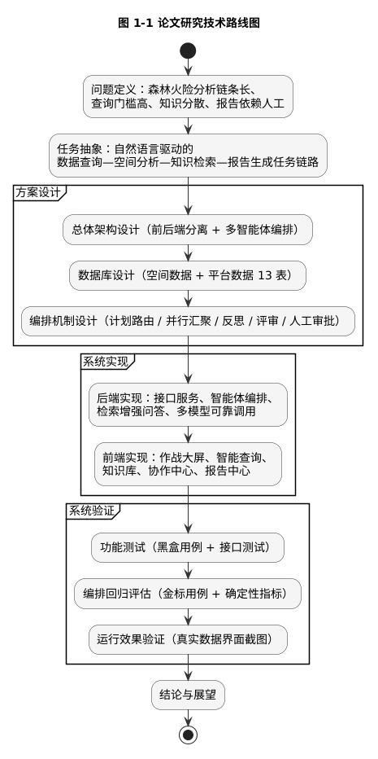

图 1-1 论文研究技术路线图

由图 1-1 可知，本文遵循"问题定义—方案设计—系统实现—系统验证"的研究主线：首先将业务问题抽象为任务链路问题，继而完成总体架构与编排机制设计，随后分别完成后端与前端实现，最后从功能、编排回归与运行效果三个层面完成验证。

各章内容安排如下：第 1 章介绍研究背景、国内外研究现状与主要工作；第 2 章介绍系统涉及的相关技术原理；第 3 章从技术、经济、操作与合规四个角度进行可行性分析；第 4 章进行需求分析，给出用例模型、业务流程与非功能需求；第 5 章给出系统总体设计，包括架构、模块、数据库、接口与部署设计；第 6 章阐述系统各模块的实现细节并展示运行效果；第 7 章介绍系统测试与结果分析；第 8 章总结全文并展望后续工作。

# 第2章 相关技术与理论基础

## 2.1 大语言模型技术

### 2.1.1 Transformer 架构

Transformer 是当前大语言模型的标准基础架构[1]，其基本结构如图 2-1 所示。

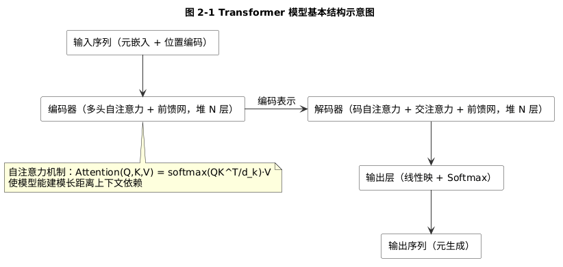

图 2-1 Transformer 模型基本结构示意图

由图 2-1 可知，Transformer 由编码器与解码器堆叠构成，其核心是自注意力机制：模型将输入序列映射为查询、键、值三组向量，通过缩放点积注意力计算词元间的关联权重[28]，从而以并行方式建模任意距离的上下文依赖。解码器额外引入掩码自注意力与交叉注意力，使输出序列能够逐词元自回归生成。该架构天然适配文本生成任务，是本系统报告生成、意图识别与知识问答等能力的模型基础。

### 2.1.2 指令微调与国产开源模型生态

基础语言模型经过指令微调与人类反馈对齐后才能稳定遵循用户指令[8]。近年来国产模型生态快速成熟：通义千问系列提供对话、向量、视觉与语音全谱系模型并开放标准接口[21][22]；DeepSeek 系列模型在保持低成本的同时达到先进推理水平[23]。本系统采用兼容接口协议接入上述模型服务，对话模型支持在云端多提供商与本地部署之间切换，向量、视觉与语音模型则固定使用统一服务商以保证多模态能力稳定。

## 2.2 检索增强生成技术

大语言模型的参数化知识存在时效滞后与领域不足的问题，直接问答容易产生与事实不符的内容。检索增强生成[3]将"参数化知识"与"外部知识库"解耦：先从知识库中检索与问题相关的内容片段，再将其作为上下文交给模型生成回答，使回答有据可依。其基本流程如图 2-2 所示。

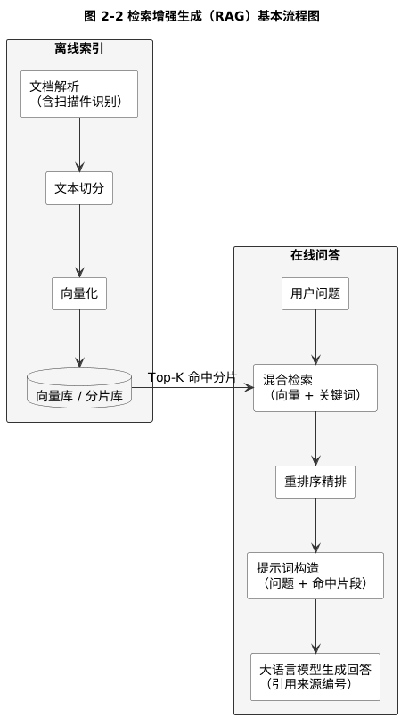

图 2-2 检索增强生成（RAG）基本流程图

检索环节的质量决定回答质量。语义检索以稠密向量表达文本[10]，关键词检索以词项命中计数打分[29]，两者各有所长：前者擅长同义改写，后者擅长专有名词精确匹配。实践中普遍采用多通道召回后融合排序的策略，并可引入重排序模型对候选片段进行精排。本文知识库模块在此基础上针对中文场景增加了中文分词通道，并设计了重排序失败时的降级融合方案。

## 2.3 多智能体系统与状态图编排

### 2.3.1 从单智能体到多智能体协作

单个语言模型智能体可以借助工具调用完成简单任务[4][11]，但面对"查询数据、空间分析、知识检索、撰写报告"这类长链条任务时，单一上下文容易过载且错误会逐级放大。多智能体协作将任务拆解给职责单一的智能体，通过编排机制控制协作顺序与信息流动[5][6][14][15]。经典协作模式包括：交替推理与行动的 ReAct 范式[4]、基于失败反馈的反思重试[12]、生成后自我评审的评审循环，以及在关键决策点引入人工确认的人机协同控制[13]。这些模式构成本系统编排机制设计的理论基础。

### 2.3.2 状态图编排模型

将多智能体工作流建模为"状态 + 节点 + 边"的有向图是当前工程实践的主流方案：全局状态以键值结构承载任务上下文，节点是读取状态并返回增量的处理函数，边分为固定边与条件边，条件边依据状态决定后继节点，从而使图具备分支、循环与中断恢复能力。并行节点对同一状态键的写入需要通过归并函数合并，这是并发安全的关键。本系统采用的编排框架即基于该模型实现，其原理如图 2-3 所示。

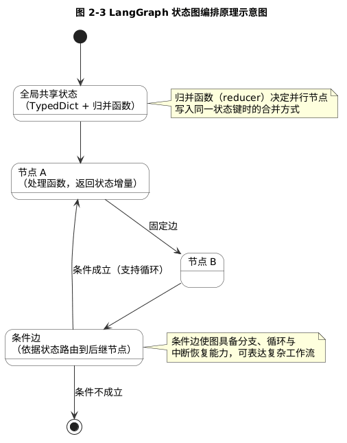

图 2-3 LangGraph 状态图编排原理示意图

由图 2-3 可知，全局共享状态与归并函数保证了并行节点写入不互相覆盖，条件边支持循环结构（如评审不通过退回重写），配合检查点持久化还能够将中断状态落库，为人工审批等长等待场景提供支撑。

## 2.4 Web 开发与空间数据技术

### 2.4.1 前后端分离与接口架构

前后端分离架构下，前端以单页应用形式独立开发部署，后端以接口服务形式提供能力，两者通过表述性状态转移风格的接口通信[16]。本系统后端采用异步框架以支撑长连接实时推送，前端采用渐进式框架与组件库构建界面。系统后端核心技术选型如表 2-1 所示，前端核心技术选型如表 2-2 所示。

表 2-1 后端核心技术选型表

| 类别 | 技术 | 版本 | 选型理由 |
| --- | --- | --- | --- |
| 接口框架 | FastAPI | 0.115.0 | 原生异步，自动生成交互式接口文档 |
| 运行服务 | Uvicorn | 0.53.0 | 高性能异步服务器，支撑长连接 |
| 对象关系映射 | SQLAlchemy | 2.0.35 | 成熟稳定，支持十三张表的模型定义 |
| 空间扩展映射 | GeoAlchemy2 | 0.15.1 | 映射点、多边形等空间几何字段 |
| 数据库 | PostgreSQL + PostGIS | 14 / 3.5 | 空间类型、空间索引与函数齐全 |
| 智能体编排 | LangGraph | 0.2.64 | 状态图编排、并行汇聚与中断恢复 |
| 编排状态持久化 | langgraph-checkpoint-postgres | 2.0.15 | 检查点落库，支撑人工审批续跑 |
| 模型接入 | LangChain + langchain-openai | 0.3.17 | 统一的模型与向量模型客户端 |
| 文本解析 | pdfplumber / PyMuPDF / RapidOCR 等 | — | 四层兜底解析含扫描版文档 |
| 认证安全 | bcrypt + python-jose | 4.2.1 / 3.3.0 | 密码哈希与令牌签发校验 |
| 空间计算 | GeoPandas + Shapely | 1.0.1 / 2.0.5 | 网格聚类与缓冲区分析 |
| 容器化 | Docker + Nginx | — | 一键部署与反向代理 |

表 2-2 前端核心技术选型表

| 类别 | 技术 | 版本 | 选型理由 |
| --- | --- | --- | --- |
| 框架 | Vue 3 | 3.5.13 | 组合式接口，生态成熟 |
| 路由 | Vue Router | 4.5.0 | 支持导航守卫与权限过滤 |
| 状态管理 | Pinia | 3.0.1 | 轻量状态管理，支持持久化 |
| 组件库 | Element Plus | 2.9.6 | 表格、表单、上传等组件齐全 |
| 地图引擎 | OpenLayers | 10.4.0 | 聚合、热力图、绘制与导出能力强 |
| 空间计算 | Turf.js | 7.2.0 | 面积与距离量测 |
| 图表 | ECharts | 5.6.0 | 图表类型丰富，支持自定义主题 |
| 构建工具 | Vite | 6.1.0 | 开发热更新快，支持代理配置 |
| 语音处理 | Web Audio API | 原生 | 前端采集并编码音频，规避兼容性问题 |
| 富文本渲染 | Markdown 渲染封装 | — | 报告与识别结果统一渲染 |

### 2.4.2 空间数据库技术

空间数据库在传统关系数据库基础上扩展了几何类型、空间函数与空间索引[24]。PostGIS 是应用最广泛的空间扩展：几何字段支持点、线、多边形等类型并携带坐标系标识，空间索引能够显著加速范围查询与相交判断。本系统历史火点采用带坐标系的点几何存储，十六个州市边界采用多面几何存储，预测火险亦附带面几何用于地图渲染，均依赖空间数据库能力。

## 2.5 本章小结

本章介绍了系统实现所依赖的关键技术：Transformer 架构与国产模型生态是智能能力的来源；检索增强生成与混合检索是知识问答的基础；多智能体系统的反思、评审与人机协同模式，以及状态图编排模型，是本系统编排机制的直接理论依据；前后端分离架构与空间数据库技术则构成工程实现底座。后续章节将以上述技术为支撑展开需求分析与系统设计。

# 第3章 可行性分析

## 3.1 技术可行性

系统全部采用成熟的开源技术与公开的模型服务接口，技术栈在生产环境均有大量成功案例，具体分析如表 3-1 所示。

表 3-1 技术可行性分析表

| 层面 | 分析 | 结论 |
| --- | --- | --- |
| 前端技术 | 组合式接口已成为主流开发范式，地图引擎对聚合、热力图与绘制支持成熟，图表库覆盖全部可视化需求 | 可行 |
| 后端技术 | 异步接口框架与对象关系映射均为生产级成熟方案，完整支持空间几何字段 | 可行 |
| 空间数据库 | 空间扩展提供几何类型、空间函数与索引，满足火点存储与空间分析需求 | 可行 |
| 模型能力 | 模型服务商提供兼容接口，支持多提供商切换与本地部署兜底 | 可行 |
| 检索链路 | 文本解析、中文切分、向量化与混合检索均有成熟组件，链路完整 | 可行 |
| 降级容错 | 全部模型依赖点均设计无密钥降级方案，保证任何环境下可演示 | 可行 |

## 3.2 经济可行性

系统全部采用开源技术栈，无授权费用。模型服务按调用量计费且提供免费额度，本地部署的模型可作为离线兜底，使运行成本可控。硬件方面，单台八吉字节内存的计算机即可同时运行前后端与数据库，满足开发与演示需求。数据方面，历史火点取自公开的卫星火点数据产品，行政边界取自开放的地理数据，预测火险由既有模型产出，均无采购成本。综上，经济上完全可行。

## 3.3 操作可行性

系统前端全部交互基于组件库控件与自然语言输入，业务人员无需掌握查询语言或专业软件即可使用；智能查询、知识库与协作中心均提供示例语句，一键即可发起。系统管理页提供模型配置的在线修改、连接测试与脱敏回显，运维人员无需登录服务器即可完成配置变更。语音输入与播报进一步降低了移动场景下的使用门槛。综上，操作上具备可行性。

## 3.4 法律合规与数据安全可行性

系统使用的数据均无版权风险：火点数据来自公开的科研数据产品，行政边界来自开放地理数据，知识库文档由用户自行上传。安全方面，用户密码以单向哈希存储，签名密钥置于环境变量而不进入代码仓库，接口访问基于令牌鉴权，普通用户之间的历史数据完全隔离。系统不采集任何与业务无关的个人信息，不进行数据转售。综上，法律与数据安全层面可行。

## 3.5 本章小结

本章从技术、经济、操作与合规四个维度论证了系统建设的可行性，结论表明：系统所依赖的技术全部成熟可用，成本可控，操作门槛低，数据来源与安全机制合规，具备完整的建设条件。

# 第4章 需求分析

## 4.1 系统总体目标与角色边界

系统的总体目标是：在继承既有火险可视化能力的基础上，构建一个以自然语言为主要交互方式的智能决策平台，将"数据查询—空间分析—知识检索—报告生成"的任务链路交由多个智能体自动完成，并由人工对关键产出进行确认。系统的输入特征包括三类：自然语言查询与分析请求、知识库文档、火情现场图像与语音；输出特征包括空间可视化、四维查询结果、带引用的知识问答与结构化分析报告。

系统涉及两类角色，其职责边界严格区分：普通用户可以使用全部业务能力（大屏浏览、智能查询、知识问答、任务发起、报告管理、火情识别、语音交互），但只能访问自己的历史数据；管理员在普通用户能力之外，负责系统配置、模型接入、连接测试、日志审计与用户管理。平台层面还存在两类不可交互的服务角色：模型服务提供推理与向量化能力，地图与天气服务提供底图与气象数据。

## 4.2 功能性需求

系统总体用例模型如图 4-1 所示，普通用户与管理员两类角色通过统一入口访问平台。

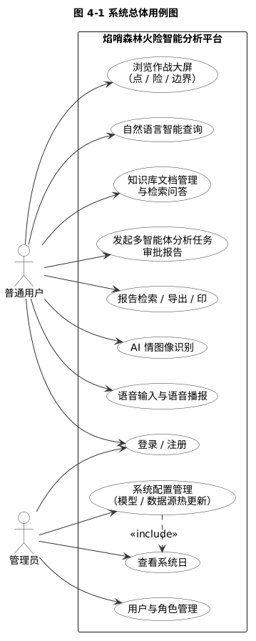

图 4-1 系统总体用例图

由图 4-1 可知，系统的功能用例围绕"看数据、查数据、问知识、做分析、管报告、控系统"六条主线组织。核心用例的功能需求描述如表 4-1 所示。

表 4-1 核心功能用例描述表

| 编号 | 用例名称 | 参与者 | 主要流程 | 关键约束 |
| --- | --- | --- | --- | --- |
| UC-01 | 浏览作战大屏 | 普通用户 | 打开大屏，浏览历史火点、预测火险与行政边界，使用聚合、热力图、量测、标绘与导出工具 | 数据加载失败时自动降级本地数据，页面不空白 |
| UC-02 | 自然语言智能查询 | 普通用户 | 输入自然语言或语音输入，系统解析意图与参数后执行查询，返回摘要、表格、图表与地图四维结果并自动落库历史 | 模型不可用时降级为关键词解析；重复查询去重 |
| UC-03 | 知识库问答 | 普通用户 | 上传文档，提问后系统混合检索知识库并生成带引用来源的回答 | 扫描版文档可解析；未命中时明确声明 |
| UC-04 | 多智能体分析 | 普通用户 | 输入分析任务，多个智能体自动执行查询、分析、检索与报告生成，过程实时可见 | 数据查询、空间分析与报告生成为不可裁剪步骤 |
| UC-05 | 报告审批 | 普通用户 | 在人工审批环节对报告执行通过、编辑或驳回操作 | 驳回必须附带意见，意见注入重写 |
| UC-06 | 报告管理 | 普通用户 | 按类型筛选报告，查看正文，导出为 Markdown 或网页格式并打印 | 用户仅可见自己的报告；删除为软删除 |
| UC-07 | 火情图像识别 | 普通用户 | 上传火场照片，系统输出火情判定、场景描述、严重程度与处置建议，识别历史可回看 | 非火情图片明确标注；识别记录按用户隔离 |
| UC-08 | 语音交互 | 普通用户 | 语音输入自动转为查询、提问或任务；结果一键语音播报 | 识别完成自动执行；播报互斥防重叠 |
| UC-09 | 系统配置管理 | 管理员 | 在线修改模型与数据源配置，保存即生效并脱敏回显 | 无需重启；敏感信息脱敏展示 |
| UC-10 | 用户与日志管理 | 管理员 | 管理用户与角色，查看系统日志 | 防止自我降权与自我删除 |

## 4.3 核心业务流程分析

### 4.3.1 智能查询业务流程

智能查询是使用频率最高的功能，其业务流程覆盖"输入—解析—执行—展示—沉淀"五个阶段，活动图如图 4-2 所示。

图 4-2 自然语言智能查询活动图

由图 4-2 可知，解析环节存在两级容错：模型解析失败时降级为关键词规则解析，模型服务整体不可用时直接走规则通道，保证查询功能永远可用；执行环节按意图类型分流到历史火点、预测火险与数据汇总三种执行器，最终统一生成四维结果并完成历史去重落库。

### 4.3.2 多智能体分析任务流程

多智能体分析任务是系统的核心业务，涉及前端、接口层、编排层与数据层的多方协作，交互时序如图 4-3 所示。

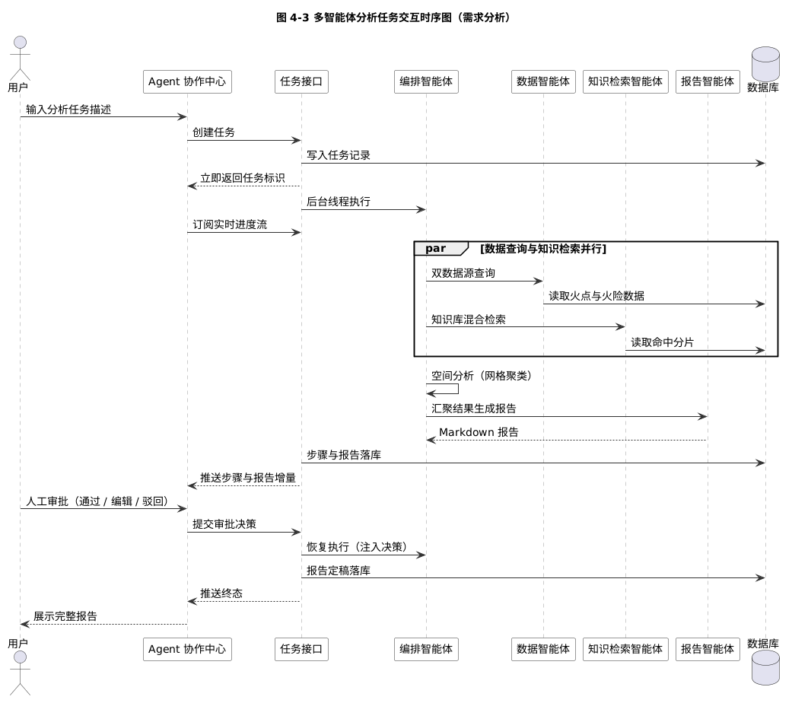

图 4-3 多智能体分析任务交互时序图（需求分析）

由图 4-3 可知，任务创建接口立即返回任务标识，执行过程转入后台线程，前端通过订阅实时进度流获取节点级进展；数据查询与知识检索并行执行以缩短总耗时；报告生成后进入人工审批，审批决策注入后流程继续直至定稿落库。该流程对系统的隐含要求包括：任务状态必须持久化以支撑中断恢复、步骤信息必须落库以支撑历史回放、进度推送必须与落库解耦以避免阻塞执行。

## 4.4 非功能性需求

除功能需求外，系统在性能、可用性、安全性、可维护性与兼容性方面的要求如表 4-2 所示。

表 4-2 非功能性需求表

| 类别 | 需求描述 |
| --- | --- |
| 性能 | 大屏并发拉取数千条火点数据应在秒级完成；智能查询全链路（含模型调用）控制在可接受时长内；任务执行期间界面实时可见进展而非长时间无响应 |
| 可用性 | 任一模型接口不可用时自动降级，核心页面永不白屏；大屏数据提供本地兜底；报告提供模板兜底 |
| 安全性 | 密码单向哈希存储；接口基于令牌鉴权；敏感配置脱敏回显；用户数据严格隔离 |
| 可维护性 | 配置集中于环境变量并支持在线热更新；系统日志全程留痕；关键模块职责单一、边界清晰 |
| 可扩展性 | 模型提供商可切换；编排节点可插拔；数据导入脚本支持自定义数据源 |
| 兼容性 | 支持主流现代浏览器；地图采用标准坐标系；接口响应采用统一包裹结构 |

## 4.5 本章小结

本章完成了系统需求分析：界定了普通用户与管理员的角色边界，梳理了十个核心用例及其约束条件，通过活动图与时序图刻画了智能查询与多智能体分析两条核心业务流程，并归纳了六个维度的非功能性需求。其中"任务状态持久化、步骤落库、进度推送解耦"等隐含需求将直接转化为第 5 章的设计决策。

# 第5章 系统总体设计

## 5.1 总体架构设计

系统采用前后端分离的六层架构，总体架构如图 5-1 所示。

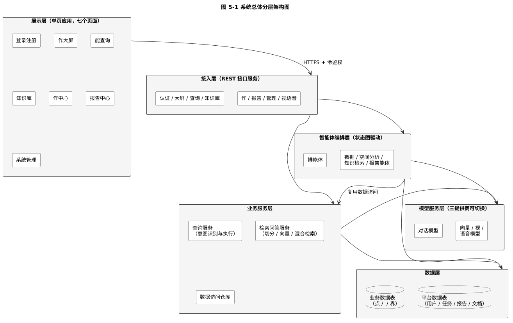

图 5-1 系统总体分层架构图

架构设计的核心决策及其理由如下。第一，展示层与接入层彻底分离：前端通过开发代理或反向代理统一转发接口请求，天然规避跨域问题，也使前端可以独立构建部署。第二，业务服务层与智能体编排层分离：智能体不直接构造数据库语句，而是复用业务服务层的数据访问能力，遵循"编排与执行分离"原则，使编排逻辑可以独立于数据实现演进。第三，模型服务层三提供商可切换：对话模型在云端多提供商与本地部署之间路由，向量、视觉与语音模型固定使用统一服务商，既获得灵活性又保证多模态能力稳定。第四，数据层按"业务数据"与"平台数据"双线组织：前者承载火点、火险与边界等空间数据，后者承载用户、任务、步骤、报告与文档等平台数据，职责清晰。

## 5.2 功能模块设计

系统功能模块结构如图 5-2 所示。

图 5-2 系统功能模块结构图

由图 5-2 可知，系统划分为八个功能模块。认证与权限模块承担身份识别、角色控制与数据隔离三项职责；作战大屏模块承担空间数据可视化与分析工具；智能查询模块承担意图解析与四维结果生成；知识库问答模块承担文档管理与检索问答；多智能体协作模块是系统核心，内部进一步细分为任务拆解路由、并行数据获取、空间热点分析、报告生成与评审、人工审批与实时进度推送六项子职责；报告管理模块承担报告检索与导出；视觉与语音模块承担图像识别与语音交互；系统管理模块承担配置热更新、连接测试、模型目录与日志用户管理。

## 5.3 智能体编排机制设计

编排机制是本系统的设计重心，其设计遵循"生成与执行分离、状态驱动流转、并发安全合并、关键产出受控"四项原则。

在状态设计上，全局状态以键值结构承载用户请求、执行计划、数据结果、空间结果、知识结果、报告正文与各类控制信息。其中步骤日志与知识结果两类键被声明为增量归并：并行节点只允许返回新增部分，由归并函数自动合并，从根本上避免并行写入互相覆盖。

在流转设计上，任务拆解节点产出结构化执行计划，计划以子任务列表表达，每个子任务包含类型、描述与是否必需标记。路由函数只读取计划而不读取执行状态，这一约束消除了并行波次下的状态竞争。执行计划存在两条硬约束：数据查询、空间分析与报告生成三个步骤被强制保留，即使用户请求只要求"查一下数据"，系统也会保证最终产出报告，避免"跑完无结论"。

在受控设计上，报告生成后依次经过评审与审批两道关口：评审环节将模型评审与确定性硬护栏并联，任一不通过即退回重写；审批环节通过中断机制将任务挂起并持久化，等待人工决策后恢复。中断状态的持久化使人工审批不再受限于单次请求生命周期，用户可以在任意时刻完成审批。

## 5.4 数据库设计

数据库设计按照概念结构设计与逻辑结构设计两个阶段展开[30]：先以实体关系图刻画业务实体及其联系，再映射为关系模式并定义完整性约束。

### 5.4.1 概念结构设计

系统数据实体及关系如图 5-3 所示。

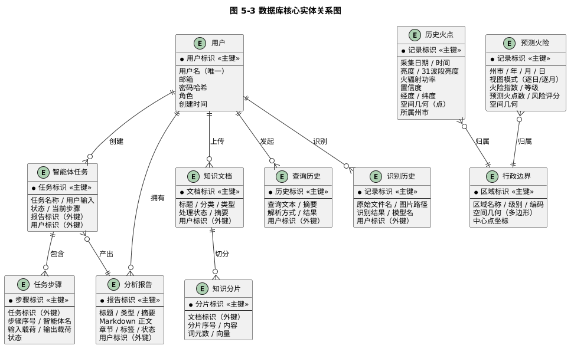

图 5-3 数据库核心实体关系图

由图 5-3 可知，用户实体处于平台数据的关系中心：用户发起查询历史、创建智能体任务、上传知识文档、发起识别历史并拥有分析报告；任务与步骤构成一对多关系，任务与报告之间是多对一引用关系，知识文档与分片构成一对多关系；空间数据一侧，历史火点与预测火险分别归属行政区划。

### 5.4.2 逻辑结构设计

数据库共十三张业务表，按业务数据与平台数据两类组织，如表 5-1 所示。

表 5-1 数据库表清单

| 分类 | 表名 | 说明 | 数据规模 |
| --- | --- | --- | --- |
| 业务数据 | 历史火点表 | 卫星火点观测记录（含点几何） | 五千四百余条 |
| 业务数据 | 预测火险表 | 模型预测火险（逐日与逐月双视图） | 两个年度全量 |
| 业务数据 | 行政边界表 | 十六个州市边界（多面几何） | 十六条 |
| 业务数据 | 应急资源表 | 消防站与物资点（预留扩展） | 预留 |
| 平台数据 | 用户表 | 注册用户（含角色） | 按注册增长 |
| 平台数据 | 查询历史表 | 智能查询记录（按用户与文本去重） | 按使用增长 |
| 平台数据 | 问答历史表 | 知识库问答记录 | 按使用增长 |
| 平台数据 | 智能体任务表 | 分析任务主记录 | 按使用增长 |
| 平台数据 | 任务步骤表 | 任务执行步骤（含输入输出载荷） | 按使用增长 |
| 平台数据 | 分析报告表 | 报告正文与元信息 | 按使用增长 |
| 平台数据 | 知识文档表 | 上传文档主记录 | 按上传增长 |
| 平台数据 | 知识分片表 | 文档切分后的片段（含向量） | 按上传增长 |
| 平台数据 | 识别历史表 | 火情图像识别记录 | 按识别增长 |

关键表的结构设计说明如下。

历史火点表是数据规模最大的空间表，其结构如表 5-2 所示。观测日期、置信度与所属州市三列建立普通索引以支撑高频过滤条件，几何列建立空间索引以支撑地图范围查询。

表 5-2 历史火点表结构

| 字段 | 类型 | 约束 | 含义 |
| --- | --- | --- | --- |
| 记录标识 | 整数 | 主键 | 自增编号 |
| 观测日期 | 日期 | 非空，索引 | 卫星过境观测日期 |
| 观测时间 | 字符串 | — | 观测时刻 |
| 昼夜标记 | 字符串 | — | 白昼或夜间过境 |
| 亮度温度 | 浮点数 | — | 中红外通道亮温 |
| 三十一波段亮温 | 浮点数 | — | 长波通道亮温 |
| 火辐射功率 | 浮点数 | — | 火点能量指标，用于排序 |
| 置信度 | 字符串 | 索引 | 低、中、高三档 |
| 经度 / 纬度 | 浮点数 | 非空 | 观测位置坐标 |
| 空间几何 | 空间点 | — | 带坐标系的空间点列 |
| 所属州市 | 字符串 | 索引 | 行政区划名称 |
| 数据来源 | 字符串 | — | 卫星传感器标识 |

预测火险表以"逐日"与"逐月"两种视图模式存储同一预测体系，其关键字段如表 5-3 所示。风险评分列是排序主字段，火险等级为一至五级分档，与前端配色体系同源。

表 5-3 预测火险表结构（关键字段）

| 字段 | 类型 | 约束 | 含义 |
| --- | --- | --- | --- |
| 记录标识 | 整数 | 主键 | 自增编号 |
| 州市 | 字符串 | 非空 | 所属行政区划 |
| 年 / 月 / 日 | 整数 | 逐日视图日期非空 | 时间维度 |
| 视图模式 | 字符串 | 非空 | 逐日或逐月 |
| 基础 / 最终火险指数 | 浮点数 | — | 模型输出指数 |
| 火险等级 | 整数 | — | 一至五级 |
| 预测火点数 | 浮点数 | — | 预测火点数量 |
| 风险评分 | 浮点数 | — | 综合风险评分，排序主字段 |
| 空间几何 | 空间面 | — | 州市面几何，用于渲染 |

任务与步骤两张表共同支撑"历史回放"能力，如表 5-4 所示。步骤表以结构化载荷记录每个智能体的输入与输出，使任意历史任务都可以完整还原执行过程。

表 5-4 智能体任务表与任务步骤表结构

| 表 | 字段 | 类型 | 约束 | 含义 |
| --- | --- | --- | --- | --- |
| 任务表 | 任务标识 | 整数 | 主键 | 自增编号 |
| 任务表 | 任务名称 / 用户输入 | 字符串 / 文本 | — | 任务概要 |
| 任务表 | 状态 | 字符串 | — | 待执行、执行中、待审批、完成、失败 |
| 任务表 | 当前步骤 | 字符串 | — | 当前所处节点 |
| 任务表 | 报告标识 | 整数 | 外键 | 产出报告 |
| 任务表 | 用户标识 | 整数 | 外键，索引 | 归属用户 |
| 步骤表 | 步骤标识 | 整数 | 主键 | 自增编号 |
| 步骤表 | 任务标识 | 整数 | 外键，级联删除 | 所属任务 |
| 步骤表 | 步骤序号 | 整数 | — | 执行顺序 |
| 步骤表 | 智能体名 / 步骤名 | 字符串 | — | 执行主体与动作 |
| 步骤表 | 输入 / 输出载荷 | 结构化文本 | — | 每步的输入输出快照 |
| 步骤表 | 状态 | 字符串 | — | 执行中、成功、失败 |

分析报告表与知识文档、分片表的结构要点如表 5-5 与表 5-6 所示。

表 5-5 分析报告表结构

| 字段 | 类型 | 约束 | 含义 |
| --- | --- | --- | --- |
| 报告标识 | 整数 | 主键 | 自增编号 |
| 标题 | 字符串 | — | 报告标题 |
| 报告类型 | 字符串 | — | 日报、周报、月报、专项 |
| 摘要 | 文本 | — | 内容摘要 |
| 正文 | 文本 | — | 结构化 Markdown 正文 |
| 章节 / 标签 | 结构化文本 | — | 章节索引与标签 |
| 状态 | 字符串 | — | 草稿、发布、归档 |
| 可见性标记 | 整数 | — | 用户自删与管理员删除的软删位 |
| 生成审计 | 字符串 | — | 提供商、模型名与词元数 |
| 用户标识 | 整数 | 外键 | 归属用户 |

表 5-6 知识文档表与知识分片表结构（关键字段）

| 表 | 字段 | 类型 | 含义 |
| --- | --- | --- | --- |
| 文档表 | 文档标识 / 标题 / 分类 | 整数 / 字符串 | 主键与元信息 |
| 文档表 | 处理状态 | 字符串 | 待处理、处理中、就绪、失败四态 |
| 文档表 | 文件类型 / 摘要 | 字符串 / 文本 | 类型与内容摘要 |
| 文档表 | 用户标识 | 整数 | 归属用户，实现隔离 |
| 分片表 | 分片标识 | 整数 | 主键 |
| 分片表 | 文档标识 | 整数 | 外键，级联删除 |
| 分片表 | 分片序号 / 内容 | 整数 / 文本 | 切分顺序与文本内容 |
| 分片表 | 词元数 / 向量 | 整数 / 文本 | 长度与序列化向量 |

用户表与三类历史记录表结构较为简单，其要点如表 5-7 所示。所有历史表均携带用户标识并建立索引，用户隔离在查询构造层统一实施。

表 5-7 用户表与历史记录表结构要点

| 表 | 关键字段 | 说明 |
| --- | --- | --- |
| 用户表 | 用户名（唯一）、邮箱、密码哈希、角色、创建时间 | 密码仅存哈希 |
| 查询历史表 | 查询文本、摘要、解析方式、结果、用户标识 | 解析方式标注模型或规则 |
| 问答历史表 | 问题、回答、检索方式、是否使用模型、命中数、用户标识 | 支持效果分析 |
| 识别历史表 | 原始文件名、图片路径、识别结果、模型名、用户标识 | 图片以随机名落盘 |

## 5.5 接口设计

接口按资源域划分为八个模块，统一响应结构为"代码、消息、数据"三段式。核心接口设计如表 5-8 所示。

表 5-8 核心接口设计表

| 模块 | 方法 | 路径 | 鉴权 | 功能说明 |
| --- | --- | --- | --- | --- |
| 认证 | POST | /auth/register | 无 | 注册并直接登录 |
| 认证 | POST | /auth/login | 无 | 登录签发令牌 |
| 认证 | GET | /auth/me | 令牌 | 获取当前用户信息 |
| 大屏 | GET | /dashboard/history-fires | 无 | 历史火点分页查询（多条件过滤） |
| 大屏 | GET | /dashboard/predict-risks | 无 | 预测火险查询（逐日与逐月） |
| 大屏 | GET | /dashboard/summary | 无 | 摘要统计 |
| 查询 | POST | /query/parse | 无 | 仅解析意图不执行 |
| 查询 | POST | /query/execute | 无 | 解析并执行，返回四维结果 |
| 查询 | GET | /query/history | 令牌 | 当前用户查询历史 |
| 知识库 | POST | /rag/ask | 无 | 知识问答（含引用） |
| 知识库 | POST | /rag/ask/stream | 无 | 流式知识问答 |
| 知识库 | POST | /rag/documents | 令牌 | 上传知识文档 |
| 协作 | POST | /agent/tasks | 令牌 | 创建分析任务，立即返回任务标识 |
| 协作 | GET | /agent/tasks/{id} | 令牌 | 任务详情（步骤与报告，支持回放） |
| 协作 | GET | /agent/tasks/{id}/stream | 参数令牌 | 实时进度事件流 |
| 协作 | POST | /agent/tasks/{id}/resume | 令牌 | 提交人工审批决策 |
| 协作 | GET | /agent/capabilities | 无 | 系统能力运行态面板 |
| 报告 | GET | /reports/list | 令牌 | 报告分页列表（类型筛选） |
| 报告 | GET | /reports/export/{id} | 令牌 | 导出 Markdown 或网页格式 |
| 管理 | POST | /admin/config | 令牌 | 更新配置并热生效 |
| 管理 | POST | /admin/test/llm | 令牌 | 模型连接真实测试 |
| 管理 | GET | /admin/users | 管理员 | 用户列表 |
| 视觉 | POST | /vision/analyze | 令牌 | 火情图像识别 |
| 视觉 | POST | /vision/audio/transcriptions | 令牌 | 语音识别 |
| 视觉 | POST | /vision/audio/speech | 令牌 | 语音合成 |

接口设计遵循三条原则：其一，写操作必须鉴权，读操作中涉及用户数据的必须鉴权并过滤；其二，长耗时操作一律异步化并返回任务标识，避免请求阻塞；其三，所有用户数据接口在服务端按用户标识过滤，不信任前端传参。

## 5.6 部署设计

系统支持脚本部署与容器编排两种方式，容器化部署架构如图 5-4 所示。

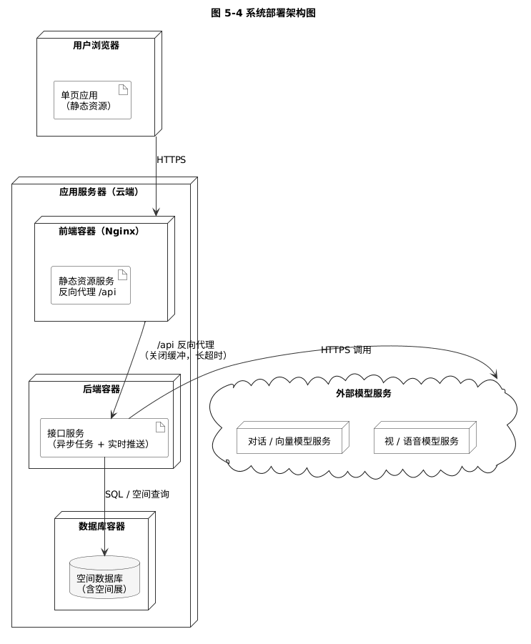

图 5-4 系统部署架构图

由图 5-4 可知，前端容器以内置网关同时承担静态资源服务与接口反向代理职责，代理配置显式关闭缓冲并放宽读写超时，这是实时事件流能够穿透网关的关键；后端容器与数据库容器置于同一编排网络内，数据库健康检查就绪后才启动后端，数据卷持久化保存数据库内容与上传文件；模型服务位于外部云端，通过加密通道调用。

## 5.7 本章小结

本章完成了系统总体设计：六层架构明确了分层职责与关键决策理由；八个功能模块界定了职责边界；编排机制设计确立了状态归并、计划约束与双重受控三项核心机制；数据库设计覆盖十三张表的完整结构；接口设计给出核心接口契约；部署设计明确了容器化方案与网关配置要点。

# 第6章 系统实现

## 6.1 开发环境与工程结构

系统开发与运行环境如表 6-1 所示。

表 6-1 开发与运行环境表

| 类别 | 环境与版本 |
| --- | --- |
| 操作系统 | Windows / Linux（容器化部署） |
| 后端运行时 | Python 3.10+，异步接口框架 |
| 前端运行时 | Node.js 18+，Vite 6 构建 |
| 数据库 | PostgreSQL 14，启用空间扩展 |
| 模型服务 | 云端对话、向量、视觉、语音模型（兼容接口），本地模型兜底 |
| 部署方式 | 容器编排（数据库、后端、前端三容器） |

后端工程按"接口层—服务层—仓库层—模型层—编排层—核心层"组织：接口层负责协议处理与鉴权，服务层承载业务逻辑，仓库层封装数据访问，模型层定义十三张表，编排层承载多智能体状态图，核心层提供配置、鉴权、模型调用、检查点与推送通道等横切能力。前端工程按"页面—组件—路由—状态—工具—样式"组织，公共能力（请求封装、语音工具、图表渲染、等级配色）沉淀为工具模块供六个页面复用。

## 6.2 认证与权限模块实现

认证模块实现注册、登录与身份校验的完整闭环。注册环节先对用户名与邮箱查重，随后以盐值哈希算法对密码做单向散列后入库，任何明文口令都不落库；登录环节校验口令后签发带签名的访问令牌，有效期为二十四小时；此后每次请求在服务端解码校验令牌并加载用户身份，管理员接口在身份校验之上再校验角色。

数据隔离在本模块统一实施：查询历史、问答历史、知识文档、任务与报告的每一次读取都在查询构造层附加用户过滤条件，管理员可见全部数据。前端配合路由守卫实现体验层防护：未登录访问受保护页面时重定向到登录页并携带回跳地址，非管理员访问管理页时被拦截并提示。体验层防护与接口层校验互为冗余，任一层失效都不会造成数据越权。

## 6.3 智能查询模块实现

智能查询模块实现了"双引擎意图识别 + 三种意图执行器 + 四维结果生成"的完整链路。意图识别优先使用对话模型：提示词中内置全部州市清单、季节与月份映射关系及置信度枚举，要求模型以结构化格式输出意图与参数；模型输出解析失败或模型服务不可用时，降级为关键词规则引擎，规则引擎覆盖州市全称与常见简称的映射（例如简称"版纳"可映射到全称"西双版纳傣族自治州"）、年份月份解析、季节到月份区间的转换以及结果条数上限提取。

三种意图执行器分别处理历史火点查询（按日期区间过滤并按火辐射功率排序）、预测火险查询（按风险评分排序并按等级分档配色）与数据汇总（统计各州市火点数量并输出排名）。执行完成后，通用生成器将结果转换为空间数据格式，风险分档配色规则与前端保持同一来源，保证地图与图表颜色一致。查询结果与解析方式（模型或规则）一同写入历史记录，同一用户重复查询相同文本时仅更新时间与摘要，不产生重复条目。

## 6.4 知识库检索问答实现

### 6.4.1 文档解析与切分

文档处理流水线支持三种格式。纯文本直接读取；Markdown 先转换再剥离标签；便携文档格式的解析设计为四层兜底链：常规文本层解析器优先，失败后切换备用解析器，再退回到渲染式解析，最终以离线光学字符识别兜底。该链路解决了扫描版与自定义字体编码文档提取乱码的问题，实际测试中成功解析了采用自定义字体编码的国家标准文档。

解析得到的全文按递归切分策略分片，分片长度五百字符、重叠五十字符，分隔符按中文习惯优先采用空行、换行、句号与逗号，使分片边界尽量落在语义完整处。分片向量化后连同词元数一并落库，文档状态机经历待处理、处理中、就绪三态，失败时标记失败态并向用户展示原因。

### 6.4.2 混合检索与精排

检索环节采用双通道召回加精排的架构，流程如图 6-6 所示。

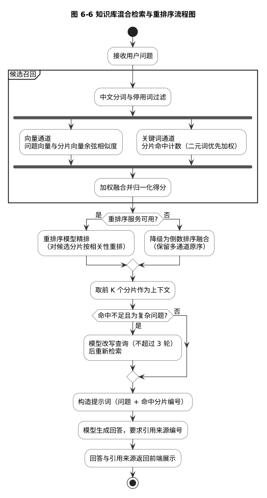

图 6-6 知识库混合检索与重排序流程图

由图 6-6 可知，向量通道以问题向量与分片向量的余弦相似度打分，擅长语义改写场景；关键词通道以中文分词后的词项命中计数打分并对二字词加权，擅长专有名词精确匹配。两通道得分加权融合归一化后，若重排序服务可用则由重排序模型对候选分片精排，否则降级为倒数排序融合保留多通道原序。针对复杂问题，系统增加了自适应改写环：命中不足时由模型改写查询重新检索，最多三轮。回答生成环节的提示词明确要求引用来源编号，未检索到相关内容时模型被要求明确声明，而不是编造答案。问答结果支持流式输出，增量内容经事件流逐段推送至前端，完整内容在生成结束后统一落库。

## 6.5 多智能体编排实现

### 6.5.1 编排状态图

编排层以状态图驱动八个节点协作，整体拓扑如图 6-1 所示。

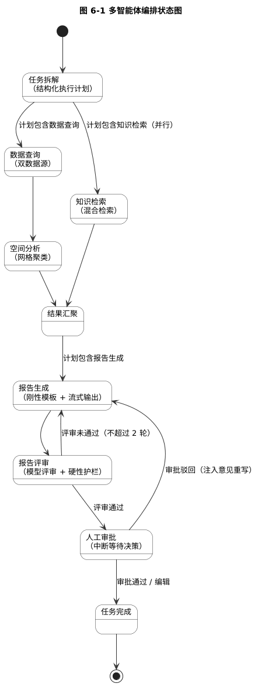

图 6-1 多智能体编排状态图

由图 6-1 可知，任务拆解节点位于入口，产出结构化执行计划；数据查询与知识检索依据计划并行执行，数据查询完成后接续空间分析，两条支路在汇聚屏障合流；报告生成节点汇聚全部上下文产出报告，随后进入评审与人工审批两道关口。智能体职责分工如表 6-2 所示。

表 6-2 智能体职责分工表

| 智能体 | 承载节点 | 职责 | 关键机制 |
| --- | --- | --- | --- |
| 编排智能体 | 任务拆解 | 产出结构化执行计划，约束关键步骤 | 结构化输出；计划归一化硬约束 |
| 数据智能体 | 数据查询 | 历史火点与预测火险双数据源查询 | 空结果反思重试 |
| 空间分析智能体 | 空间分析 | 网格聚类热点识别与高风险州市识别 | 零点一度网格统计 |
| 知识检索智能体 | 知识检索 | 知识库混合检索与引用来源返回 | 复用检索问答服务 |
| 报告智能体 | 报告生成 | 按刚性模板生成结构化报告 | 流式输出；模板兜底 |
| 评审节点 | 报告评审 | 模型评审与硬护栏双重把关 | 低温度评审；确定性规则 |
| 审批闸口 | 人工审批 | 中断等待人工决策 | 中断恢复；状态持久化 |

### 6.5.2 并行执行与汇聚屏障

数据查询与知识检索并行执行以缩短任务总时长。并行引入的核心风险是状态竞争：两个节点若同时写同一状态键，后写者会覆盖先写者。本实现将步骤日志与知识结果两类状态键声明为增量归并模式——节点只返回新增片段，编排框架以追加方式合并，从机制上消除了覆盖问题。汇聚屏障由编排框架在图结构中天然保证：后续报告生成节点仅在两条并行支路全部完成后启动。

### 6.5.3 查询反思重试

查询环节存在三类常见失败：时间范围过窄、州市名称拼写偏差、视图模式不匹配。针对空结果，数据查询节点引入反思重试机制，流程如图 6-2 所示。

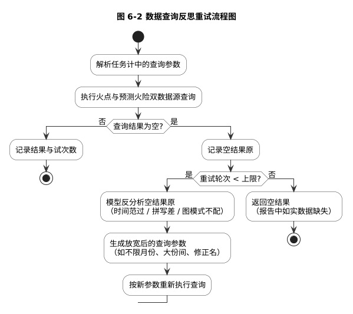

图 6-2 数据查询反思重试流程图

由图 6-2 可知，查询为空时，模型先分析空结果的可能原因，再生成放宽后的参数（例如不限月份、扩大年份区间、修正州市名称），以新参数重查；重试轮次设有上限，超限后如实返回空结果说明，报告中如实声明数据缺失，避免编造。每一次尝试与空原因都记录在步骤日志中，供前端回放。

### 6.5.4 报告生成与评审循环

报告生成节点的提示词以刚性模板约束产出结构：报告必须包含执行摘要、数据来源与分析方法、火情数据分析、高风险区域识别、重点巡防建议、结论与展望及参考依据七个部分，标题顺序不可调整，篇幅不少于下限，且必须引用查询得到的真实数据。模板化带来的直接收益是报告质量稳定、风格统一，且评审环节可以按明确规则检查。节点支持流式产出，增量内容经推送通道实时到达前端；模型不可用时退化为固定模板报告，保证任务链路不断裂。

评审环节由模型评审与确定性硬护栏并联构成，流程如图 6-3 所示。

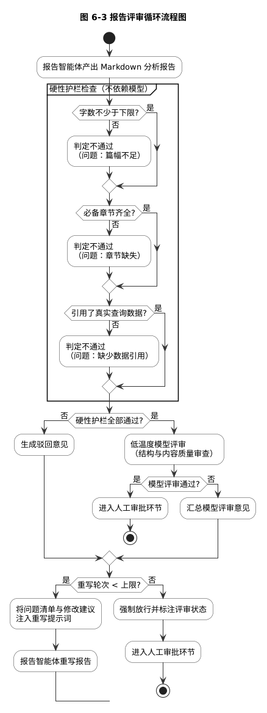

图 6-3 报告评审循环流程图

硬护栏不依赖模型，以确定性规则一票否决：篇幅不足、必备章节缺失、缺少真实数据引用三者任一命中即判定不通过；硬护栏全部通过后，再由低温度模型评审结构与内容质量。未通过时，问题清单与修改建议注入重写提示词，报告节点带意见重写；重写轮次设上限，超限后强制放行并标注评审状态，避免死循环。该设计将"模型判质量、规则守底线"两种能力互补组合，评审结论稳定可复现。

### 6.5.5 人工审批与中断恢复

报告评审通过后进入人工审批闸口，其实现依托编排框架的中断恢复机制，时序如图 6-4 所示。

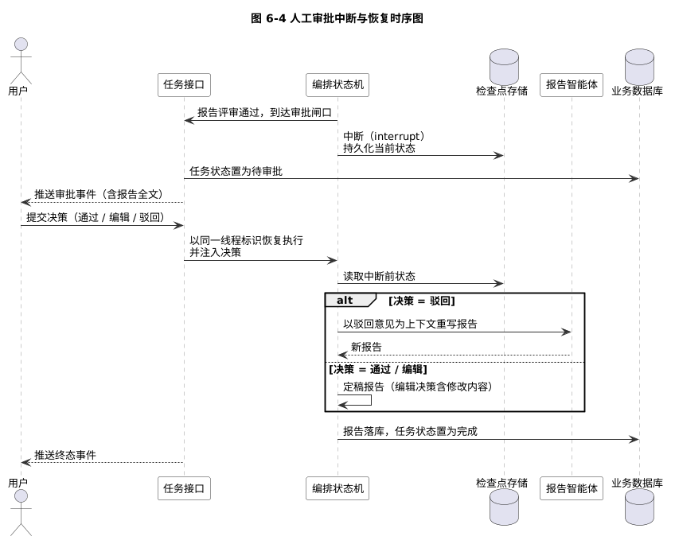

图 6-4 人工审批中断与恢复时序图

由图 6-4 可知，到达审批闸口时，状态机执行中断操作，将当前全部状态持久化到检查点存储，任务状态置为待审批；用户可在任意时刻提交通过、编辑或驳回决策，接口以同一线程标识恢复执行，状态机从中断点续跑。驳回决策携带的意见会被注入报告重写提示词，形成"人机协同改进"闭环。由于中断状态落在数据库中，服务重启后待审批任务依然可以恢复，不会丢失。

### 6.5.6 节点级实时进度推送

任务执行的可见性由事件流推送实现，机制如图 6-5 所示。

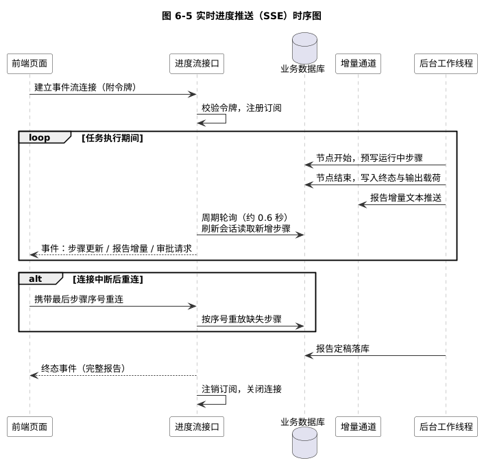

图 6-5 实时进度推送（SSE）时序图

该机制有三个设计要点。其一，数据库是唯一事实源：工作线程将节点开始与结束状态以"先预写运行中、再覆盖终态"的方式写入步骤表，推送接口周期性刷新读取会话并将新增步骤推送给订阅者，推送与执行彻底解耦。其二，断线可重放：前端重连时携带最后收到的步骤序号，推送接口按序号补发缺失部分，保证事件不丢。其三，报告增量走独立的易失通道：生成中的半截内容不落库，终态以数据库落库内容为准，避免半截数据污染事实源。推送连接在任务完成后自动关闭，单连接设有最长存活时限。

### 6.5.7 编排状态持久化

状态机的检查点持久化到关系数据库中：每创建一个任务即分配唯一的线程标识，任务执行过程中的每一次状态变更都会写入检查点，使中断恢复、断点续跑成为可能。每个任务线程独享检查点连接以规避驱动层的线程安全问题；持久化组件不可用时自动降级为内存存储，此时人工审批在进程存活期内依然可用。服务重启时，仍在执行中的任务被标记为失败并说明原因，待审批任务不受影响。

## 6.6 大模型可靠调用与降级实现

### 6.6.1 统一调用层

全部模型调用收敛到统一调用层，对外提供文本、结构化与流式三类入口，内置完整的可靠性机制，流程如图 6-7 所示。

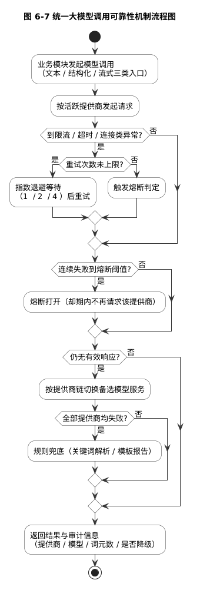

图 6-7 统一大模型调用可靠性机制流程图

调用层针对限流、超时与连接类异常执行指数退避重试（间隔一秒、两秒、四秒）；连续失败达到阈值后熔断打开，冷却期内不再请求该提供商，避免故障扩大；熔断或重试穷尽后按提供商链自动切换备选服务；全部提供商失败时落到规则兜底[31]。每次调用返回审计信息，包括实际使用的提供商、模型名、词元消耗与是否发生降级，审计信息随报告一并落库，使每一份报告的生成来源可追溯。结构化输出采用函数调用方式优先，失败时降级为文本调用并做兜底解析，兼容不同提供商的能力差异。

### 6.6.2 全链路降级设计

在统一调用层之上，每个依赖模型的业务点都设计了无密钥降级路径，形成"拔掉密钥系统依然完整可用"的容错体系，如表 6-3 所示。

表 6-3 全链路降级策略一览表

| 业务点 | 完整模式 | 降级模式 |
| --- | --- | --- |
| 智能查询解析 | 模型结构化解析意图 | 关键词规则解析 |
| 任务拆解 | 模型生成执行计划 | 固定默认计划 |
| 报告生成 | 模型按模板生成 | 固定模板报告 |
| 知识问答 | 模型生成引用回答 | 检索结果直接返回 |
| 火情图像识别 | 视觉模型结构化识别 | 返回友好提示不报错 |
| 语音交互 | 识别转文本、合成播报 | 前端隐藏对应入口 |
| 大屏数据 | 后端接口返回 | 前端本地数据兜底 |

## 6.7 空间分析与数据导入实现

### 6.7.1 网格聚类热点分析

空间分析智能体将零散火点转化为可决策的热点结论，算法流程如图 6-8 所示。

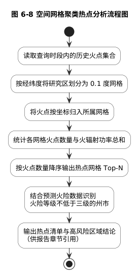

图 6-8 空间网格聚类热点分析流程图

由图 6-8 可知，算法以零点一度的经纬度网格为聚合单元，将火点按坐标归入网格后统计各网格的火点数量与火辐射功率总和，按数量降序输出热点网格，再结合预测火险数据识别等级不低于三级的州市，最终产出热点清单与高风险区域结论供报告引用。该算法实现简洁、结果可解释，网格粒度与市级尺度匹配，适合本系统的决策场景。

### 6.7.2 数据导入脚本

数据导入由一组独立脚本完成：初始化脚本启用空间扩展并建立全部表结构；火点导入脚本将卫星火点数据转换为几何列写入；预测导入脚本写入逐日与逐月两套预测数据；边界导入脚本以指定坐标系写入十六个州市边界；一键导入脚本将上述步骤串接并输出耗时统计。全部脚本支持自定义数据路径，便于替换为其他省份的数据。

## 6.8 前端界面实现

### 6.8.1 路由与页面结构

前端共七个页面，路由与权限设计如表 6-4 所示。

表 6-4 前端路由与权限设计表

| 路由 | 页面 | 权限 | 说明 |
| --- | --- | --- | --- |
| /login | 登录注册 | 公开 | 双模式切换，支持回跳 |
| /dashboard | 作战大屏 | 登录 | 默认首页，空间可视化 |
| /smart-query | 智能查询 | 登录 | 自然语言查询 |
| /knowledge-base | 知识库 | 登录 | 文档管理与问答 |
| /agent-center | 协作中心 | 登录 | 多智能体任务 |
| /report-center | 报告中心 | 登录 | 报告管理与导出 |
| /admin | 系统管理 | 管理员 | 六个管理页签 |

主布局采用窄边栏设计，菜单按角色过滤；状态管理持久化保存令牌与用户信息；请求封装统一附加认证头并拦截过期响应自动登出。等级配色、图表主题与空间数据处理均沉淀为工具模块，保证六个页面风格与行为一致。

### 6.8.2 作战大屏

作战大屏以地图为中心组织空间分析能力：底图之上叠加历史火点聚合图层、预测火险面图层与州市边界图层；点击聚合簇弹出详情抽屉；热力图层直观展示火点密集区域；绘制工具支持多边形与线段量测，面积与距离计算由前端空间库完成；地图支持导出为图片；逐日与逐月视图切换联动图表与地图。页面数据优先取自后端接口，任一接口失败时自动降级为随包分发的本地数据，并在界面标注当前数据来源，保证大屏在离线环境依然完整可用。大屏左侧集成火情识别侧栏，上传照片即可获得视觉模型的结构化识别结论，识别历史可回看与删除。页面整体布局与地图效果如图 6-11 所示。

图 6-11 作战大屏总体效果

热力图、火点详情、数据筛选、量测工具、图层管理、地图导出、预警信息与数据管线状态的运行效果依次如图 6-12 至图 6-19 所示。

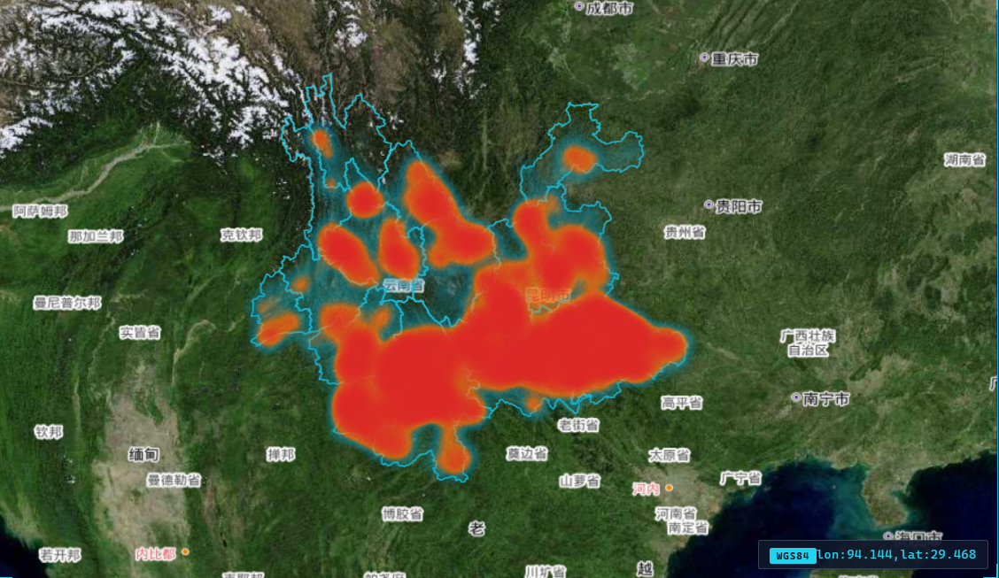

图 6-12 火点热力图效果

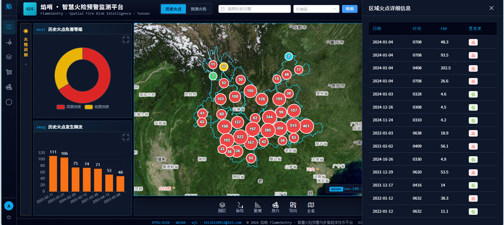

图 6-13 火点详情展示

图 6-14 火点筛选效果

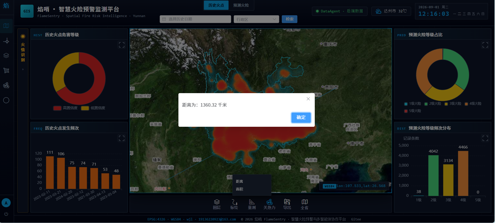

图 6-15 量测工具效果

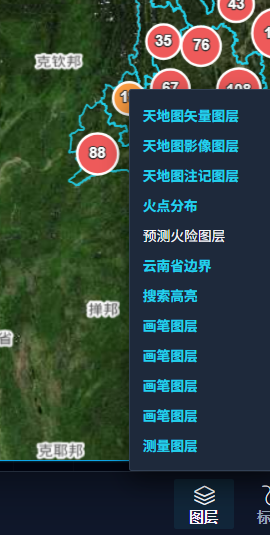

图 6-16 图层管理效果

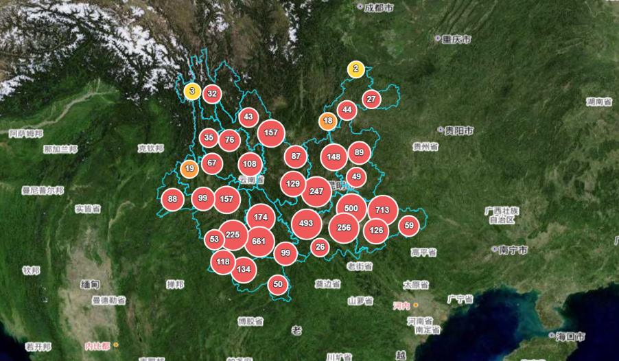

图 6-17 地图导出效果

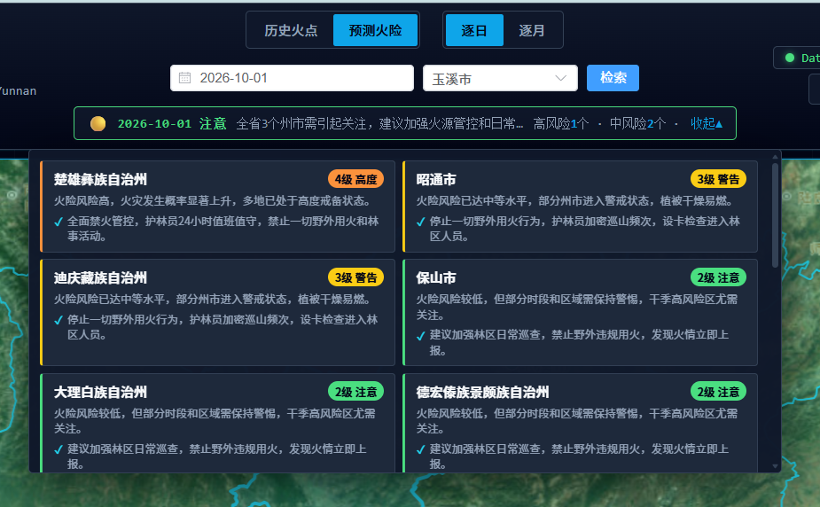

图 6-18 预警信息展示

图 6-19 数据管线状态展示

由上述各图可知，大屏将空间数据的多维呈现（聚合、热力、边界）、分析工具（量测、标绘、导出）与数据来源状态有机整合，形成了完整的态势感知界面。

### 6.8.3 智能查询与知识库页面

智能查询页以四维结果区为核心：摘要卡片展示结论与记录总数，表格页签动态生成列，图表页签按数据形态自适应选择柱状、折线或饼图，地图页签以风险分档配色渲染空间数据并自适应缩放。输入区支持快捷键执行、示例语句一键填入与语音输入；左侧历史侧栏支持点击回放与单条删除，解析方式以徽标标注。页面运行效果如图 6-20 所示。

图 6-20 智能查询页面效果

知识库页左侧为文档面板（拖拽上传、状态徽标、分类与删除），右侧为问答区：回答卡片标注是否使用模型，检索过程展示命中片段、检索方式与相关性分数，引用来源列表可展开查看原文片段与分数。语音提问在识别完成后自动提交。页面运行效果如图 6-21 所示。

图 6-21 知识库页面效果

### 6.8.4 协作中心与报告中心页面

协作中心将多智能体执行过程完整可视化：顶部任务输入区支持示例与语音输入，其下是五个智能体的就绪状态条与五步流水线，执行时步骤逐个点亮（运行中脉冲、完成绿色、待执行灰色），执行过程摘要面板展示每个智能体的输入输出，报告区以渲染后的正文呈现并支持语音播报。历史任务点击后从数据库拉取持久化步骤与报告，完整还原执行过程。任务到达待审批状态时，审批卡内联展示报告全文与三个决策按钮。页面运行效果如图 6-22 所示。

图 6-22 协作中心页面效果

报告中心左侧为列表面板（类型筛选、分页、摘要截断、删除），右侧为详情区，提供语音播报、Markdown 下载、网页导出、打印保存与删除五种操作；智能体生成的报告在列表与详情中均带来源徽标。页面运行效果如图 6-23 所示。

图 6-23 报告中心页面效果

### 6.8.5 全链路语音交互

语音交互覆盖五个页面，录音识别与语音播报两条链路的处理流程如图 6-9 所示。

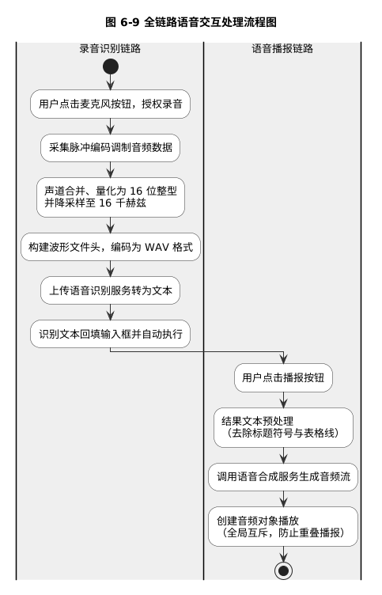

图 6-9 全链路语音交互处理流程图

录音链路的关键决策是绕开浏览器内置录音：内置录音输出网页容器格式，与识别服务支持的裸音频格式不兼容，因此实现采用音频采集接口直接获取采样数据，在前端完成声道合并、十六位量化与降采样，再手工构建波形文件头编码为标准格式上传。播报链路对结果文本先做净化处理（去除标题符号与表格线）再送合成服务，播放采用全局互斥状态防止重叠。语音工具以统一模块封装录音状态、播报状态与资源释放，页面卸载时自动回收麦克风与音频资源。

## 6.9 系统运行效果

除上述核心页面外，系统登录页的运行效果如图 6-10 所示，登录后按角色进入平台。

图 6-10 系统登录页效果

系统部署于云端服务器并长期运行，支持演示账号体验全部业务功能。从实际运行看：大屏在真实数据下渲染流畅；智能查询对自然语言问句的解析准确，四维结果联动正确；多智能体任务能够自动完成从查询到报告的完整链路，过程进度实时可见；报告经评审与审批后正常定稿并可在报告中心检索导出。

## 6.10 本章小结

本章按模块阐述了系统实现：认证与权限模块实现了双重防护与统一数据隔离；智能查询模块实现了双引擎解析与四维结果；知识库模块实现了四层解析兜底与混合检索精排；编排层实现了并行汇聚、反思重试、评审循环、人工审批、实时推送与状态持久化六项核心机制；统一调用层实现了重试、熔断、多提供商降级与全链路兜底；前端实现了七个页面的完整交互与全链路语音能力，并以真实运行截图展示了系统效果。

# 第7章 系统测试与结果分析

系统实现完成后，需要通过系统化的测试验证功能正确性、接口稳定性、编排逻辑可靠性与安全性。本章从测试环境搭建入手，依次开展功能测试、接口测试、多智能体编排回归评估与安全测试，并对测试结果进行分析。

## 7.1 测试环境与测试方法

系统测试覆盖云端部署环境与本地开发环境两类环境，软硬件配置如表 7-1 所示。云端环境用于验证真实网络条件下的部署形态与界面效果；本地环境用于开发调试、回归评估与问题定位。

表 7-1 系统测试环境

| 环境类别 | 项目 | 配置说明 |
| --- | --- | --- |
| 云端部署环境 | 服务器 | 云主机，Docker Compose 编排 db、backend、frontend 三容器 |
| 云端部署环境 | 操作系统 | Linux（容器基于 python:3.12-slim 与 nginx 镜像） |
| 云端部署环境 | 数据库 | PostgreSQL 14+，启用 PostGIS 3.5 空间扩展 |
| 云端部署环境 | 后端服务 | FastAPI 0.115.0 + Uvicorn，LangGraph 0.2.64 |
| 云端部署环境 | 前端服务 | Nginx 静态托管 + 反向代理（SSE 关闭缓冲） |
| 本地开发环境 | 操作系统 | Windows 11 |
| 本地开发环境 | Python 环境 | Python 3.12，依赖版本以依赖清单锁定为准 |
| 本地开发环境 | 前端构建 | Node.js 18+，Vite 6 构建 |
| 客户端 | 浏览器 | Chrome 及 Edge 最新稳定版 |

测试方法上，功能测试采用黑盒方式，按模块设计用例覆盖正常与异常输入；接口测试借助框架自带的交互式接口文档逐项验证请求参数、鉴权与响应结构；编排回归评估采用金标用例加确定性指标的自动化方式，保证改动编排逻辑前后行为可对比；安全测试针对身份认证、权限隔离、注入与跨站脚本等常见风险逐项核查。

## 7.2 功能测试

功能测试按八个业务模块设计用例，覆盖主流程与边界场景，主要用例与结果如表 7-2 所示。

表 7-2 功能测试用例表

| 模块 | 测试项 | 输入与操作 | 预期结果 | 测试结果 |
| --- | --- | --- | --- | --- |
| 认证 | 注册与登录 | 合法用户名密码注册后登录 | 注册成功即登录，令牌有效期 24 小时 | 通过 |
| 认证 | 异常口令 | 错误密码登录 | 拒绝登录并返回明确提示 | 通过 |
| 大屏 | 火点图层渲染 | 切换历史火点与预测火险图层 | 热力分布、州界与图例渲染正确 | 通过 |
| 大屏 | 时空筛选 | 按年份、月份与城市组合过滤 | 地图与统计面板联动刷新 | 通过 |
| 大屏 | 量算与导出 | 使用测距工具并导出视图 | 距离量算正确，导出图片完整 | 通过 |
| 智能查询 | 自然语言查询 | 输入"2023年3月大理历史火点分布" | 返回摘要、表格、图表与 GeoJSON 四维结果 | 通过 |
| 智能查询 | 历史去重 | 重复提交相同问句 | 命中历史记录，不重复入库 | 通过 |
| 知识库 | 文档上传 | 上传法规类 PDF 与纯文本 | 解析状态流转正常，可检索 | 通过 |
| 知识库 | 流式问答 | 发起带来源引用的提问 | 答案逐字流式输出并标注引用来源 | 通过 |
| Agent 协作 | 任务编排 | 发起火险分析与报告生成任务 | 节点进度实时推送，产物全部落库 | 通过 |
| Agent 协作 | 人工审批 | 对待审批报告分别执行同意、修改、驳回 | 三种分支均正确进入下一状态 | 通过 |
| 报告 | 报告导出 | 导出 Markdown 与 HTML 格式 | 文件内容完整，打印模板排版正常 | 通过 |
| 视觉 | 火情图像识别 | 上传含烟雾火焰的图片 | 返回四段结构化结论并写入识别历史 | 通过 |
| 语音 | 录音识别 | 录音后发送识别请求 | 转写文本正确显示并填入输入框 | 通过 |
| 语音 | 语音播报 | 对查询结果发起播报 | 音频正常播放，互斥控制无重叠 | 通过 |
| 系统管理 | 配置热生效 | 修改模型提供商并保存 | 免重启生效，敏感信息脱敏显示 | 通过 |

测试结果显示，各模块功能均符合设计预期。其中大屏模块的图层切换与时空筛选在真实数据规模下（五千余条历史火点）保持流畅；智能查询模块对多种问句风格均能正确解析意图；语音模块在浏览器端录音编码与服务端识别之间格式匹配正确。

## 7.3 接口测试

接口测试基于交互式接口文档逐项执行，重点验证请求参数校验、鉴权要求、响应结构与错误码。代表性接口的测试内容如表 7-3 所示。

表 7-3 接口测试表（代表性接口）

| 接口路径 | 方法 | 测试内容 | 预期结果 | 测试结果 |
| --- | --- | --- | --- | --- |
| /api/v1/auth/register、/login | POST | 注册登录与令牌签发 | 返回访问令牌，重复注册被拦截 | 通过 |
| /api/v1/auth/me | GET | 无令牌与伪造令牌访问 | 返回 401，拒绝访问 | 通过 |
| /api/v1/dashboard/history-fires | GET | 日期、城市、分页参数组合 | 数据条数与过滤条件一致 | 通过 |
| /api/v1/dashboard/summary | GET | 摘要统计字段完整性 | 总数、高置信数、Top5 城市齐全 | 通过 |
| /api/v1/query | POST | 自然语言问句提交 | 返回四维结果结构且历史入库 | 通过 |
| /api/v1/rag/documents | POST | PDF/TXT 上传与非法类型拦截 | 合法文件进入解析队列，非法类型被拒 | 通过 |
| /api/v1/rag/ask/stream | GET | 流式问答中断与续传 | 断线后可依据序号重放增量 | 通过 |
| /api/v1/agent/tasks | POST | 任务创建与异步执行 | 立即返回任务标识，状态异步更新 | 通过 |
| /api/v1/agent/tasks/{id}/events | GET | 步骤级 SSE 进度订阅 | 事件顺序与节点执行顺序一致 | 通过 |
| /api/v1/agent/tasks/{id}/approval | POST | 审批三分支动作 | 状态机按同意、修改、驳回正确迁移 | 通过 |
| /api/v1/reports/{id}/export | GET | 报告导出格式 | Markdown 与 HTML 内容一致完整 | 通过 |
| /api/v1/admin/config | PUT | 普通用户访问与配置写入 | 普通用户 403，管理员写入热生效 | 通过 |
| /api/v1/vision/audio/transcriptions | POST | 音频转写与超限校验 | 20MB 内音频正常转写，超限被拒 | 通过 |
| /api/v1/vision/audio/speech | POST | 文本合成与长度校验 | 500 字内合成成功返回音频 | 通过 |

除内部接口外，系统还通过工具协议接入外部天气数据源，用于丰富火险研判的环境要素。测试中对天气查询链路进行了实际调用验证，界面联动效果如图 7-1 所示，天气数据能够随区域查询正确展示。

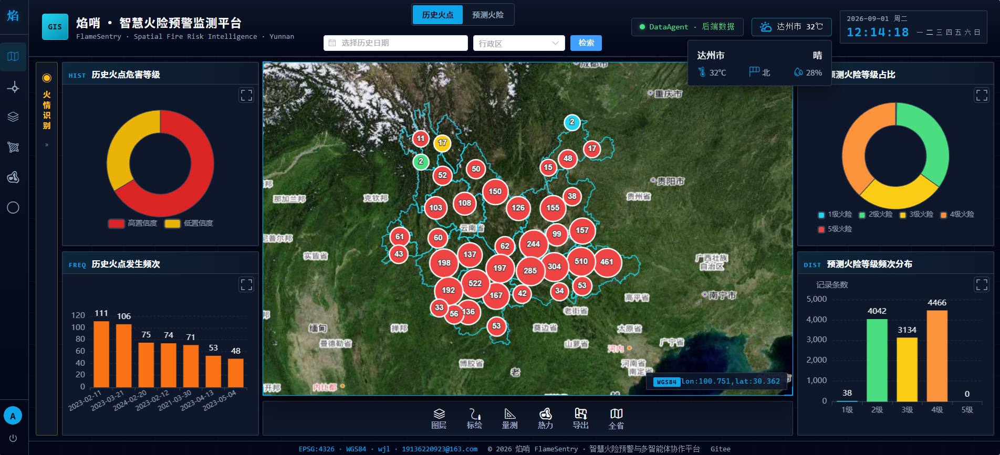

图 7-1 外部天气数据源集成效果

接口测试结果表明，各接口的参数校验、鉴权控制与响应结构均符合设计约定，流式接口在弱网条件下亦能维持增量推送的连续性。

## 7.4 多智能体编排回归评估

智能体编排是系统中提示词、模型与状态图耦合最深的部分，任何 prompt 调整、模型更换或图结构改动都可能引起路由行为漂移。为将该风险纳入工程管控，系统沉淀了金标评估集，包含十条覆盖典型任务形态的用例，并在改动前强制回归，全部通过才允许合入。金标用例的任务类型分布如表 7-4 所示。

表 7-4 编排回归金标用例表

| 用例编号 | 任务类型 | 问句要点 | 期望计划类型 |
| --- | --- | --- | --- |
| 用例 1 | 数据查询加报告 | 分析 2025 年 4 月云南火险形势并生成报告 | 数据查询 + 报告生成 |
| 用例 2 | 历史火点查询 | 2023 年 3 月大理历史火点分布 | 数据查询 |
| 用例 3 | 预测火险查询 | 2026 年 2 月昆明火险等级预测 | 数据查询 |
| 用例 4 | 知识检索问答 | 防火条例对野外用火的规定 | 知识检索 |
| 用例 5 | 统计对比 | 2024 年各州市火点数量对比 | 数据查询 |
| 用例 6 | 区域巡防报告 | 丽江 2025 年春季巡防方案报告 | 数据查询 + 报告生成 |
| 用例 7 | 知识加报告 | 结合防火规范分析曲靖火险并出报告 | 知识检索 + 报告生成 |
| 用例 8 | 趋势报告 | 昭通 2024 与 2025 年火点趋势报告 | 数据查询 + 报告生成 |
| 用例 9 | 知识标准查询 | 火险等级划分标准 | 知识检索 |
| 用例 10 | 非法类型过滤 | 火险分析任务中混入危险计划类型 | 危险类型必须被过滤 |

评估采用四类确定性指标，不依赖人工主观打分，指标定义与通过标准如表 7-5 所示。

表 7-5 回归评估指标与结果

| 指标类别 | 评估方式 | 通过标准 | 评估结果 |
| --- | --- | --- | --- |
| 工具选择正确性 | 比对解析产出的计划类型集合 | 与金标计划类型完全一致 | 十条用例全部通过 |
| 路由逻辑正确性 | 校验并行分发与汇聚结构 | 并行分发正确、汇聚后进入终态或报告链 | 十条用例全部通过 |
| 轨迹一致性 | 比对节点执行序列 | 与期望节点轨迹一致，兜底图轨迹精确匹配 | 十条用例全部通过 |
| 轻量忠实度 | 检查报告要素与篇幅下限 | 执行摘要、数据来源、巡防等要素齐全且篇幅达标 | 六条报告类用例全部通过 |

其中用例 10 专门验证安全边界：问句中混入的危险计划类型必须在解析后被路由过滤，确保智能体在任意输入下都不会获得危险工具。评估支持离线与在线两种模式，离线模式不依赖外部模型，可全量快速执行；在线模式接入真实模型验证端到端行为。两轮评估结果表明，编排逻辑在金标用例集上行为稳定，为后续迭代提供了可重复的回归基线。

## 7.5 安全测试

针对平台类系统的常见攻击面，设计安全测试项如表 7-6 所示，逐项验证防护措施的有效性。

表 7-6 安全测试表

| 测试项 | 测试方法 | 预期结果 | 测试结果 |
| --- | --- | --- | --- |
| 口令存储 | 查询数据库用户表 | 仅存加盐哈希，无明文口令 | 通过 |
| 会话伪造 | 构造篡改签名的访问令牌 | 签名校验失败，返回未授权 | 通过 |
| 令牌过期 | 使用过期令牌访问受保护接口 | 拒绝访问并要求重新登录 | 通过 |
| 水平越权 | 普通用户访问他人数据与管理接口 | 数据按用户隔离，管理接口拒绝 | 通过 |
| 垂直越权 | 普通用户调用管理员接口 | 返回禁止访问 | 通过 |
| SQL 注入 | 查询参数中注入拼接语句 | 全部经参数化处理，注入无效 | 通过 |
| 跨站脚本 | 输入与报告中嵌入脚本片段 | 渲染层转义处理，脚本不执行 | 通过 |
| 上传限制 | 上传非 PDF/TXT/MD 文件 | 类型校验拒绝，解析状态标记失败 | 通过 |
| 敏感信息泄露 | 查看系统管理配置接口 | 密钥类配置脱敏显示 | 通过 |

安全测试结果表明，认证、鉴权、注入防护与信息脱敏等机制运行有效，未发现可复现的安全缺陷。

## 7.6 本章小结

本章完成了系统的综合测试：功能测试覆盖八个模块十六项用例，全部通过；接口测试验证了十四条代表性接口的参数校验、鉴权与流式行为；编排回归评估以十条金标用例、四类确定性指标验证了多智能体编排的稳定性，并通过非法类型用例验证了安全边界；安全测试覆盖口令存储、越权、注入与跨站脚本等九个风险项。测试结果与第 4 章提出的功能需求和非功能需求相互印证，表明系统达到了设计目标。

# 第8章 总结与展望

## 8.1 工作总结

本文围绕森林火险预警业务中数据分散、研判依赖经验、报告编制耗时等现实问题，设计并实现了基于多智能体协同的森林火险智能分析与预警平台。主要工作总结如下。

第一，完成了业务调研与系统设计。梳理了历史火点、预测火险、州市边界等多源数据结构，提出分层架构与模块划分方案，完成了十三张业务表的数据库设计与统一风格的接口设计，为系统实现奠定了基础。

第二，构建了基于状态图的多智能体协同引擎。将任务解析、数据查询、空间分析、知识检索、报告生成、报告评审等环节建模为八个节点的状态图，通过并行分发汇聚提高执行效率，通过评审循环与人工审批保障产物质量，并借助检查点持久化支持任务恢复与历史回放。

第三，实现了面向大语言模型应用的可靠性底座。统一调用层提供指数退避重试、熔断保护、多提供商自动降级与规则兜底四级容错，使系统在模型服务波动甚至完全离线时仍能维持核心功能可用；每次调用附带提供商、模型与用量审计信息，为运维排查提供依据。

第四，实现了空间数据管理与智能分析能力。以空间扩展支撑五千余条历史火点与逐日逐月预测火险的存储索引，实现了网格聚类热点识别、缓冲区影响分析等空间算法，并以图层化地图组件与统计图表完成多维可视化呈现。

第五，实现了知识库检索增强与全链路实时交互。知识库支持四层文本解析兜底、中文感知切分、混合检索与重排精排；前端以服务端推送事件实现节点级任务进度、流式问答与报告增量呈现，并结合语音识别与合成完成了多模态交互闭环。

第六，建立了可重复的工程化保障。通过金标用例与确定性指标实现编排行为的回归管控，通过测试环境与测试用例体系验证了功能、接口与安全质量。

## 8.2 不足与展望

受开发周期与条件限制，系统仍存在以下不足，有待在后续工作中改进。

第一，向量检索存储有待升级。当前嵌入向量以结构化文本形式存储于分片表中，相似度计算在应用层完成，在知识库规模持续增长后检索效率将成为瓶颈。系统已预留向量扩展依赖，后续应将向量列迁移至数据库向量索引，实现存储与检索的数据库内闭环。

第二，接口级自动化测试尚未体系化。当前接口验证以人工执行与交互式文档为主，编排回归已实现自动化，但覆盖全部路由的接口自动化用例仍需补齐，以支撑持续集成流水线。

第三，运行日志为进程内存缓冲。系统日志采用环形缓冲存储于内存中，服务重启后历史日志丢失。后续应接入集中式日志存储与结构化追踪，将可观测性能力与业务进程解耦。

第四，火险预测依赖离线模型产物。预测数据来自地理加权时空回归模型的离线计算结果，系统未集成在线训练与滚动更新机制，预测时效性受制于数据导入周期。

展望未来，系统可从三个方向深化：其一，接入遥感影像与多源观测数据，结合视觉识别能力向灾情感知一体化演进；其二，扩展智能体工具生态，通过标准化工具协议接入更多外部数据与业务系统，提升协同分析的覆盖面；其三，探索面向防火业务的轻量化模型部署方案，在保障数据安全的前提下降低对外部模型服务的依赖。

系统的研究与实践表明，多智能体协同与检索增强生成技术在垂直业务领域具有切实的应用价值：在合理的编排设计与可靠性设计之下，大语言模型应用可以同时获得智能水平与工程稳定性，为智慧应急领域的智能化建设提供了可借鉴的工程路径。

# 参考文献

[1] Vaswani A, Shazeer N, Parmar N, et al. Attention is all you need[C]//Advances in Neural Information Processing Systems 30. Long Beach: Curran Associates, 2017: 5998-6008.

[2] Brown T B, Mann B, Ryder N, et al. Language models are few-shot learners[C]//Advances in Neural Information Processing Systems 33. Vancouver: Curran Associates, 2020: 1877-1901.

[3] Lewis P, Perez E, Piktus A, et al. Retrieval-augmented generation for knowledge-intensive NLP tasks[C]//Advances in Neural Information Processing Systems 33. Vancouver: Curran Associates, 2020: 9459-9474.

[4] Yao S, Zhao J, Yu D, et al. ReAct: Synergizing reasoning and acting in language models[C]//Proceedings of the 11th International Conference on Learning Representations. Kigali: OpenReview, 2023.

[5] Wang L, Ma C, Feng X, et al. A survey on large language model based autonomous agents[J]. Frontiers of Computer Science, 2024, 18(6): 186345.

[6] Xi Z, Chen W, Guo X, et al. The rise and potential of large language model based agents: A survey[J]. Science China Information Sciences, 2025, 68(2): 121101.

[7] Wooldridge M, Jennings N R. Intelligent agents: Theory and practice[J]. The Knowledge Engineering Review, 1995, 10(2): 115-152.

[8] Ouyang L, Wu J, Jiang X, et al. Training language models to follow instructions with human feedback[C]//Advances in Neural Information Processing Systems 35. New Orleans: Curran Associates, 2022: 27730-27744.

[9] Wei J, Wang X, Schuurmans D, et al. Chain-of-thought prompting elicits reasoning in large language models[C]//Advances in Neural Information Processing Systems 35. New Orleans: Curran Associates, 2022: 24824-24837.

[10] Karpukhin V, Oguz B, Min S, et al. Dense passage retrieval for open-domain question answering[C]//Proceedings of the 2020 Conference on Empirical Methods in Natural Language Processing. Online: Association for Computational Linguistics, 2020: 6769-6781.

[11] Schick T, Dwivedi-Yu J, Dessì R, et al. Toolformer: Language models can teach themselves to use tools[C]//Advances in Neural Information Processing Systems 36. New Orleans: Curran Associates, 2023: 68539-68551.

[12] Shinn N, Cassano F, Gopinath A, et al. Reflexion: Language agents with verbal reinforcement learning[C]//Advances in Neural Information Processing Systems 36. New Orleans: Curran Associates, 2023.

[13] Park J S, O'Brien J, Cai C J, et al. Generative agents: Interactive simulacra of human behavior[C]//Proceedings of the 36th Annual ACM Symposium on User Interface Software and Technology. San Francisco: ACM, 2023: 1-22.

[14] Wu Q, Bansal G, Zhang J, et al. AutoGen: Enabling next-gen LLM applications via multi-agent conversation[EB/OL]. (2023-08-21)[2026-10-04]. https://arxiv.org/abs/2308.08155.

[15] Hong S, Zhuge M, Chen J, et al. MetaGPT: Meta programming for a multi-agent collaborative framework[C]//Proceedings of the 12th International Conference on Learning Representations. Vienna: OpenReview, 2024.

[16] Fielding R T. Architectural styles and the design of network-based software architectures[D]. Irvine: University of California, Irvine, 2000.

[17] 车万翔, 窦志成, 冯岩松, 等. 大模型时代的自然语言处理：挑战、机遇与发展[J]. 中国科学：信息科学, 2023, 53(9): 1645-1688.

[18] 舒文韬, 李睿潇, 孙天祥, 等. 大型语言模型：原理、实现与发展[J]. 计算机研究与发展, 2024, 61(2): 351-361.

[19] 张钹, 朱军, 苏航. 迈向第三代人工智能[J]. 中国科学：信息科学, 2020, 50(9): 1281-1302.

[20] 黄昌宁, 赵海. 中文分词十年回顾[J]. 中文信息学报, 2007, 21(3): 16-24.

[21] Bai J, Bai S, Yang S, et al. Qwen technical report[EB/OL]. (2023-09-28)[2026-10-04]. https://arxiv.org/abs/2309.16609.

[22] Qwen Team. Qwen2.5 technical report[EB/OL]. (2024-12-19)[2026-10-04]. https://arxiv.org/abs/2412.15115.

[23] DeepSeek-AI. DeepSeek-V3 technical report[EB/OL]. (2024-12-26)[2026-10-04]. https://arxiv.org/abs/2412.19437.

[24] 邬伦, 刘瑜, 张晶, 等. 地理信息系统：原理、方法和应用[M]. 北京: 科学出版社, 2001.

[25] 龚健雅. 地理信息系统基础[M]. 北京: 科学出版社, 2001.

[26] Huang B, Wu B, Barry M. Geographically and temporally weighted regression for modeling spatio-temporal variation in house prices[J]. International Journal of Geographical Information Science, 2010, 24(3): 383-401.

[27] Giglio L, Schroeder W, Justice C O. The collection 6 MODIS active fire detection product: Standardization and upgrades[J]. Remote Sensing of Environment, 2016, 178: 137-146.

[28] 邱锡鹏. 神经网络与深度学习[M]. 北京: 机械工业出版社, 2020.

[29] 李航. 统计学习方法[M]. 2版. 北京: 清华大学出版社, 2019.

[30] 王珊, 萨师煊. 数据库系统概论[M]. 5版. 北京: 高等教育出版社, 2014.

[31] 周志华. 机器学习[M]. 北京: 清华大学出版社, 2016.

# 致  谢

毕业设计从选题、系统研发到论文撰写历时数月，其间得到了许多人的帮助与支持，在此谨致谢意。

感谢指导教师在选题论证、技术路线与论文规范等环节给予的悉心指导。从确定"以真实系统为依据撰写论文"的写作原则，到多智能体编排机制的设计取舍，再到论文图表的表述方式，导师的建议使本文在工程深度与学术表达之间取得了更好的平衡。

感谢学院的各位授课教师。系统开发所依赖的软件工程、数据库原理、地理信息系统与人工智能等课程知识，为完成本课题打下了基础。

感谢一同学习与开发的同学。在系统联调与测试阶段，他们既是问题的发现者，也是第一批真实用户，多次反馈使界面交互与功能细节得到改进。

最后感谢家人一直以来的理解与支持，让我能够安心完成学业与本课题的研发。

限于本人水平，论文难免存在疏漏与不足之处，恳请各位专家与老师批评指正。

# 附  录

## 附录 A 插图清单与图源文件对照表

本文全部示意图、流程图类插图均以 PlantUML 编写源文件，渲染为黑白学术风格图片后插入正文，源文件统一保存于后端仓库 docs/puml 目录；系统界面截图保存于 docs/images 目录。插图清单如表 A-1 所示。

表 A-1 插图清单与图源文件对照表

| 图号 | 图名 | 图源文件 |
| --- | --- | --- |
| 图 1-1 | 论文研究技术路线图 | puml/fig1-1_techroute.puml |
| 图 2-1 | Transformer 模型基本结构示意图 | puml/fig2-1_transformer.puml |
| 图 2-2 | 检索增强生成（RAG）基本流程图 | puml/fig2-2_rag.puml |
| 图 2-3 | LangGraph 状态图编排原理示意图 | puml/fig2-3_langgraph.puml |
| 图 4-1 | 系统总体用例图 | puml/fig4-1_usecase.puml |
| 图 4-2 | 自然语言智能查询活动图 | puml/fig4-2_activity_query.puml |
| 图 4-3 | 多智能体分析任务交互时序图（需求分析） | puml/fig4-3_seq_agent.puml |
| 图 5-1 | 系统总体分层架构图 | puml/fig5-1_arch.puml |
| 图 5-2 | 系统功能模块结构图 | puml/fig5-2_modules.puml |
| 图 5-3 | 数据库核心实体关系图 | puml/fig5-3_er.puml |
| 图 5-4 | 系统部署架构图 | puml/fig5-4_deploy.puml |
| 图 6-1 | 多智能体编排状态图 | puml/fig6-1_orch.puml |
| 图 6-2 | 数据查询反思重试流程图 | puml/fig6-2_reflect.puml |
| 图 6-3 | 报告评审循环流程图 | puml/fig6-3_review.puml |
| 图 6-4 | 人工审批中断与恢复时序图 | puml/fig6-4_hitl.puml |
| 图 6-5 | 实时进度推送（SSE）时序图 | puml/fig6-5_sse.puml |
| 图 6-6 | 知识库混合检索与重排序流程图 | puml/fig6-6_hybrid.puml |
| 图 6-7 | 统一大模型调用可靠性机制流程图 | puml/fig6-7_llminvoker.puml |
| 图 6-8 | 空间网格聚类热点分析流程图 | puml/fig6-8_gis.puml |
| 图 6-9 | 全链路语音交互处理流程图 | puml/fig6-9_speech.puml |
| 图 6-10 | 系统登录页效果 | images/fig6-10_login.png |
| 图 6-11 | 作战大屏总体效果 | images/fig6-11_dashboard.png |
| 图 6-12 | 火点热力图效果 | images/fig6-12_heatmap.png |
| 图 6-13 | 火点详情展示 | images/fig6-13_firedetail.png |
| 图 6-14 | 火点筛选效果 | images/fig6-14_filter.png |
| 图 6-15 | 量测工具效果 | images/fig6-15_measure.png |
| 图 6-16 | 图层管理效果 | images/fig6-16_layers.png |
| 图 6-17 | 地图导出效果 | images/fig6-17_export.png |
| 图 6-18 | 预警信息展示 | images/fig6-18_warning.png |
| 图 6-19 | 数据管线状态展示 | images/fig6-19_dataconn.png |
| 图 6-20 | 智能查询页面效果 | images/fig6-20_smartquery.png |
| 图 6-21 | 知识库页面效果 | images/fig6-21_knowledge.png |
| 图 6-22 | 协作中心页面效果 | images/fig6-22_agentcenter.png |
| 图 6-23 | 报告中心页面效果 | images/fig6-23_reportcenter.png |
| 图 7-1 | 外部天气数据源集成效果 | images/fig7-11_weather.png |

## 附录 B 系统模块与论文章节映射表

为便于按章节核对系统实现，表 B-1 给出系统主要模块与论文章节的对应关系。

表 B-1 系统模块与论文章节映射表

| 系统模块 | 主要实现内容 | 对应章节 |
| --- | --- | --- |
| 认证与权限 | 注册登录、令牌鉴权、双角色权限、用户数据隔离 | 6.2 |
| 大屏可视化 | 历史火点与预测火险图层、时空筛选、量算导出、预警展示 | 6.8、6.9 |
| 智能查询 | 双引擎意图识别、结构化查询、四维结果、历史去重 | 6.3 |
| 知识库 | 四层文本解析、中文切分、混合检索、重排序精排、流式问答 | 6.4 |
| 智能体协作 | 八节点状态图、并行汇聚、反思重试、评审循环、人工审批、检查点持久化 | 6.5 |
| 报告管理 | 七章刚性模板报告、导出 Markdown 与 HTML、报告中心 | 6.5、6.8 |
| 可靠调用 | 指数退避重试、熔断、多提供商降级、规则兜底、调用审计 | 6.6 |
| 空间分析与数据 | 网格聚类、缓冲区分析、三类数据导入脚本 | 6.7 |
| 视觉与语音 | 火情图像识别、语音识别、语音合成、前端音频编码 | 6.8 |
| 系统管理 | 配置热生效、敏感信息脱敏、模型目录、系统日志、用户管理 | 6.2、6.8 |
| 数据库与接口 | 十三张业务表、八大模块接口体系 | 5.4、5.5 |
| 编排回归评估 | 金标用例集、四类确定性指标、离线与在线评估 | 7.4 |

