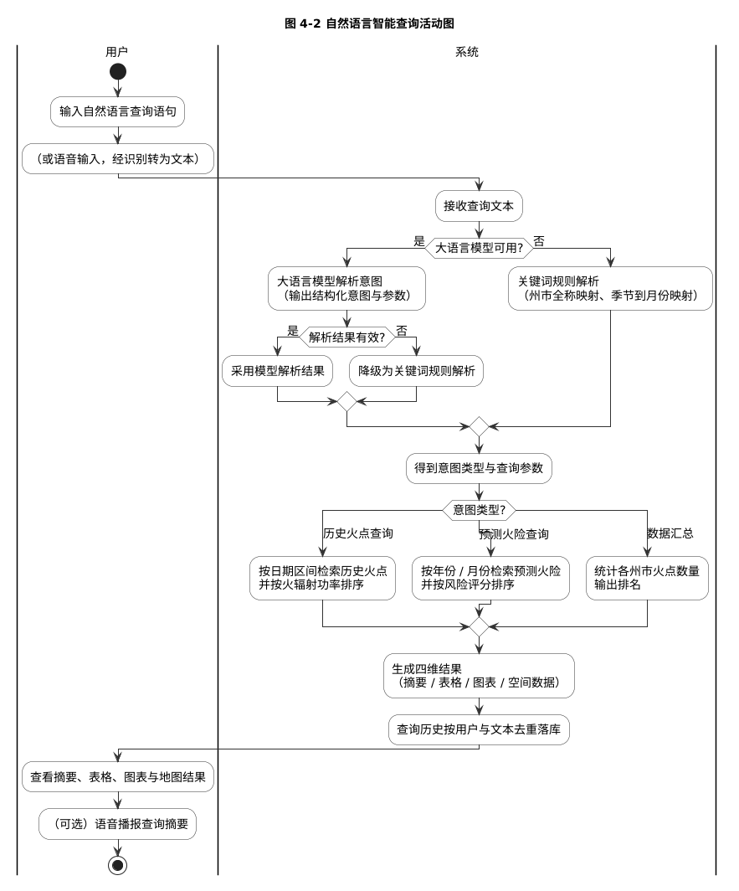
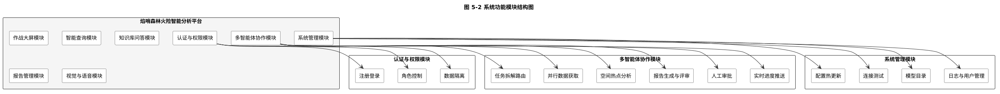
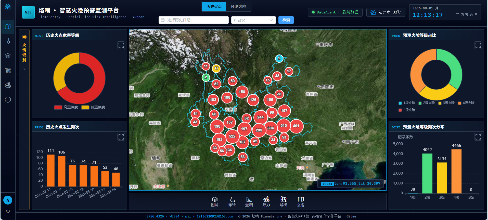
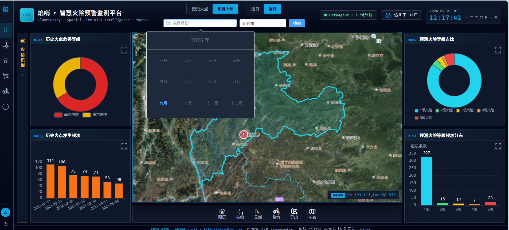
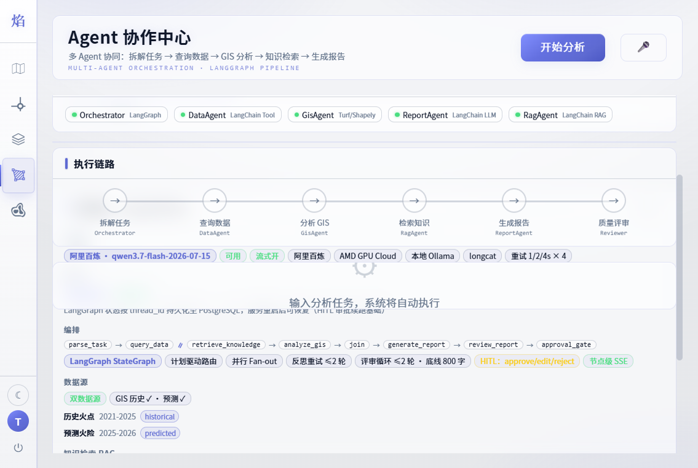

# 基于多智能体协同的森林火险智能分析与预警平台设计与实现（前端分册）

> 论文类型：本科毕业设计（软件工程方向） · 成果系统：焰哨（FlameSentry）森林火险智能分析与预警平台
> 分册说明：本册为完整毕业论文的前端分册，聚焦界面设计、空间可视化、实时交互与全链路语音；图表编号与参考文献编号沿用完整论文，保证两册可交叉对照。界面截图保存于前端仓库 docs/images 目录，示意图源文件保存于 docs/puml 目录。

## 摘  要

森林火险治理业务需要将分散的火点数据、预测结果与领域知识转化为直观可用的决策界面。传统可视化大屏以被动展示为主，交互门槛高，分析过程不可见，报告获取困难。针对上述问题，本文设计并实现了基于多智能体协同的森林火险智能分析与预警平台的前端应用，重点解决空间数据多维呈现、智能分析过程可视化和全链路语音交互问题。

前端基于渐进式框架与组件库构建七个页面，以开源地图引擎为核心实现作战大屏：底图之上叠加历史火点聚合、热力分布、预测火险面与州市边界多类图层，提供详情抽屉、时空筛选、绘制量测、视图导出与图层管理能力，接口失败时自动降级为随包分发的本地数据并标注数据来源。智能查询页实现摘要、表格、图表与地图四维结果联动渲染；知识库页呈现检索命中片段、相关性分数与引用来源；协作中心以五步流水线方式将多智能体执行过程逐步点亮，通过服务端推送事件实现节点级实时进度与历史回放，并内联完成报告审批；报告中心提供语音播报、Markdown 下载、网页导出与打印保存。全链路语音交互覆盖五个页面，录音链路在浏览器端完成采样处理与波形编码，播报链路实现文本净化与全局互斥播放。

测试表明，前端在真实数据规模下渲染流畅，四维结果联动正确，任务进度实时可见，语音识别与播报链路稳定可用，为多智能体分析能力提供了直观高效的交互载体。

**关键词**：前端可视化；Web 地图；交互设计；服务端推送事件；语音交互

## Abstract

Forest fire management requires intuitive interfaces that turn scattered fire data, predictions, and domain knowledge into actionable insight. This volume presents the front end of an intelligent forest-fire analysis and early-warning platform based on multi-agent collaboration, focusing on spatial visualization, process visibility, and full-chain voice interaction.

Built on a progressive framework and a component library, the application provides seven pages. The operations dashboard centers on an open-source map engine with aggregated fire points, heatmap, predicted risk polygons, and administrative boundary layers, together with detail drawers, spatio-temporal filters, drawing and measurement tools, view export, and layer management, and degrades to bundled local data when APIs fail. The smart-query page renders summary, table, chart, and map results in a linked four-view layout; the knowledge-base page presents retrieval snippets, relevance scores, and cited sources; the agent collaboration center visualizes the multi-agent pipeline with step-level progress streamed via Server-Sent Events, supports history replay and inline report approval; the report center offers voice broadcasting, Markdown download, HTML export, and printing. Voice interaction covers five pages: recording is encoded in the browser as standard waveform audio, and playback applies text cleanup with global mutual exclusion.

Testing shows that the front end renders smoothly under real data volume, keeps the four views synchronized, streams task progress in real time, and maintains stable voice recognition and broadcasting, providing an intuitive interaction carrier for the multi-agent analysis capabilities.

**Key words**: front-end visualization; web mapping; interaction design; server-sent events; voice interaction

## 目  录

- 第1章 绪论
  - 1.1 研究背景与意义
  - 1.2 国内外研究现状
  - 1.3 研究内容与主要工作
  - 1.4 论文组织结构
- 第2章 前端相关技术基础
  - 2.1 渐进式框架与前端工程体系
  - 2.2 地图渲染与空间计算引擎
  - 2.3 图表与富内容渲染
  - 2.4 浏览器音频与实时通信技术
  - 2.5 本章小结
- 第3章 可行性分析
  - 3.1 技术可行性
  - 3.2 经济可行性
  - 3.3 操作可行性
  - 3.4 法律合规与数据安全可行性
  - 3.5 本章小结
- 第4章 需求分析
  - 4.1 系统总体目标与角色边界
  - 4.2 功能性需求
  - 4.3 核心业务流程分析
  - 4.4 非功能性需求
  - 4.5 本章小结
- 第5章 前端设计
  - 5.1 前端总体结构设计
  - 5.2 路由与导航设计
  - 5.3 地图图层与交互设计
  - 5.4 状态管理与数据流设计
  - 5.5 语音交互设计
  - 5.6 本章小结
- 第6章 前端界面实现
  - 6.1 路由与页面结构
  - 6.2 作战大屏
  - 6.3 智能查询与知识库页面
  - 6.4 协作中心与报告中心页面
  - 6.5 全链路语音交互
  - 6.6 系统运行效果
  - 6.7 本章小结
- 第7章 前端测试与效果分析
  - 7.1 测试环境与测试方法
  - 7.2 界面功能测试
  - 7.3 流式交互与弱网测试
  - 7.4 兼容性与交互细节
  - 7.5 本章小结
- 第8章 总结与展望
  - 8.1 工作总结
  - 8.2 不足与展望
- 参考文献
- 致  谢

---

# 第1章 绪论

## 1.1 研究背景与意义

森林火灾具有突发性强、蔓延速度快、破坏范围广的特点，是威胁森林资源、生态系统与人民生命财产安全的重大自然灾害。云南省地处我国西南边陲，境内横断山脉与干热河谷交错分布，冬春季节（尤其是二月至五月）干旱少雨、风大物燥，森林火险等级长期居高不下，是我国森林火灾最高发的省份之一。森林火险治理涉及火情监测、风险评估、资源调度与应急处置等多个环节，对信息系统的依赖程度日益提高。

然而，现有森林火险信息化系统多以可视化大屏与静态报表为主，业务价值存在明显瓶颈。其一，查询门槛高：业务人员若要获得"某州市某月份火险排名"这类结论，需要掌握结构化查询语言或专业地理信息系统软件，一线人员难以直接使用。其二，知识沉淀不足：防火条例、处置规范、国家标准等文档散落在本地各处，火情发生时难以及时检索到权威依据。其三，分析依赖人工：从数据查询、空间分析到撰写处置报告的完整链条均由人工完成，耗时长且质量因人而异。其四，系统割裂：数据大屏、数据查询与报告撰写分属不同工具，无法形成决策闭环。

近年来，以大语言模型为代表的人工智能技术取得突破性进展[1][2]，检索增强生成[3]使模型能够基于外部知识回答领域问题，多智能体编排技术[4][5][6]使复杂任务能够被拆解为多个智能体分工协作完成。将这些技术与地理空间数据能力结合，构建一个"自然语言驱动、多智能体分工协作、知识库增强"的森林火险智能决策平台，在技术上已经成熟，在业务上具有明确价值。

本课题的意义在于：面向云南省森林火险治理的真实场景，完成从传统可视化大屏到智能决策平台的完整演进；将自然语言作为统一交互入口，降低业务人员使用门槛；将"查询—分析—检索—报告"链条交由多个智能体自动执行，缩短决策周期；同时通过可靠性工程设计保证系统在真实环境中稳定可用，形成可答辩、可演示、可维护的完整工程成果。

## 1.2 国内外研究现状

### 1.2.1 国外研究现状

智能体（Agent）研究由来已久。Wooldridge 与 Jennings 早在二十世纪九十年代就对智能体的弱定义与强定义进行了系统阐述[7]，奠定了多智能体系统的理论基础。2017 年，Vaswani 等提出 Transformer 架构[1]，以自注意力机制建模长距离上下文依赖，成为后续大规模预训练模型的标准骨架。Brown 等于 2020 年提出 GPT-3[2]，验证了大规模语言模型少样本学习的涌现能力；Ouyang 等通过基于人类反馈的指令微调[8]显著提升了模型遵循指令的能力；Wei 等提出思维链提示[9]，增强了模型在复杂推理任务上的表现。

在模型能力外部化方面，Lewis 等提出检索增强生成框架[3]，将参数化知识与外部知识库解耦，显著降低了幻觉问题；Karpukhin 等提出的稠密段落检索[10]为向量语义检索提供了经典方案。在工具使用与自主行动方面，Yao 等提出 ReAct 范式[4]，将推理与行动交替执行；Schick 等提出 Toolformer[11]，使模型学会自主调用外部工具。在自我改进方面，Shinn 等提出 Reflexion 机制[12]，使智能体能够基于失败反馈进行反思重试。

多智能体协作方面，Park 等构建了具有记忆与反思能力的生成式智能体社会[13]；Wu 等提出 AutoGen 多智能体对话框架[14]；Hong 等提出 MetaGPT[15]，将软件公司的标准作业流程引入多智能体协作。Wang 等与 Xi 等分别对基于大语言模型的自主智能体进行了系统综述[5][6]，指出任务规划、记忆、工具使用与多智能体协作是该方向的核心议题。此外，Fielding 的表述性状态转移架构约束[16]为现代 Web 服务接口设计提供了方法论基础。

### 1.2.2 国内研究现状

国内在大语言模型及其应用方向的研究紧随国际前沿并形成自身特色。车万翔等系统论述了大模型时代自然语言处理面临的挑战、机遇与发展路径[17]，指出语言模型正在从任务专用走向通用基座；舒文韬等从原理、实现与发展三个维度对大型语言模型进行了全面梳理[18]；张钹等提出迈向第三代人工智能的技术路线[19]，强调将知识驱动与数据驱动相结合，这一思路与本文"模型推理 + 知识库检索 + 确定性护栏"的混合设计相契合。在中文信息处理基础方面，黄昌宁等对中文分词技术进行了系统回顾[20]，为本文知识库检索中的中文分词通道提供了依据。

在领域应用层面，国产大模型生态快速成熟：通义千问系列模型先后发布技术报告[21][22]，提供了开放接口与向量、多模态系列模型；DeepSeek 系列模型以低成本高性能著称[23]，并可通过云服务接口获得。空间信息领域，国产地理信息系统的理论与工程体系较为完善[24][25]，地理与时序加权回归模型（GTWR）由 Huang 等提出[26]，被广泛用于火险等时空非平稳关系的建模，本文预测火险数据即来源于基于该模型的预测结果。在火情遥感监测方面，Giglio 等发展的 MODIS 主动火点检测算法[27]是全球火点数据产品的基础，本文历史火点数据即取自其数据产品。总体来看，将大模型与多智能体技术应用于森林火险治理的完整工程实践仍较少，本文工作具有一定的探索价值。

## 1.3 研究内容与主要工作

本文的研究对象是面向森林火险治理的智能分析与预警平台，核心研究内容可抽象为"如何以状态图编排多个智能体，在保证可靠性与可控性的前提下，自动完成自然语言驱动的数据分析任务链路"。围绕这一抽象，本文完成的主要工作如下：

1. 完成系统总体设计与数据库设计。构建前后端分离的六层架构，设计覆盖业务数据与平台数据共十三张数据表，其中空间数据表采用点与多边形几何字段并建立空间索引；设计覆盖认证、大屏、查询、知识库、协作、报告、管理与视觉语音八大模块的接口体系。
2. 设计并实现状态图驱动的多智能体编排机制。包括结构化执行计划的产出与约束、数据查询与知识检索的并行执行与汇聚屏障、查询为空时的反思重试、报告的模型评审与确定性硬护栏双重把关、基于中断恢复机制的人工审批闸口，以及节点级实时进度推送。
3. 实现检索增强问答与可靠性工程。包括扫描版文档的四层文本解析兜底、中文感知切分、向量与关键词双通道混合检索、重排序精排及其降级方案，以及覆盖重试、熔断、多提供商降级与规则兜底的统一模型调用层。
4. 实现前端六类交互界面与全链路语音交互。包括基于开源地图引擎的作战大屏（聚合、热力图、量测、导出）、智能查询四维结果联动、知识库问答、协作中心流水线可视化、报告管理与系统管理，以及录音识别与语音播报的完整链路。
5. 建立多维度系统验证体系。包括黑盒功能测试、接口测试、基于金标用例集的编排回归评估与安全测试。

## 1.4 论文组织结构

本文共分八章，研究技术路线如图 1-1 所示。

图 1-1 论文研究技术路线图

由图 1-1 可知，本文遵循"问题定义—方案设计—系统实现—系统验证"的研究主线：首先将业务问题抽象为任务链路问题，继而完成总体架构与编排机制设计，随后分别完成后端与前端实现，最后从功能、编排回归与运行效果三个层面完成验证。

各章内容安排如下：第 1 章介绍研究背景、国内外研究现状与主要工作；第 2 章介绍系统涉及的相关技术原理；第 3 章从技术、经济、操作与合规四个角度进行可行性分析；第 4 章进行需求分析，给出用例模型、业务流程与非功能需求；第 5 章给出系统总体设计，包括架构、模块、数据库、接口与部署设计；第 6 章阐述系统各模块的实现细节并展示运行效果；第 7 章介绍系统测试与结果分析；第 8 章总结全文并展望后续工作。

# 第2章 前端相关技术基础

## 2.1 渐进式框架与前端工程体系

前端采用渐进式框架 Vue 3 作为主体框架。其组合式接口允许按业务关注点组织状态与方法，配合响应式数据绑定与虚拟文档对象模型差量更新，在频繁交互的地图与表格场景下保持良好渲染性能。工程层面采用原生模块化的构建工具链，开发阶段热更新显著提升联调效率，构建产物经容器化由网页服务器托管。前端核心技术选型如表 2-1 所示。

表 2-1 前端核心技术选型表

| 类别 | 技术 | 版本 | 选型理由 |
| --- | --- | --- | --- |
| 框架 | Vue 3 | 3.5.13 | 组合式接口，生态成熟 |
| 路由 | Vue Router | 4.5.0 | 支持导航守卫与权限过滤 |
| 状态管理 | Pinia | 3.0.1 | 轻量状态管理，支持持久化 |
| 组件库 | Element Plus | 2.9.6 | 表格、表单、上传等组件齐全 |
| 地图引擎 | OpenLayers | 10.4.0 | 聚合、热力图、绘制与导出能力强 |
| 空间计算 | Turf.js | 7.2.0 | 面积与距离量测 |
| 图表 | ECharts | 5.6.0 | 图表类型丰富，支持自定义主题 |
| 构建工具 | Vite | 6.1.0 | 开发热更新快，支持代理配置 |
| 语音处理 | Web Audio API | 原生 | 前端采集并编码音频，规避兼容性问题 |
| 富文本渲染 | Markdown 渲染封装 | — | 报告与识别结果统一渲染 |

## 2.2 地图渲染与空间计算引擎

开源地图引擎以图层为核心组织空间渲染：瓦片底图层承载基础地理信息，矢量要素层承载点、面要素并支持样式与交互绑定，热力图层基于权重字段生成密度渲染。引擎内置聚合策略，可将海量点要素按缩放级别动态合并为聚合簇，避免数千级火点直接渲染导致的性能问题；绘制交互与画布导出能力则支撑量测与快照功能。空间计算库提供面积、距离等测度算法，与前述引擎配合完成前端独立的量算能力。

## 2.3 图表与富内容渲染

统计图表库提供柱状、折线、饼图等基础图形与主题定制能力，前端依据查询结果的数据形态自适应选择图表类型。分析报告与识别结论以 Markdown 格式存储与传输，前端封装统一渲染管线将其转换为结构化页面元素，并为打印导出场景准备了独立排版样式。

## 2.4 浏览器音频与实时通信技术

音频处理方面，浏览器音频接口允许直接访问采样数据：将多声道采样合并、量化为十六位整数并降采样后，按波形文件格式手工构建文件头即可生成标准音频，避免浏览器内置录音容器格式与识别服务不兼容的问题。实时通信方面，服务端推送事件基于单向长连接按序推送文本增量，浏览器端事件源接口自动维护连接并在断开后重连，配合序号参数可实现断线期间的增量重放，适合任务进度与流式回答的实时呈现。

## 2.5 本章小结

本章介绍了前端实现所依赖的技术：渐进式框架与工程体系构成开发底座，地图与空间计算引擎支撑空间可视化，图表与富内容渲染完成结果呈现，浏览器音频与实时通信技术则支撑语音交互与实时进度。后续章节将基于上述技术展开前端需求分析与设计。

# 第3章 可行性分析

## 3.1 技术可行性

系统全部采用成熟的开源技术与公开的模型服务接口，技术栈在生产环境均有大量成功案例，具体分析如表 3-1 所示。

表 3-1 技术可行性分析表

| 层面 | 分析 | 结论 |
| --- | --- | --- |
| 前端技术 | 组合式接口已成为主流开发范式，地图引擎对聚合、热力图与绘制支持成熟，图表库覆盖全部可视化需求 | 可行 |
| 后端技术 | 异步接口框架与对象关系映射均为生产级成熟方案，完整支持空间几何字段 | 可行 |
| 空间数据库 | 空间扩展提供几何类型、空间函数与索引，满足火点存储与空间分析需求 | 可行 |
| 模型能力 | 模型服务商提供兼容接口，支持多提供商切换与本地部署兜底 | 可行 |
| 检索链路 | 文本解析、中文切分、向量化与混合检索均有成熟组件，链路完整 | 可行 |
| 降级容错 | 全部模型依赖点均设计无密钥降级方案，保证任何环境下可演示 | 可行 |

## 3.2 经济可行性

系统全部采用开源技术栈，无授权费用。模型服务按调用量计费且提供免费额度，本地部署的模型可作为离线兜底，使运行成本可控。硬件方面，单台八吉字节内存的计算机即可同时运行前后端与数据库，满足开发与演示需求。数据方面，历史火点取自公开的卫星火点数据产品，行政边界取自开放的地理数据，预测火险由既有模型产出，均无采购成本。综上，经济上完全可行。

## 3.3 操作可行性

系统前端全部交互基于组件库控件与自然语言输入，业务人员无需掌握查询语言或专业软件即可使用；智能查询、知识库与协作中心均提供示例语句，一键即可发起。系统管理页提供模型配置的在线修改、连接测试与脱敏回显，运维人员无需登录服务器即可完成配置变更。语音输入与播报进一步降低了移动场景下的使用门槛。综上，操作上具备可行性。

## 3.4 法律合规与数据安全可行性

系统使用的数据均无版权风险：火点数据来自公开的科研数据产品，行政边界来自开放地理数据，知识库文档由用户自行上传。安全方面，用户密码以单向哈希存储，签名密钥置于环境变量而不进入代码仓库，接口访问基于令牌鉴权，普通用户之间的历史数据完全隔离。系统不采集任何与业务无关的个人信息，不进行数据转售。综上，法律与数据安全层面可行。

## 3.5 本章小结

本章从技术、经济、操作与合规四个维度论证了系统建设的可行性，结论表明：系统所依赖的技术全部成熟可用，成本可控，操作门槛低，数据来源与安全机制合规，具备完整的建设条件。

# 第4章 需求分析

## 4.1 系统总体目标与角色边界

系统的总体目标是：在继承既有火险可视化能力的基础上，构建一个以自然语言为主要交互方式的智能决策平台，将"数据查询—空间分析—知识检索—报告生成"的任务链路交由多个智能体自动完成，并由人工对关键产出进行确认。系统的输入特征包括三类：自然语言查询与分析请求、知识库文档、火情现场图像与语音；输出特征包括空间可视化、四维查询结果、带引用的知识问答与结构化分析报告。

系统涉及两类角色，其职责边界严格区分：普通用户可以使用全部业务能力（大屏浏览、智能查询、知识问答、任务发起、报告管理、火情识别、语音交互），但只能访问自己的历史数据；管理员在普通用户能力之外，负责系统配置、模型接入、连接测试、日志审计与用户管理。平台层面还存在两类不可交互的服务角色：模型服务提供推理与向量化能力，地图与天气服务提供底图与气象数据。

## 4.2 功能性需求

系统总体用例模型如图 4-1 所示，普通用户与管理员两类角色通过统一入口访问平台。

图 4-1 系统总体用例图

由图 4-1 可知，系统的功能用例围绕"看数据、查数据、问知识、做分析、管报告、控系统"六条主线组织。核心用例的功能需求描述如表 4-1 所示。

表 4-1 核心功能用例描述表

| 编号 | 用例名称 | 参与者 | 主要流程 | 关键约束 |
| --- | --- | --- | --- | --- |
| UC-01 | 浏览作战大屏 | 普通用户 | 打开大屏，浏览历史火点、预测火险与行政边界，使用聚合、热力图、量测、标绘与导出工具 | 数据加载失败时自动降级本地数据，页面不空白 |
| UC-02 | 自然语言智能查询 | 普通用户 | 输入自然语言或语音输入，系统解析意图与参数后执行查询，返回摘要、表格、图表与地图四维结果并自动落库历史 | 模型不可用时降级为关键词解析；重复查询去重 |
| UC-03 | 知识库问答 | 普通用户 | 上传文档，提问后系统混合检索知识库并生成带引用来源的回答 | 扫描版文档可解析；未命中时明确声明 |
| UC-04 | 多智能体分析 | 普通用户 | 输入分析任务，多个智能体自动执行查询、分析、检索与报告生成，过程实时可见 | 数据查询、空间分析与报告生成为不可裁剪步骤 |
| UC-05 | 报告审批 | 普通用户 | 在人工审批环节对报告执行通过、编辑或驳回操作 | 驳回必须附带意见，意见注入重写 |
| UC-06 | 报告管理 | 普通用户 | 按类型筛选报告，查看正文，导出为 Markdown 或网页格式并打印 | 用户仅可见自己的报告；删除为软删除 |
| UC-07 | 火情图像识别 | 普通用户 | 上传火场照片，系统输出火情判定、场景描述、严重程度与处置建议，识别历史可回看 | 非火情图片明确标注；识别记录按用户隔离 |
| UC-08 | 语音交互 | 普通用户 | 语音输入自动转为查询、提问或任务；结果一键语音播报 | 识别完成自动执行；播报互斥防重叠 |
| UC-09 | 系统配置管理 | 管理员 | 在线修改模型与数据源配置，保存即生效并脱敏回显 | 无需重启；敏感信息脱敏展示 |
| UC-10 | 用户与日志管理 | 管理员 | 管理用户与角色，查看系统日志 | 防止自我降权与自我删除 |

## 4.3 核心业务流程分析

### 4.3.1 智能查询业务流程

智能查询是使用频率最高的功能，其业务流程覆盖"输入—解析—执行—展示—沉淀"五个阶段，活动图如图 4-2 所示。

图 4-2 自然语言智能查询活动图

由图 4-2 可知，解析环节存在两级容错：模型解析失败时降级为关键词规则解析，模型服务整体不可用时直接走规则通道，保证查询功能永远可用；执行环节按意图类型分流到历史火点、预测火险与数据汇总三种执行器，最终统一生成四维结果并完成历史去重落库。

### 4.3.2 多智能体分析任务流程

多智能体分析任务是系统的核心业务，涉及前端、接口层、编排层与数据层的多方协作，交互时序如图 4-3 所示。

图 4-3 多智能体分析任务交互时序图（需求分析）

由图 4-3 可知，任务创建接口立即返回任务标识，执行过程转入后台线程，前端通过订阅实时进度流获取节点级进展；数据查询与知识检索并行执行以缩短总耗时；报告生成后进入人工审批，审批决策注入后流程继续直至定稿落库。该流程对系统的隐含要求包括：任务状态必须持久化以支撑中断恢复、步骤信息必须落库以支撑历史回放、进度推送必须与落库解耦以避免阻塞执行。

## 4.4 非功能性需求

除功能需求外，系统在性能、可用性、安全性、可维护性与兼容性方面的要求如表 4-2 所示。

表 4-2 非功能性需求表

| 类别 | 需求描述 |
| --- | --- |
| 性能 | 大屏并发拉取数千条火点数据应在秒级完成；智能查询全链路（含模型调用）控制在可接受时长内；任务执行期间界面实时可见进展而非长时间无响应 |
| 可用性 | 任一模型接口不可用时自动降级，核心页面永不白屏；大屏数据提供本地兜底；报告提供模板兜底 |
| 安全性 | 密码单向哈希存储；接口基于令牌鉴权；敏感配置脱敏回显；用户数据严格隔离 |
| 可维护性 | 配置集中于环境变量并支持在线热更新；系统日志全程留痕；关键模块职责单一、边界清晰 |
| 可扩展性 | 模型提供商可切换；编排节点可插拔；数据导入脚本支持自定义数据源 |
| 兼容性 | 支持主流现代浏览器；地图采用标准坐标系；接口响应采用统一包裹结构 |

## 4.5 本章小结

本章完成了系统需求分析：界定了普通用户与管理员的角色边界，梳理了十个核心用例及其约束条件，通过活动图与时序图刻画了智能查询与多智能体分析两条核心业务流程，并归纳了六个维度的非功能性需求。其中"任务状态持久化、步骤落库、进度推送解耦"等隐含需求将直接转化为第 5 章的设计决策。

# 第5章 前端设计

## 5.1 前端总体结构设计

前端按"视图层—组件层—状态层—工具层—路由层"五层组织：视图层由七个页面构成，对应平台全部业务入口；组件层沉淀地图组件与通用业务组件，保证地图能力在页面间复用；状态层管理认证信息与界面主题并持久化；工具层封装请求、语音、Markdown 渲染、等级配色与空间数据处理等横切逻辑；路由层负责页面组织与权限过滤。前端界面与系统功能模块的对应关系如图 5-2 所示。

图 5-2 系统功能模块结构图

## 5.2 路由与导航设计

前端共七个页面，路由与权限设计如表 5-1 所示。全局导航守卫在路由切换时校验登录状态与角色，未登录访问受限页面时重定向至登录页并在登录后回跳原目标；菜单依据角色过滤，普通用户不可见系统管理入口。

表 5-1 前端路由与权限设计表

| 路由 | 页面 | 权限 | 说明 |
| --- | --- | --- | --- |
| /login | 登录注册 | 公开 | 双模式切换，支持回跳 |
| /dashboard | 作战大屏 | 登录 | 默认首页，空间可视化 |
| /smart-query | 智能查询 | 登录 | 自然语言查询 |
| /knowledge-base | 知识库 | 登录 | 文档管理与问答 |
| /agent-center | 协作中心 | 登录 | 多智能体任务 |
| /report-center | 报告中心 | 登录 | 报告管理与导出 |
| /admin | 系统管理 | 管理员 | 六个管理页签 |

## 5.3 地图图层与交互设计

作战大屏以地图为中心组织图层与交互，图层设计如表 5-2 所示。交互上，点击聚合簇弹出详情抽屉，绘制工具配合空间计算库完成量测，画布导出生成快照图片；预测火险面图层按等级配色渲染并与图表联动。

表 5-2 地图图层设计表

| 图层 | 数据来源 | 交互与说明 |
| --- | --- | --- |
| 底图 | 瓦片地图服务 | 基础地理参照，支持缩放平移 |
| 历史火点聚合 | /api/v1/dashboard/history-fires | 按缩放聚合，点击弹出详情抽屉 |
| 火点热力 | 同上 | 以权重字段渲染密度分布 |
| 预测火险面 | /api/v1/dashboard/predict-risks | 逐日与逐月视图切换，等级配色 |
| 州市边界 | 随包分发边界数据 | 描边渲染，辅助空间定位 |
| 绘制与量测 | 前端空间计算库 | 多边形量面积、线段量距离 |
| 标注与导出 | 画布合成 | 视图导出为图片 |

## 5.4 状态管理与数据流设计

状态层持久化保存令牌与用户信息，刷新页面无需重新登录；请求封装统一附加认证头并拦截过期响应自动登出。实时数据流方面，任务进度与流式回答经服务端推送事件下发，前端按事件序号维护游标，断线重连后携带游标请求增量重放，保证长任务进度不丢失。部署架构中反向代理对事件流关闭缓冲，确保增量即时到达浏览器，系统部署架构如图 5-4 所示。

图 5-4 系统部署架构图

## 5.5 语音交互设计

语音交互覆盖五个页面，设计上分为录音识别与语音播报两条链路：录音链路在浏览器端完成声道合并、量化与降采样，并手工编码为标准波形格式上传，规避容器格式兼容问题；播报链路先对结果文本净化（去除标题符号与表格线）再送合成服务，播放采用全局互斥状态防止重叠；语音工具以统一模块封装录音状态、播报状态与资源释放，页面卸载时自动回收麦克风与音频资源。两条链路的完整处理流程如图 6-9 所示。

## 5.6 本章小结

本章完成了前端总体设计：五层结构划清了职责边界，路由与导航设计落实了权限控制，地图图层设计明确了数据来源与交互方式，状态与数据流设计保证了认证安全与实时体验，语音交互设计确立了编码与播放策略。后续章节将按此设计展开前端实现。

# 第6章 前端界面实现

## 6.1 路由与页面结构

前端共七个页面，路由与权限设计如表 6-1 所示。

表 6-1 前端路由与权限设计表

| 路由 | 页面 | 权限 | 说明 |
| --- | --- | --- | --- |
| /login | 登录注册 | 公开 | 双模式切换，支持回跳 |
| /dashboard | 作战大屏 | 登录 | 默认首页，空间可视化 |
| /smart-query | 智能查询 | 登录 | 自然语言查询 |
| /knowledge-base | 知识库 | 登录 | 文档管理与问答 |
| /agent-center | 协作中心 | 登录 | 多智能体任务 |
| /report-center | 报告中心 | 登录 | 报告管理与导出 |
| /admin | 系统管理 | 管理员 | 六个管理页签 |

主布局采用窄边栏设计，菜单按角色过滤；状态管理持久化保存令牌与用户信息；请求封装统一附加认证头并拦截过期响应自动登出。等级配色、图表主题与空间数据处理均沉淀为工具模块，保证六个页面风格与行为一致。

## 6.2 作战大屏

作战大屏以地图为中心组织空间分析能力：底图之上叠加历史火点聚合图层、预测火险面图层与州市边界图层；点击聚合簇弹出详情抽屉；热力图层直观展示火点密集区域；绘制工具支持多边形与线段量测，面积与距离计算由前端空间库完成；地图支持导出为图片；逐日与逐月视图切换联动图表与地图。页面数据优先取自后端接口，任一接口失败时自动降级为随包分发的本地数据，并在界面标注当前数据来源，保证大屏在离线环境依然完整可用。大屏左侧集成火情识别侧栏，上传照片即可获得视觉模型的结构化识别结论，识别历史可回看与删除。页面整体布局与地图效果如图 6-11 所示。

图 6-11 作战大屏总体效果

热力图、火点详情、数据筛选、量测工具、图层管理、地图导出、预警信息与数据管线状态的运行效果依次如图 6-12 至图 6-19 所示。

图 6-12 火点热力图效果

图 6-13 火点详情展示

图 6-14 火点筛选效果

图 6-15 量测工具效果

图 6-16 图层管理效果

图 6-17 地图导出效果

图 6-18 预警信息展示

图 6-19 数据管线状态展示

由上述各图可知，大屏将空间数据的多维呈现（聚合、热力、边界）、分析工具（量测、标绘、导出）与数据来源状态有机整合，形成了完整的态势感知界面。

## 6.3 智能查询与知识库页面

智能查询页以四维结果区为核心：摘要卡片展示结论与记录总数，表格页签动态生成列，图表页签按数据形态自适应选择柱状、折线或饼图，地图页签以风险分档配色渲染空间数据并自适应缩放。输入区支持快捷键执行、示例语句一键填入与语音输入；左侧历史侧栏支持点击回放与单条删除，解析方式以徽标标注。页面运行效果如图 6-20 所示。

图 6-20 智能查询页面效果

知识库页左侧为文档面板（拖拽上传、状态徽标、分类与删除），右侧为问答区：回答卡片标注是否使用模型，检索过程展示命中片段、检索方式与相关性分数，引用来源列表可展开查看原文片段与分数。语音提问在识别完成后自动提交。页面运行效果如图 6-21 所示。

图 6-21 知识库页面效果

## 6.4 协作中心与报告中心页面

协作中心将多智能体执行过程完整可视化：顶部任务输入区支持示例与语音输入，其下是五个智能体的就绪状态条与五步流水线，执行时步骤逐个点亮（运行中脉冲、完成绿色、待执行灰色），执行过程摘要面板展示每个智能体的输入输出，报告区以渲染后的正文呈现并支持语音播报。历史任务点击后从数据库拉取持久化步骤与报告，完整还原执行过程。任务到达待审批状态时，审批卡内联展示报告全文与三个决策按钮。页面运行效果如图 6-22 所示。

图 6-22 协作中心页面效果

报告中心左侧为列表面板（类型筛选、分页、摘要截断、删除），右侧为详情区，提供语音播报、Markdown 下载、网页导出、打印保存与删除五种操作；智能体生成的报告在列表与详情中均带来源徽标。页面运行效果如图 6-23 所示。

图 6-23 报告中心页面效果

## 6.5 全链路语音交互

语音交互覆盖五个页面，录音识别与语音播报两条链路的处理流程如图 6-9 所示。

图 6-9 全链路语音交互处理流程图

录音链路的关键决策是绕开浏览器内置录音：内置录音输出网页容器格式，与识别服务支持的裸音频格式不兼容，因此实现采用音频采集接口直接获取采样数据，在前端完成声道合并、十六位量化与降采样，再手工构建波形文件头编码为标准格式上传。播报链路对结果文本先做净化处理（去除标题符号与表格线）再送合成服务，播放采用全局互斥状态防止重叠。语音工具以统一模块封装录音状态、播报状态与资源释放，页面卸载时自动回收麦克风与音频资源。

## 6.6 系统运行效果

除上述核心页面外，系统登录页的运行效果如图 6-10 所示，登录后按角色进入平台。

图 6-10 系统登录页效果

系统部署于云端服务器并长期运行，支持演示账号体验全部业务功能。从实际运行看：大屏在真实数据下渲染流畅；智能查询对自然语言问句的解析准确，四维结果联动正确；多智能体任务能够自动完成从查询到报告的完整链路，过程进度实时可见；报告经评审与审批后正常定稿并可在报告中心检索导出。

## 6.7 本章小结

本章按页面阐述了前端实现：路由与布局落实了权限过滤与统一交互；作战大屏构建了以地图为中心的空间可视化体系，并具备离线兜底能力；智能查询与知识库页实现了结果多维联动与检索过程透明化；协作中心与报告中心实现了执行过程可视化与报告全生命周期操作；全链路语音交互以浏览器端编码与互斥播报覆盖五个页面；系统运行效果截图展示了各页面在真实数据下的实际表现。

# 第7章 前端测试与效果分析

## 7.1 测试环境与测试方法

前端测试覆盖本地开发环境与云端部署环境，测试环境如表 7-1 所示。测试方法以黑盒界面测试为主，结合流式交互观测与浏览器兼容性验证。

表 7-1 前端测试环境表

| 环境类别 | 项目 | 配置说明 |
| --- | --- | --- |
| 云端部署环境 | 访问地址 | 云服务器 HTTPS 站点，Nginx 托管前端静态资源 |
| 云端部署环境 | 数据规模 | 五千余条历史火点、2025—2026 全量预测火险 |
| 本地开发环境 | 构建工具 | Node.js 18+ 与 Vite 6 开发服务器 |
| 客户端 | 浏览器 | Chrome 与 Edge 最新稳定版 |
| 客户端 | 分辨率 | 主流桌面分辨率（1920×1080 等） |

## 7.2 界面功能测试

按页面模块设计用例，主要用例与结果如表 7-2 所示。

表 7-2 前端功能测试用例表

| 页面 | 测试项 | 输入与操作 | 预期结果 | 测试结果 |
| --- | --- | --- | --- | --- |
| 登录 | 双模式切换与回跳 | 未登录访问受限页面 | 重定向登录页，登录后回跳原目标 | 通过 |
| 大屏 | 图层渲染与切换 | 切换历史火点、热力、预测图层 | 各图层渲染正确，聚合簇可点击 | 通过 |
| 大屏 | 时空筛选 | 按年份、月份与城市组合过滤 | 地图与统计面板联动刷新 | 通过 |
| 大屏 | 量测与导出 | 多边形量面积、线段量距离、导出视图 | 量算结果正确，导出图片完整 | 通过 |
| 大屏 | 离线兜底 | 模拟接口失败 | 界面标注本地数据来源，大屏完整可用 | 通过 |
| 大屏 | 火情识别侧栏 | 上传含火焰烟雾照片 | 结构化识别结论渲染并写入历史 | 通过 |
| 智能查询 | 四维结果联动 | 输入自然语言问句执行查询 | 摘要、表格、图表、地图四维联动正确 | 通过 |
| 智能查询 | 历史回放与删除 | 点击历史记录、删除单条 | 结果区完整回放，删除后列表刷新 | 通过 |
| 知识库 | 文档上传与问答 | 拖拽上传文档后提问 | 状态徽标流转，回答含命中片段与引用 | 通过 |
| 协作中心 | 任务执行可视化 | 发起分析与报告任务 | 五步流水线逐个点亮，输入输出可见 | 通过 |
| 协作中心 | 内联审批 | 待审批任务执行同意、修改、驳回 | 报告全文内联展示，状态正确迁移 | 通过 |
| 报告中心 | 导出与播报 | Markdown 下载、网页导出、语音播报 | 文件内容完整，播报可播放可停止 | 通过 |
| 语音 | 录音识别 | 各页面录音并识别 | 转写文本正确填入输入框并自动提交 | 通过 |
| 语音 | 播报互斥 | 连续触发两次播报 | 后一次覆盖前一次，无重叠播放 | 通过 |
| 系统管理 | 权限菜单过滤 | 普通用户登录查看菜单 | 管理入口不可见，直达路由被拦截 | 通过 |

## 7.3 流式交互与弱网测试

针对实时能力设计专项测试：任务执行过程中页面实时接收节点级进度，步骤点亮顺序与服务端执行顺序一致；流式问答在慢速网络下逐字呈现不卡顿；手动断开网络后恢复，前端携带序号游标重连，断线期间的进度增量完整重放，长任务进度无丢失。

## 7.4 兼容性与交互细节

在 Chrome 与 Edge 最新稳定版下，七个页面渲染一致，地图、图表与语音功能均正常；快捷键执行、示例语句一键填入、语音输入按钮态、页面卸载时的麦克风与音频资源回收等交互细节均符合设计。界面效果与数据来源标注真实可信，未发现阻塞性缺陷。

## 7.5 本章小结

本章完成了前端综合测试：界面功能测试覆盖七个页面十五项用例，全部通过；流式交互与弱网测试验证了实时进度与增量重放的可靠性；兼容性测试确认了主流浏览器下的一致表现。前端达到设计目标，为多智能体分析能力提供了稳定直观的交互载体。

# 第8章 总结与展望

## 8.1 工作总结

本文完成了基于多智能体协同的森林火险智能分析与预警平台的前端设计与实现，主要工作总结如下。

第一，构建了以地图为中心的空间可视化体系。基于开源地图引擎叠加聚合、热力、预测面与边界多类图层，配合时空筛选、绘制量测、视图导出与图层管理，将五千余条火点与全量预测结果转化为直观的态势界面，并以接口失败自动降级本地数据的策略保证大屏永不白屏。

第二，实现了智能分析结果的多维联动呈现。智能查询页将摘要、表格、图表与地图四维结果联动渲染，图表类型随数据形态自适应；知识库页完整呈现检索命中片段、相关性分数与引用来源，使模型回答可溯源、可核验。

第三，实现了多智能体执行过程的完整可视化。协作中心以五步流水线呈现执行进度，通过服务端推送事件实现节点级实时更新与输入输出透视，支持历史任务回放与内联报告审批，让自动化决策过程对用户透明可控。

第四，完成了全链路语音交互。录音链路在浏览器端完成采样处理与波形编码，规避了容器格式兼容问题；播报链路实现文本净化与全局互斥播放；语音能力以统一工具模块封装，覆盖五个页面。

第五，建立了规范的前端工程结构。五层结构、统一状态管理、请求封装与工具沉淀保证了七个页面风格与行为一致，为后续扩展提供了清晰边界。

## 8.2 不足与展望

受开发周期限制，前端仍存在以下不足：三维可视化组件尚属实验性能力，渲染性能与交互细节有待打磨；移动端与超宽屏等极端尺寸的适配尚不完善；组件级自动化测试尚未建立，界面质量目前依赖人工回归；图表渲染在超大数据量场景下仍有优化空间。

展望后续工作：其一，完善移动端与大屏多种尺寸的响应式适配，覆盖防火值班室与外业巡护两类场景；其二，引入组件级测试与界面回归工具，将界面质量纳入持续集成；其三，深化三维场景与实时数据可视化能力，向"二维态势 + 三级推演"的立体化决策界面演进；其四，探索界面无障碍与多语言支持，扩大平台的适用范围。

前端的设计与实践表明，对于多智能体驱动的智能决策系统，界面的价值不仅在于呈现结果，更在于让自动化过程可观察、可干预、可追溯，这一思路可为同类平台的交互设计提供参考。

# 参考文献

[1] Vaswani A, Shazeer N, Parmar N, et al. Attention is all you need[C]//Advances in Neural Information Processing Systems 30. Long Beach: Curran Associates, 2017: 5998-6008.

[2] Brown T B, Mann B, Ryder N, et al. Language models are few-shot learners[C]//Advances in Neural Information Processing Systems 33. Vancouver: Curran Associates, 2020: 1877-1901.

[3] Lewis P, Perez E, Piktus A, et al. Retrieval-augmented generation for knowledge-intensive NLP tasks[C]//Advances in Neural Information Processing Systems 33. Vancouver: Curran Associates, 2020: 9459-9474.

[4] Yao S, Zhao J, Yu D, et al. ReAct: Synergizing reasoning and acting in language models[C]//Proceedings of the 11th International Conference on Learning Representations. Kigali: OpenReview, 2023.

[5] Wang L, Ma C, Feng X, et al. A survey on large language model based autonomous agents[J]. Frontiers of Computer Science, 2024, 18(6): 186345.

[6] Xi Z, Chen W, Guo X, et al. The rise and potential of large language model based agents: A survey[J]. Science China Information Sciences, 2025, 68(2): 121101.

[7] Wooldridge M, Jennings N R. Intelligent agents: Theory and practice[J]. The Knowledge Engineering Review, 1995, 10(2): 115-152.

[8] Ouyang L, Wu J, Jiang X, et al. Training language models to follow instructions with human feedback[C]//Advances in Neural Information Processing Systems 35. New Orleans: Curran Associates, 2022: 27730-27744.

[9] Wei J, Wang X, Schuurmans D, et al. Chain-of-thought prompting elicits reasoning in large language models[C]//Advances in Neural Information Processing Systems 35. New Orleans: Curran Associates, 2022: 24824-24837.

[10] Karpukhin V, Oguz B, Min S, et al. Dense passage retrieval for open-domain question answering[C]//Proceedings of the 2020 Conference on Empirical Methods in Natural Language Processing. Online: Association for Computational Linguistics, 2020: 6769-6781.

[11] Schick T, Dwivedi-Yu J, Dessì R, et al. Toolformer: Language models can teach themselves to use tools[C]//Advances in Neural Information Processing Systems 36. New Orleans: Curran Associates, 2023: 68539-68551.

[12] Shinn N, Cassano F, Gopinath A, et al. Reflexion: Language agents with verbal reinforcement learning[C]//Advances in Neural Information Processing Systems 36. New Orleans: Curran Associates, 2023.

[13] Park J S, O'Brien J, Cai C J, et al. Generative agents: Interactive simulacra of human behavior[C]//Proceedings of the 36th Annual ACM Symposium on User Interface Software and Technology. San Francisco: ACM, 2023: 1-22.

[14] Wu Q, Bansal G, Zhang J, et al. AutoGen: Enabling next-gen LLM applications via multi-agent conversation[EB/OL]. (2023-08-21)[2026-10-04]. https://arxiv.org/abs/2308.08155.

[15] Hong S, Zhuge M, Chen J, et al. MetaGPT: Meta programming for a multi-agent collaborative framework[C]//Proceedings of the 12th International Conference on Learning Representations. Vienna: OpenReview, 2024.

[16] Fielding R T. Architectural styles and the design of network-based software architectures[D]. Irvine: University of California, Irvine, 2000.

[17] 车万翔, 窦志成, 冯岩松, 等. 大模型时代的自然语言处理：挑战、机遇与发展[J]. 中国科学：信息科学, 2023, 53(9): 1645-1688.

[18] 舒文韬, 李睿潇, 孙天祥, 等. 大型语言模型：原理、实现与发展[J]. 计算机研究与发展, 2024, 61(2): 351-361.

[19] 张钹, 朱军, 苏航. 迈向第三代人工智能[J]. 中国科学：信息科学, 2020, 50(9): 1281-1302.

[20] 黄昌宁, 赵海. 中文分词十年回顾[J]. 中文信息学报, 2007, 21(3): 16-24.

[21] Bai J, Bai S, Yang S, et al. Qwen technical report[EB/OL]. (2023-09-28)[2026-10-04]. https://arxiv.org/abs/2309.16609.

[22] Qwen Team. Qwen2.5 technical report[EB/OL]. (2024-12-19)[2026-10-04]. https://arxiv.org/abs/2412.15115.

[23] DeepSeek-AI. DeepSeek-V3 technical report[EB/OL]. (2024-12-26)[2026-10-04]. https://arxiv.org/abs/2412.19437.

[24] 邬伦, 刘瑜, 张晶, 等. 地理信息系统：原理、方法和应用[M]. 北京: 科学出版社, 2001.

[25] 龚健雅. 地理信息系统基础[M]. 北京: 科学出版社, 2001.

[26] Huang B, Wu B, Barry M. Geographically and temporally weighted regression for modeling spatio-temporal variation in house prices[J]. International Journal of Geographical Information Science, 2010, 24(3): 383-401.

[27] Giglio L, Schroeder W, Justice C O. The collection 6 MODIS active fire detection product: Standardization and upgrades[J]. Remote Sensing of Environment, 2016, 178: 137-146.

[28] 邱锡鹏. 神经网络与深度学习[M]. 北京: 机械工业出版社, 2020.

[29] 李航. 统计学习方法[M]. 2版. 北京: 清华大学出版社, 2019.

[30] 王珊, 萨师煊. 数据库系统概论[M]. 5版. 北京: 高等教育出版社, 2014.

[31] 周志华. 机器学习[M]. 北京: 清华大学出版社, 2016.

# 致  谢

毕业设计从选题、系统研发到论文撰写历时数月，其间得到了许多人的帮助与支持，在此谨致谢意。

感谢指导教师在选题论证、技术路线与论文规范等环节给予的悉心指导。从确定"以真实系统为依据撰写论文"的写作原则，到多智能体编排机制的设计取舍，再到论文图表的表述方式，导师的建议使本文在工程深度与学术表达之间取得了更好的平衡。

感谢学院的各位授课教师。系统开发所依赖的软件工程、数据库原理、地理信息系统与人工智能等课程知识，为完成本课题打下了基础。

感谢一同学习与开发的同学。在系统联调与测试阶段，他们既是问题的发现者，也是第一批真实用户，多次反馈使界面交互与功能细节得到改进。

最后感谢家人一直以来的理解与支持，让我能够安心完成学业与本课题的研发。

限于本人水平，论文难免存在疏漏与不足之处，恳请各位专家与老师批评指正。

# 附  录

## 附录 A 本册插图清单与图源文件对照表

本册插图包括示意图与系统界面截图两类：示意图以 PlantUML 编写源文件并渲染为黑白学术风格图片（源文件位于 docs/puml 目录），界面截图保存于 docs/images 目录。本册插图清单如表 A-1 所示。

表 A-1 本册插图清单与图源文件对照表

| 图号 | 图名 | 图源文件 |
| --- | --- | --- |
| 图 1-1 | 论文研究技术路线图 | puml/fig1-1_techroute.puml |
| 图 4-1 | 系统总体用例图 | puml/fig4-1_usecase.puml |
| 图 4-2 | 自然语言智能查询活动图 | puml/fig4-2_activity_query.puml |
| 图 4-3 | 多智能体分析任务交互时序图（需求分析） | puml/fig4-3_seq_agent.puml |
| 图 5-2 | 系统功能模块结构图 | puml/fig5-2_modules.puml |
| 图 5-4 | 系统部署架构图 | puml/fig5-4_deploy.puml |
| 图 6-9 | 全链路语音交互处理流程图 | puml/fig6-9_speech.puml |
| 图 6-10 | 系统登录页效果 | images/fig6-10_login.png |
| 图 6-11 | 作战大屏总体效果 | images/fig6-11_dashboard.png |
| 图 6-12 | 火点热力图效果 | images/fig6-12_heatmap.png |
| 图 6-13 | 火点详情展示 | images/fig6-13_firedetail.png |
| 图 6-14 | 火点筛选效果 | images/fig6-14_filter.png |
| 图 6-15 | 量测工具效果 | images/fig6-15_measure.png |
| 图 6-16 | 图层管理效果 | images/fig6-16_layers.png |
| 图 6-17 | 地图导出效果 | images/fig6-17_export.png |
| 图 6-18 | 预警信息展示 | images/fig6-18_warning.png |
| 图 6-19 | 数据管线状态展示 | images/fig6-19_dataconn.png |
| 图 6-20 | 智能查询页面效果 | images/fig6-20_smartquery.png |
| 图 6-21 | 知识库页面效果 | images/fig6-21_knowledge.png |
| 图 6-22 | 协作中心页面效果 | images/fig6-22_agentcenter.png |
| 图 6-23 | 报告中心页面效果 | images/fig6-23_reportcenter.png |

## 附录 B 前端模块与本册章节映射表

为便于按章节核对前端实现，表 B-1 给出前端主要模块与本册章节的对应关系。

表 B-1 前端模块与本册章节映射表

| 前端模块 | 主要实现内容 | 对应章节 |
| --- | --- | --- |
| 路由与布局 | 七个页面、导航守卫、角色菜单过滤、请求封装 | 5.2、6.1 |
| 作战大屏 | 聚合、热力、预测面、边界图层，时空筛选，量测导出 | 5.3、6.2 |
| 智能查询页 | 四维结果联动渲染、历史回放、语音输入 | 6.3 |
| 知识库页 | 文档面板、检索过程与引用来源呈现、语音提问 | 6.3 |
| 协作中心 | 五步流水线可视化、实时进度、历史回放、内联审批 | 6.4 |
| 报告中心 | 列表筛选、语音播报、Markdown 与网页导出 | 6.4 |
| 语音工具 | 浏览器端波形编码、文本净化、全局互斥播报 | 5.5、6.5 |
| 状态与数据流 | 令牌持久化、过期拦截、SSE 游标与断线重放、本地兜底 | 5.4 |
| 前端测试 | 界面功能、流式与弱网、兼容性测试 | 7.2、7.3 |
